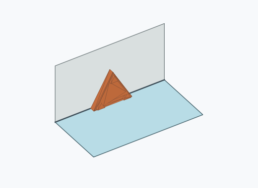
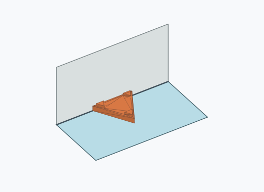
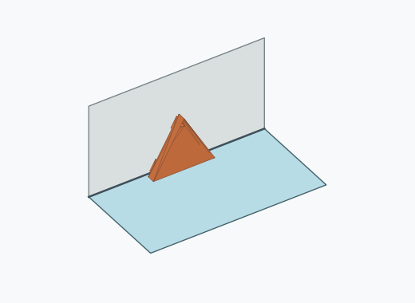
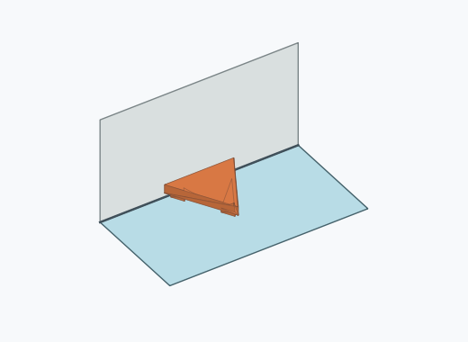
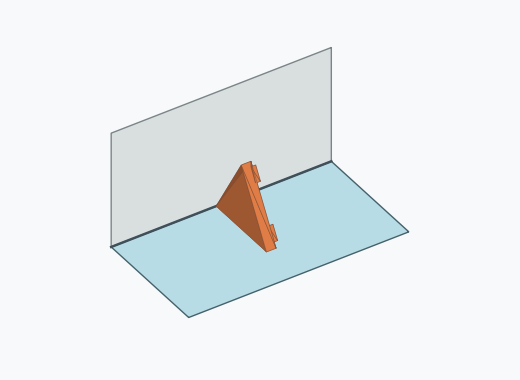
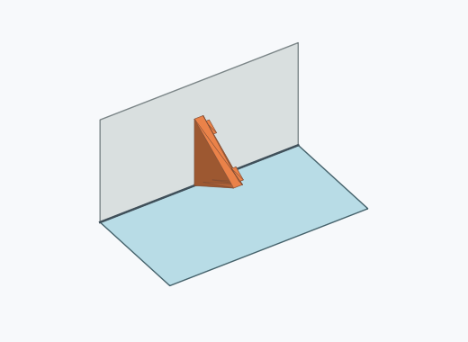

# Df1a

10000 Fallversuche auf 500 mm Strecke; 9997 eingependelte Endlagen. Prozentangaben beziehen sich auf alle Fallversuche.

Dies sind beobachtete Simulationslagen unter den dokumentierten Parametern; Reibung und Unebenheitsmodell sind noch nicht an realen Häufigkeiten kalibriert.

| Pose | Bild | Anzahl | Anteil | 95-%-Intervall | Anteil eingependelt |
| --- | --- | ---: | ---: | ---: | ---: |
| Df1a_0004 |  | 2638 | 26.38 % | 25.53–27.25 % | 26.39 % |
| Df1a_0005 |  | 2586 | 25.86 % | 25.01–26.73 % | 25.87 % |
| Df1a_0006 |  | 2386 | 23.86 % | 23.03–24.71 % | 23.87 % |
| Df1a_0001 |  | 2354 | 23.54 % | 22.72–24.38 % | 23.55 % |
| Df1a_0002 |  | 18 | 0.18 % | 0.11–0.28 % | 0.18 % |
| Df1a_0003 |  | 12 | 0.12 % | 0.07–0.21 % | 0.12 % |
| Df1a_0007 |  | 3 | 0.03 % | 0.01–0.09 % | 0.03 % |

Ergebnisstatus: settled: 9997, unsettled: 3

Details und Erkennung: [JSON](poses.json), [YAML](poses.yaml). Quaternionen: xyzw, Bauteil → Rutsche. Symmetrieoperationen werden rechts an die Bauteilrotation multipliziert. Die kontinuierliche Symmetrieachse wird gerichtet verglichen. Orientierungsabstand ≤5°; bei konkurrierenden Treffern innerhalb 1° bleibt die Zuordnung mehrdeutig.

Die Pose-IDs bleiben über Läufe erhalten. Der Registereintrag einer früher beobachteten, aktuell nicht aufgetretenen Pose bleibt zur Wiedererkennung reserviert.
