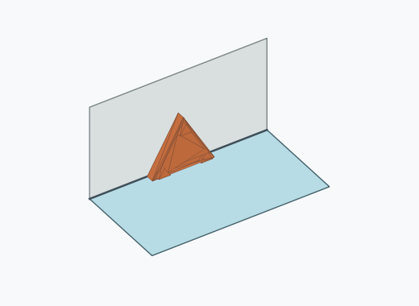
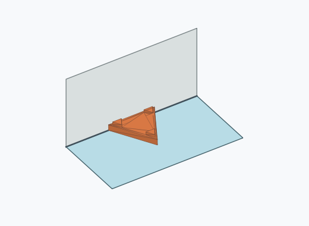
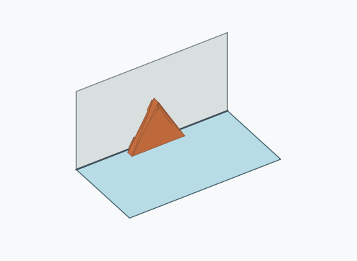
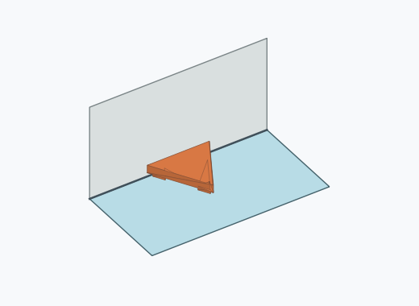
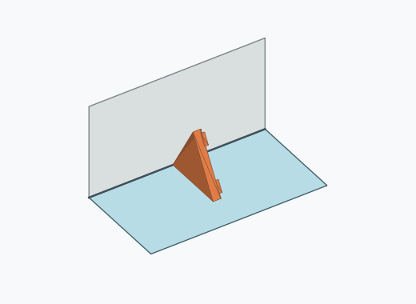
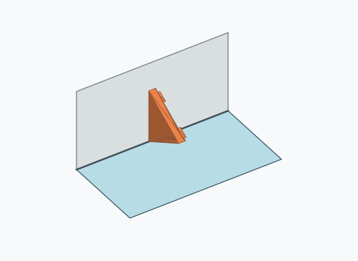

# Df1a

[Workpiece index](../README.md#workpieces)

## 10,000-drop paper study

The stationary series recorded **9,975** settled outcomes. The moving series recorded **9,999** settled outcomes at the virtual exit. Each series contains 10,000 drops.

[Study overview](simulations/20261107_10000/README.md) · [Stationary results](simulations/20261107_10000/static/README.md) · [Moving results](simulations/20261107_10000/100mm_s/README.md)

## Historical pose catalogue

Group numbers rank the saved pose basins by their combined incidence within each observation phase. Pose 0 is the most frequent individual pose in its observation phase. The membership CSV links the displayed numbers to the saved pose IDs. Groups below 1% remain visible.

[Group membership CSV](group_memberships.csv) · [Grouping method](../README.md#catalogue-grouping)

### Transport poses

9,997 settled outcomes across 10,000 historical drops on a 500 mm chute. Incidence uses all completed drops as the denominator.

Outcome counts: settled: 9,997, unsettled: 3.

| Pose | Group | Image | Count | Incidence | 95% interval | Share of settled outcomes |
| --- | --- | --- | ---: | ---: | ---: | ---: |
| Pose 0 | Group 0 |  | 2638 | 26.38 % | 25.53–27.25 % | 26.39 % |
| Pose 1 | Group 1 |  | 2586 | 25.86 % | 25.01–26.73 % | 25.87 % |
| Pose 2 | Group 2 |  | 2386 | 23.86 % | 23.03–24.71 % | 23.87 % |
| Pose 3 | Group 3 |  | 2354 | 23.54 % | 22.72–24.38 % | 23.55 % |
| Pose 4 | Group 4 |  | 18 | 0.18 % | 0.11–0.28 % | 0.18 % |
| Pose 5 | Group 5 |  | 12 | 0.12 % | 0.07–0.21 % | 0.12 % |
| Pose 6 | Group 6 |  | 3 | 0.03 % | 0.01–0.09 % | 0.03 % |

[Pose catalogue JSON](poses.json) · [Pose catalogue YAML](poses.yaml) · [Frequencies](frequencies.csv) · [Trial records](trials.csv)

Pose orientations use `xyzw` quaternions from the workpiece frame to the chute frame. Recognition uses the recorded symmetry, a 5° tolerance, and a 1° ambiguity margin. The pose registry reserves previously observed IDs for later recognition.

### Historical run files

- [Configuration](config.json)
- [Manifest](manifest.json)
- [Earlier 1,000-drop comparisons](simulations/README.md)
