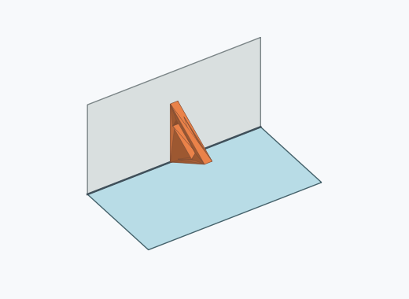

# Df2i

10000 Fallversuche auf 500 mm Strecke; 9996 eingependelte Endlagen. Prozentangaben beziehen sich auf alle Fallversuche.

Dies sind beobachtete Simulationslagen unter den dokumentierten Parametern; Reibung und Unebenheitsmodell sind noch nicht an realen Häufigkeiten kalibriert.

| Pose | Bild | Anzahl | Anteil | 95-%-Intervall | Anteil eingependelt |
| --- | --- | ---: | ---: | ---: | ---: |
| Df2i_0001 |  | 1833 | 18.33 % | 17.58–19.10 % | 18.34 % |
| Df2i_0004 |  | 1794 | 17.94 % | 17.20–18.70 % | 17.95 % |
| Df2i_0005 |  | 1785 | 17.85 % | 17.11–18.61 % | 17.86 % |
| Df2i_0002 |  | 1717 | 17.17 % | 16.44–17.92 % | 17.18 % |
| Df2i_0007 |  | 1445 | 14.45 % | 13.77–15.15 % | 14.46 % |
| Df2i_0006 |  | 1400 | 14.00 % | 13.33–14.69 % | 14.01 % |
| Df2i_0003 |  | 13 | 0.13 % | 0.08–0.22 % | 0.13 % |
| Df2i_0008 |  | 8 | 0.08 % | 0.04–0.16 % | 0.08 % |
| Df2i_0009 |  | 1 | 0.01 % | 0.00–0.06 % | 0.01 % |

Ergebnisstatus: settled: 9996, unsettled: 4

Details und Erkennung: [JSON](poses.json), [YAML](poses.yaml). Quaternionen: xyzw, Bauteil → Rutsche. Symmetrieoperationen werden rechts an die Bauteilrotation multipliziert. Die kontinuierliche Symmetrieachse wird gerichtet verglichen. Orientierungsabstand ≤5°; bei konkurrierenden Treffern innerhalb 1° bleibt die Zuordnung mehrdeutig.

Die Pose-IDs bleiben über Läufe erhalten. Der Registereintrag einer früher beobachteten, aktuell nicht aufgetretenen Pose bleibt zur Wiedererkennung reserviert.
