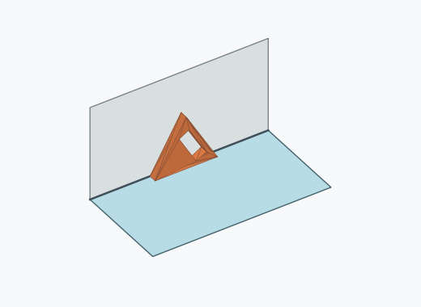
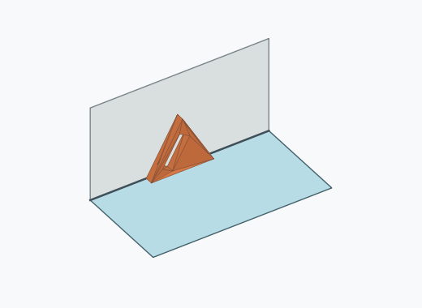
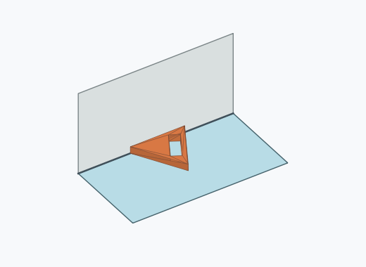
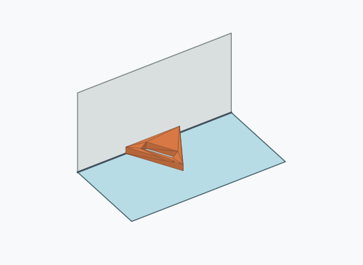
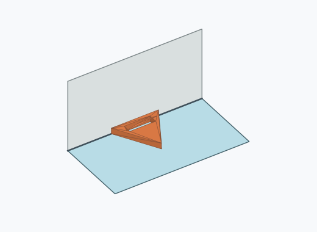
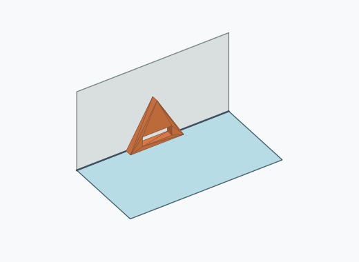
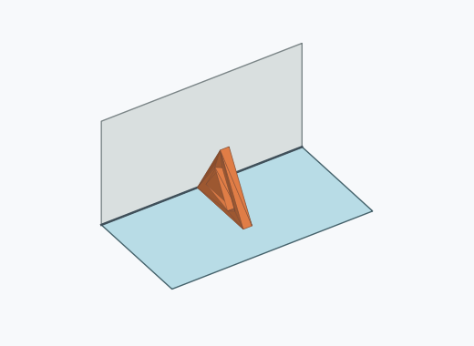
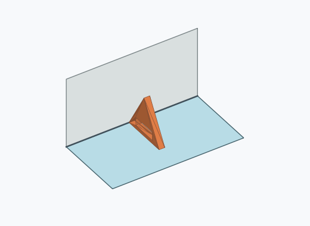

# Df2i

1000 Fallversuche auf 500 mm Strecke; 1000 eingependelte Endlagen. Prozentangaben beziehen sich auf alle Fallversuche.

Dies sind beobachtete Simulationslagen unter den dokumentierten Parametern; Reibung und Unebenheitsmodell sind noch nicht an realen Häufigkeiten kalibriert.

| Pose | Bild | Anzahl | Anteil | 95-%-Intervall | Anteil eingependelt |
| --- | --- | ---: | ---: | ---: | ---: |
| Df2i_0005 |  | 193 | 19.30 % | 16.97–21.86 % | 19.30 % |
| Df2i_0004 |  | 179 | 17.90 % | 15.65–20.40 % | 17.90 % |
| Df2i_0001 |  | 174 | 17.40 % | 15.18–19.87 % | 17.40 % |
| Df2i_0002 |  | 172 | 17.20 % | 14.99–19.66 % | 17.20 % |
| Df2i_0006 |  | 156 | 15.60 % | 13.48–17.98 % | 15.60 % |
| Df2i_0007 |  | 122 | 12.20 % | 10.31–14.37 % | 12.20 % |
| Df2i_0003 |  | 2 | 0.20 % | 0.05–0.73 % | 0.20 % |
| Df2i_0008 |  | 2 | 0.20 % | 0.05–0.73 % | 0.20 % |

Ergebnisstatus: settled: 1000

Details und Erkennung: [JSON](poses.json), [YAML](poses.yaml). Quaternionen: xyzw, Bauteil → Rutsche. Symmetrieoperationen werden rechts an die Bauteilrotation multipliziert. Die kontinuierliche Symmetrieachse wird gerichtet verglichen. Orientierungsabstand ≤5°; bei konkurrierenden Treffern innerhalb 1° bleibt die Zuordnung mehrdeutig.

Die Pose-IDs bleiben über Läufe erhalten. Der Registereintrag einer früher beobachteten, aktuell nicht aufgetretenen Pose bleibt zur Wiedererkennung reserviert.
