# Df4a

10000 Fallversuche auf 500 mm Strecke; 9999 eingependelte Endlagen. Prozentangaben beziehen sich auf alle Fallversuche.

Dies sind beobachtete Simulationslagen unter den dokumentierten Parametern; Reibung und Unebenheitsmodell sind noch nicht an realen Häufigkeiten kalibriert.

| Pose | Bild | Anzahl | Anteil | 95-%-Intervall | Anteil eingependelt |
| --- | --- | ---: | ---: | ---: | ---: |
| Df4a_0011 |  | 951 | 9.51 % | 8.95–10.10 % | 9.51 % |
| Df4a_0015 | 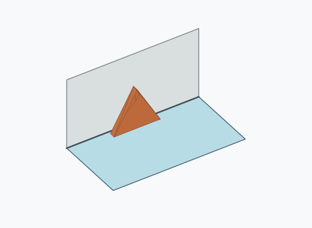 | 936 | 9.36 % | 8.80–9.95 % | 9.36 % |
| Df4a_0006 |  | 896 | 8.96 % | 8.42–9.54 % | 8.96 % |
| Df4a_0002 | 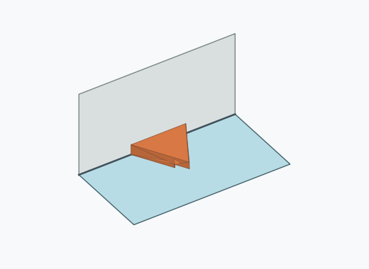 | 891 | 8.91 % | 8.37–9.48 % | 8.91 % |
| Df4a_0005 | 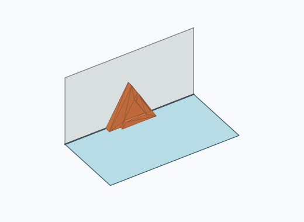 | 888 | 8.88 % | 8.34–9.45 % | 8.88 % |
| Df4a_0016 |  | 863 | 8.63 % | 8.10–9.20 % | 8.63 % |
| Df4a_0010 |  | 855 | 8.55 % | 8.02–9.11 % | 8.55 % |
| Df4a_0001 | 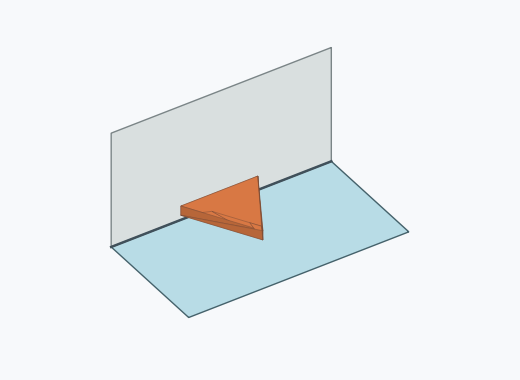 | 826 | 8.26 % | 7.74–8.82 % | 8.26 % |
| Df4a_0013 | 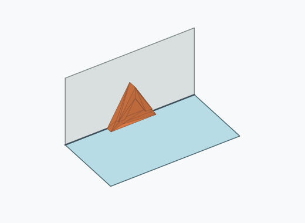 | 755 | 7.55 % | 7.05–8.08 % | 7.55 % |
| Df4a_0009 | 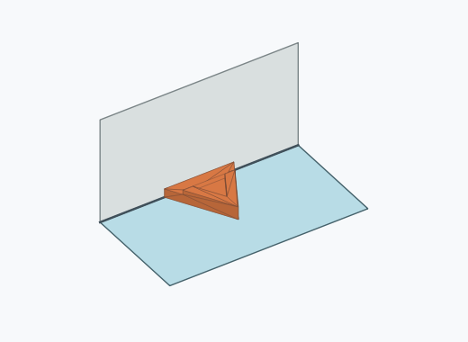 | 719 | 7.19 % | 6.70–7.71 % | 7.19 % |
| Df4a_0017 |  | 707 | 7.07 % | 6.58–7.59 % | 7.07 % |
| Df4a_0012 | 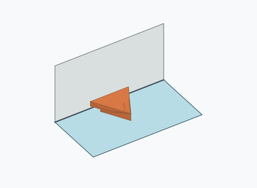 | 654 | 6.54 % | 6.07–7.04 % | 6.54 % |
| Df4a_0004 | 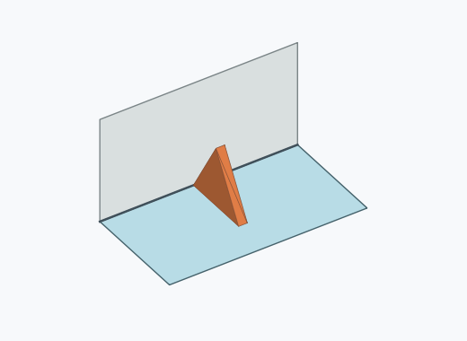 | 14 | 0.14 % | 0.08–0.23 % | 0.14 % |
| Df4a_0003 |  | 13 | 0.13 % | 0.08–0.22 % | 0.13 % |
| Df4a_0008 | 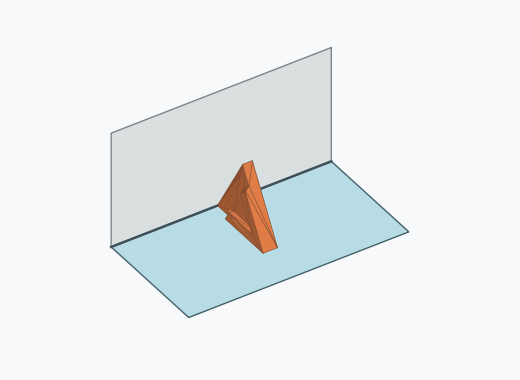 | 12 | 0.12 % | 0.07–0.21 % | 0.12 % |
| Df4a_0007 | 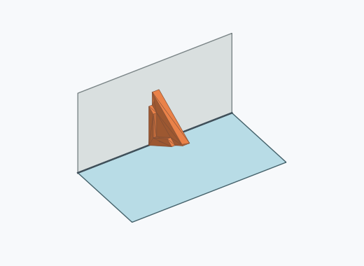 | 11 | 0.11 % | 0.06–0.20 % | 0.11 % |
| Df4a_0014 |  | 3 | 0.03 % | 0.01–0.09 % | 0.03 % |
| Df4a_0020 |  | 3 | 0.03 % | 0.01–0.09 % | 0.03 % |
| Df4a_0018 | 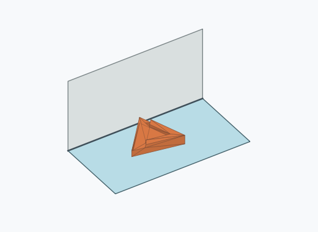 | 1 | 0.01 % | 0.00–0.06 % | 0.01 % |
| Df4a_0019 | 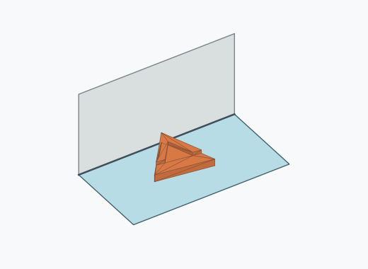 | 1 | 0.01 % | 0.00–0.06 % | 0.01 % |

Ergebnisstatus: settled: 9999, unsettled: 1

Details und Erkennung: [JSON](poses.json), [YAML](poses.yaml). Quaternionen: xyzw, Bauteil → Rutsche. Symmetrieoperationen werden rechts an die Bauteilrotation multipliziert. Die kontinuierliche Symmetrieachse wird gerichtet verglichen. Orientierungsabstand ≤5°; bei konkurrierenden Treffern innerhalb 1° bleibt die Zuordnung mehrdeutig.

Die Pose-IDs bleiben über Läufe erhalten. Der Registereintrag einer früher beobachteten, aktuell nicht aufgetretenen Pose bleibt zur Wiedererkennung reserviert.
