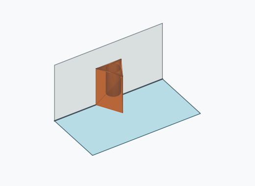
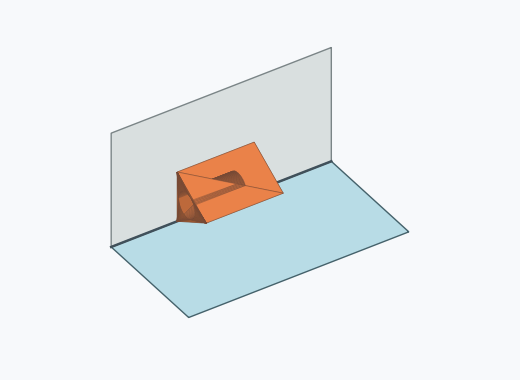
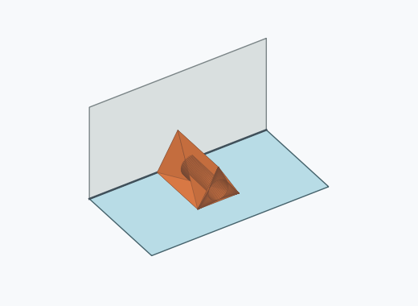
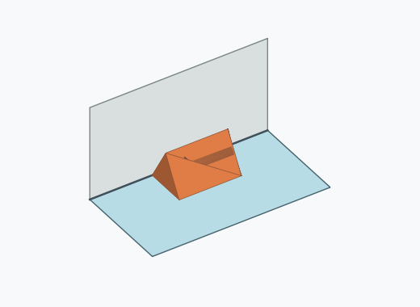
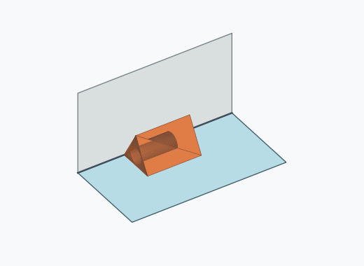
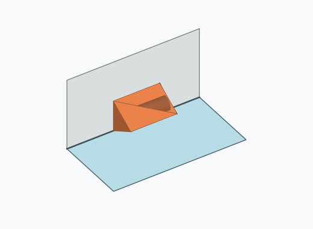
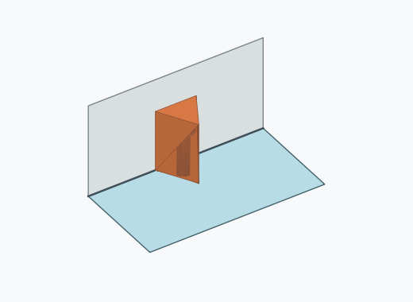
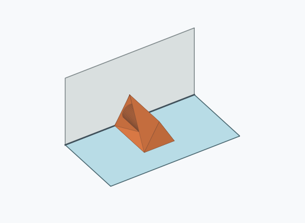

# Dk1i

1000 Fallversuche auf 500 mm Strecke; 1000 eingependelte Endlagen. Prozentangaben beziehen sich auf alle Fallversuche.

Dies sind beobachtete Simulationslagen unter den dokumentierten Parametern; Reibung und Unebenheitsmodell sind noch nicht an realen Häufigkeiten kalibriert.

| Pose | Bild | Anzahl | Anteil | 95-%-Intervall | Anteil eingependelt |
| --- | --- | ---: | ---: | ---: | ---: |
| Dk1i_0007 |  | 168 | 16.80 % | 14.61–19.24 % | 16.80 % |
| Dk1i_0005 |  | 149 | 14.90 % | 12.83–17.24 % | 14.90 % |
| Dk1i_0006 |  | 142 | 14.20 % | 12.17–16.50 % | 14.20 % |
| Dk1i_0002 |  | 135 | 13.50 % | 11.52–15.76 % | 13.50 % |
| Dk1i_0003 |  | 132 | 13.20 % | 11.24–15.44 % | 13.20 % |
| Dk1i_0004 |  | 118 | 11.80 % | 9.95–13.95 % | 11.80 % |
| Dk1i_0001 |  | 79 | 7.90 % | 6.38–9.74 % | 7.90 % |
| Dk1i_0008 |  | 77 | 7.70 % | 6.20–9.52 % | 7.70 % |

Ergebnisstatus: settled: 1000

Details und Erkennung: [JSON](poses.json), [YAML](poses.yaml). Quaternionen: xyzw, Bauteil → Rutsche. Symmetrieoperationen werden rechts an die Bauteilrotation multipliziert. Die kontinuierliche Symmetrieachse wird gerichtet verglichen. Orientierungsabstand ≤5°; bei konkurrierenden Treffern innerhalb 1° bleibt die Zuordnung mehrdeutig.

Die Pose-IDs bleiben über Läufe erhalten. Der Registereintrag einer früher beobachteten, aktuell nicht aufgetretenen Pose bleibt zur Wiedererkennung reserviert.
