# Dk2a

10000 Fallversuche auf 500 mm Strecke; 9845 eingependelte Endlagen. Prozentangaben beziehen sich auf alle Fallversuche.

Dies sind beobachtete Simulationslagen unter den dokumentierten Parametern; Reibung und Unebenheitsmodell sind noch nicht an realen Häufigkeiten kalibriert.

| Pose | Bild | Anzahl | Anteil | 95-%-Intervall | Anteil eingependelt |
| --- | --- | ---: | ---: | ---: | ---: |
| Dk2a_0006 | 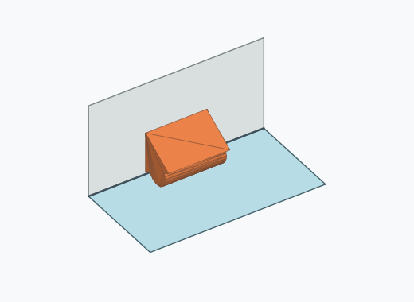 | 1694 | 16.94 % | 16.22–17.69 % | 17.21 % |
| Dk2a_0004 | 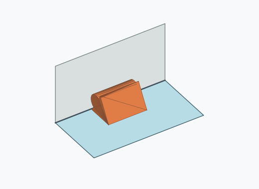 | 1557 | 15.57 % | 14.87–16.29 % | 15.82 % |
| Dk2a_0002 | 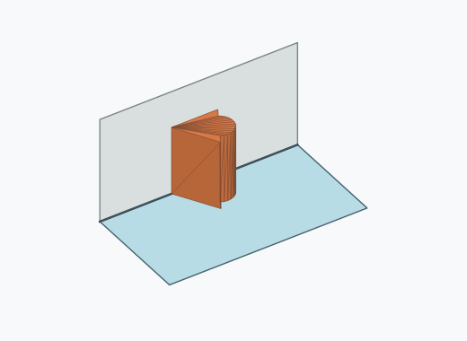 | 785 | 7.85 % | 7.34–8.39 % | 7.97 % |
| Dk2a_0015 | 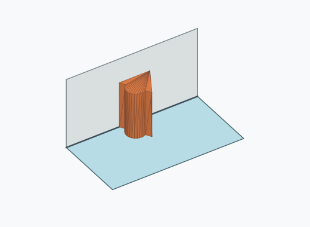 | 713 | 7.13 % | 6.64–7.65 % | 7.24 % |
| Dk2a_0014 | 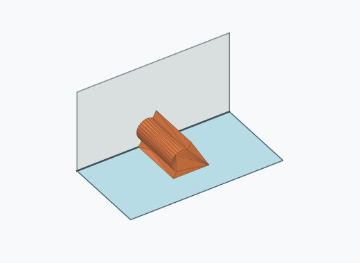 | 688 | 6.88 % | 6.40–7.39 % | 6.99 % |
| Dk2a_0007 | 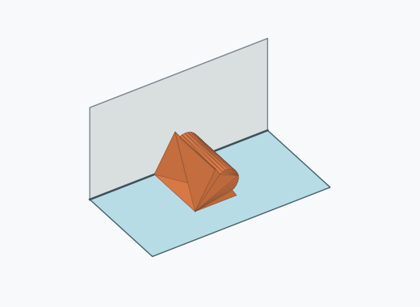 | 675 | 6.75 % | 6.27–7.26 % | 6.86 % |
| Dk2a_0016 | 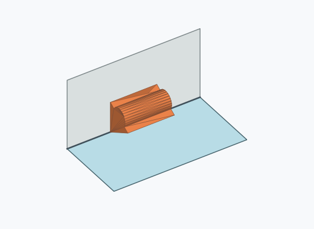 | 667 | 6.67 % | 6.20–7.18 % | 6.78 % |
| Dk2a_0013 | 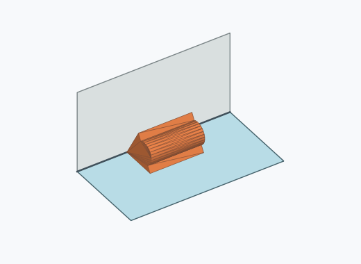 | 629 | 6.29 % | 5.83–6.78 % | 6.39 % |
| Dk2a_0005 | 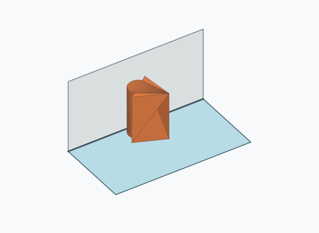 | 524 | 5.24 % | 4.82–5.69 % | 5.32 % |
| Dk2a_0003 | 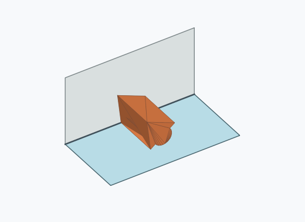 | 511 | 5.11 % | 4.70–5.56 % | 5.19 % |
| Dk2a_0012 | 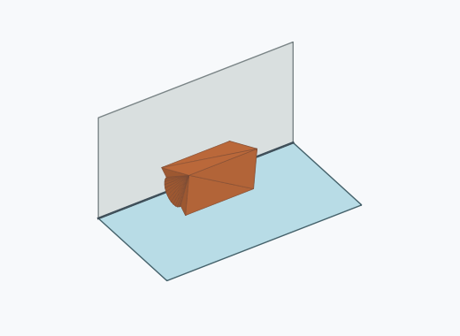 | 478 | 4.78 % | 4.38–5.22 % | 4.86 % |
| Dk2a_0011 | 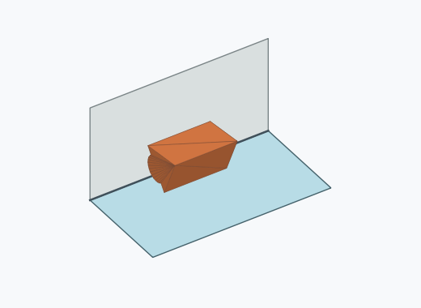 | 469 | 4.69 % | 4.29–5.12 % | 4.76 % |
| Dk2a_0001 | 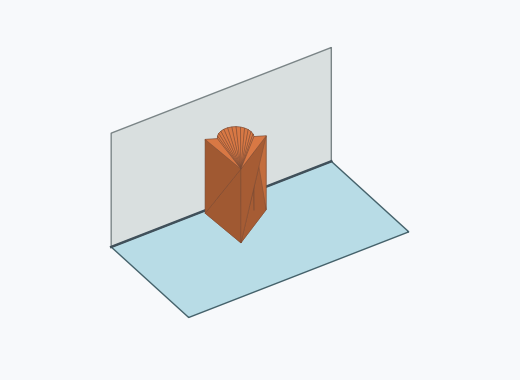 | 258 | 2.58 % | 2.29–2.91 % | 2.62 % |
| Dk2a_0009 |  | 131 | 1.31 % | 1.11–1.55 % | 1.33 % |
| Dk2a_0010 | 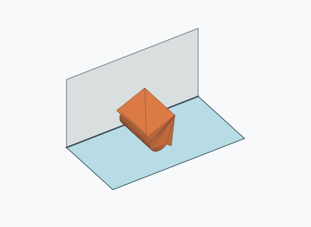 | 52 | 0.52 % | 0.40–0.68 % | 0.53 % |
| Dk2a_0008 | 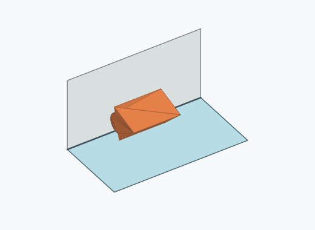 | 13 | 0.13 % | 0.08–0.22 % | 0.13 % |
| Dk2a_0017 | 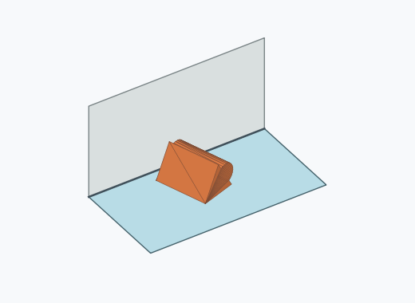 | 1 | 0.01 % | 0.00–0.06 % | 0.01 % |

Ergebnisstatus: settled: 9845, unsettled: 155

Details und Erkennung: [JSON](poses.json), [YAML](poses.yaml). Quaternionen: xyzw, Bauteil → Rutsche. Symmetrieoperationen werden rechts an die Bauteilrotation multipliziert. Die kontinuierliche Symmetrieachse wird gerichtet verglichen. Orientierungsabstand ≤5°; bei konkurrierenden Treffern innerhalb 1° bleibt die Zuordnung mehrdeutig.

Die Pose-IDs bleiben über Läufe erhalten. Der Registereintrag einer früher beobachteten, aktuell nicht aufgetretenen Pose bleibt zur Wiedererkennung reserviert.
