# Dk4i

10000 Fallversuche auf 500 mm Strecke; 9999 eingependelte Endlagen. Prozentangaben beziehen sich auf alle Fallversuche.

Dies sind beobachtete Simulationslagen unter den dokumentierten Parametern; Reibung und Unebenheitsmodell sind noch nicht an realen Häufigkeiten kalibriert.

| Pose | Bild | Anzahl | Anteil | 95-%-Intervall | Anteil eingependelt |
| --- | --- | ---: | ---: | ---: | ---: |
| Dk4i_0003 |  | 633 | 6.33 % | 5.87–6.82 % | 6.33 % |
| Dk4i_0009 | 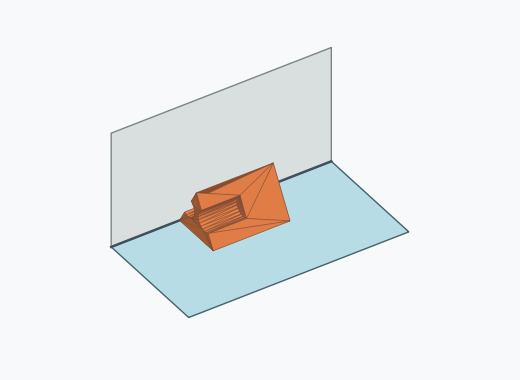 | 609 | 6.09 % | 5.64–6.58 % | 6.09 % |
| Dk4i_0006 | 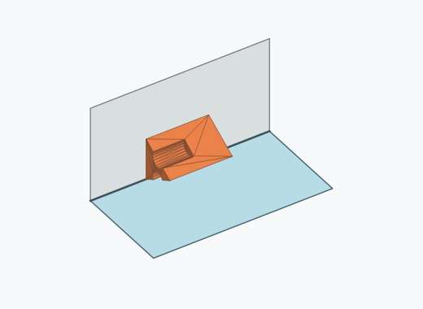 | 584 | 5.84 % | 5.40–6.32 % | 5.84 % |
| Dk4i_0015 | 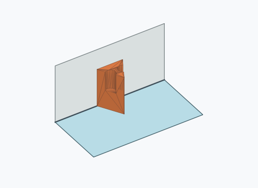 | 552 | 5.52 % | 5.09–5.98 % | 5.52 % |
| Dk4i_0023 | 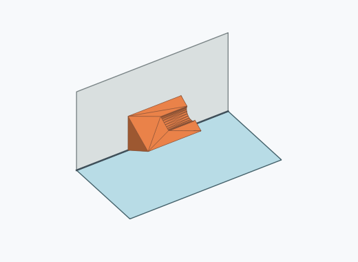 | 541 | 5.41 % | 4.98–5.87 % | 5.41 % |
| Dk4i_0010 | 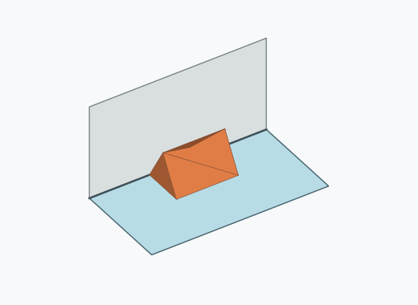 | 502 | 5.02 % | 4.61–5.47 % | 5.02 % |
| Dk4i_0022 |  | 495 | 4.95 % | 4.54–5.39 % | 4.95 % |
| Dk4i_0017 | 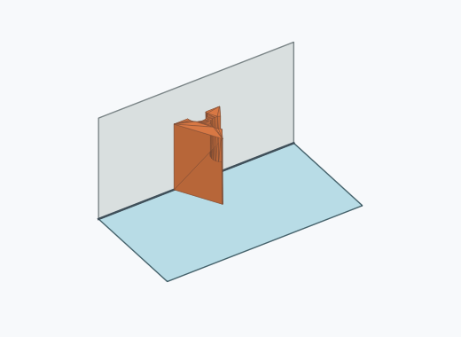 | 456 | 4.56 % | 4.17–4.99 % | 4.56 % |
| Dk4i_0016 |  | 445 | 4.45 % | 4.06–4.87 % | 4.45 % |
| Dk4i_0008 | 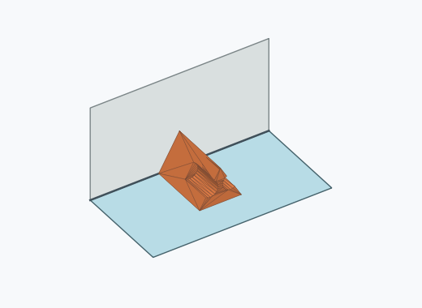 | 440 | 4.40 % | 4.02–4.82 % | 4.40 % |
| Dk4i_0020 | 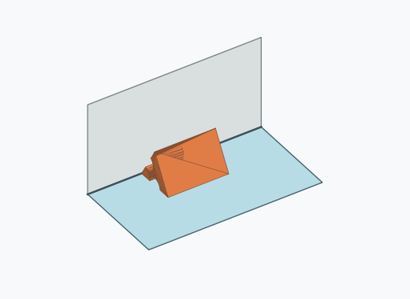 | 425 | 4.25 % | 3.87–4.66 % | 4.25 % |
| Dk4i_0007 | 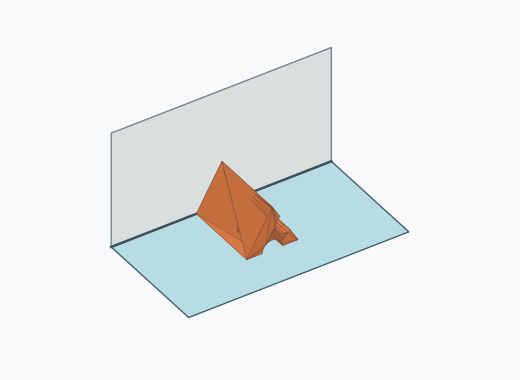 | 405 | 4.05 % | 3.68–4.45 % | 4.05 % |
| Dk4i_0014 |  | 405 | 4.05 % | 3.68–4.45 % | 4.05 % |
| Dk4i_0012 | 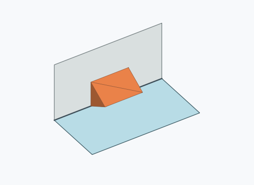 | 403 | 4.03 % | 3.66–4.43 % | 4.03 % |
| Dk4i_0021 | 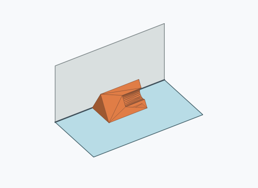 | 370 | 3.70 % | 3.35–4.09 % | 3.70 % |
| Dk4i_0011 | 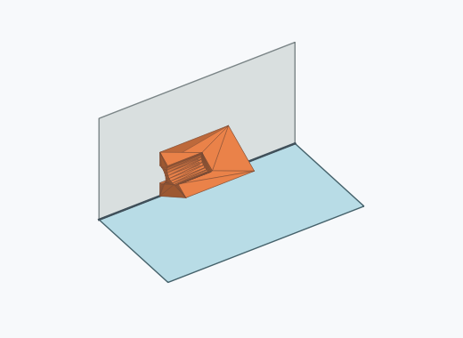 | 366 | 3.66 % | 3.31–4.05 % | 3.66 % |
| Dk4i_0004 |  | 360 | 3.60 % | 3.25–3.98 % | 3.60 % |
| Dk4i_0001 | 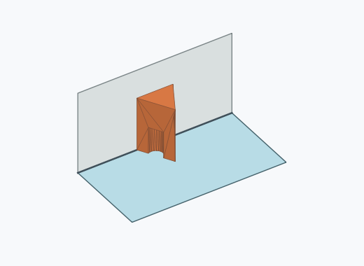 | 325 | 3.25 % | 2.92–3.62 % | 3.25 % |
| Dk4i_0005 |  | 315 | 3.15 % | 2.83–3.51 % | 3.15 % |
| Dk4i_0002 | 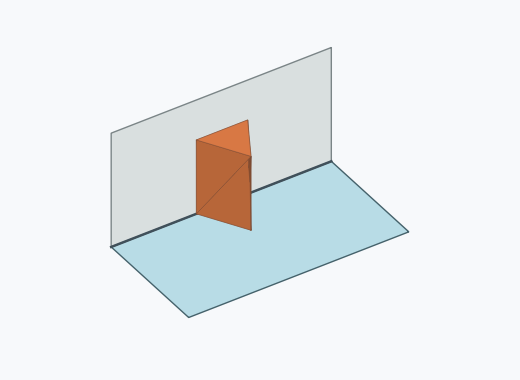 | 281 | 2.81 % | 2.50–3.15 % | 2.81 % |
| Dk4i_0024 | 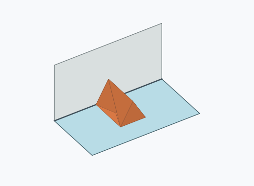 | 280 | 2.80 % | 2.49–3.14 % | 2.80 % |
| Dk4i_0013 | 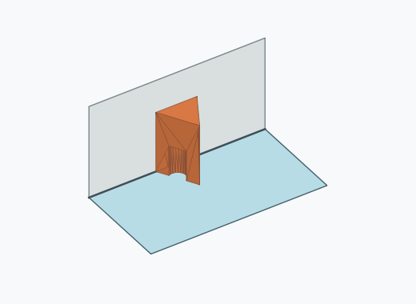 | 275 | 2.75 % | 2.45–3.09 % | 2.75 % |
| Dk4i_0019 | 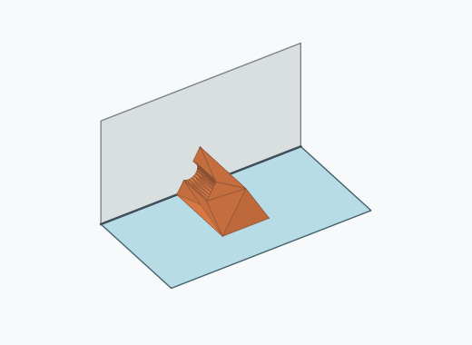 | 268 | 2.68 % | 2.38–3.02 % | 2.68 % |
| Dk4i_0018 | 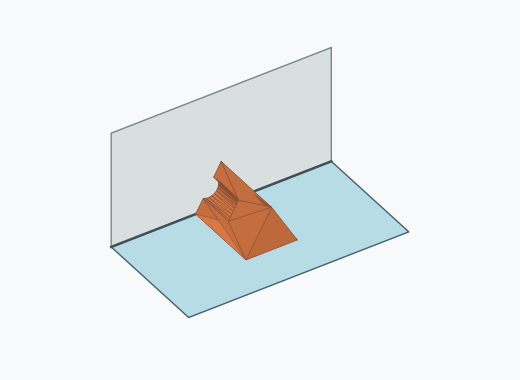 | 264 | 2.64 % | 2.34–2.97 % | 2.64 % |

Ergebnisstatus: settled: 9999, unsettled: 1

Details und Erkennung: [JSON](poses.json), [YAML](poses.yaml). Quaternionen: xyzw, Bauteil → Rutsche. Symmetrieoperationen werden rechts an die Bauteilrotation multipliziert. Die kontinuierliche Symmetrieachse wird gerichtet verglichen. Orientierungsabstand ≤5°; bei konkurrierenden Treffern innerhalb 1° bleibt die Zuordnung mehrdeutig.

Die Pose-IDs bleiben über Läufe erhalten. Der Registereintrag einer früher beobachteten, aktuell nicht aufgetretenen Pose bleibt zur Wiedererkennung reserviert.
