# Dl1a

1000 Fallversuche auf 500 mm Strecke; 998 eingependelte Endlagen. Prozentangaben beziehen sich auf alle Fallversuche.

Dies sind beobachtete Simulationslagen unter den dokumentierten Parametern; Reibung und Unebenheitsmodell sind noch nicht an realen Häufigkeiten kalibriert.

| Pose | Bild | Anzahl | Anteil | 95-%-Intervall | Anteil eingependelt |
| --- | --- | ---: | ---: | ---: | ---: |
| Dl1a_0007 |  | 273 | 27.30 % | 24.63–30.14 % | 27.35 % |
| Dl1a_0006 | 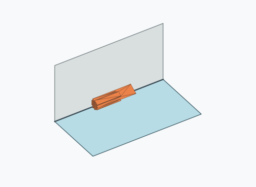 | 257 | 25.70 % | 23.09–28.50 % | 25.75 % |
| Dl1a_0004 | 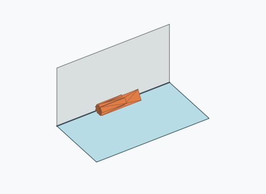 | 202 | 20.20 % | 17.83–22.80 % | 20.24 % |
| Dl1a_0005 | 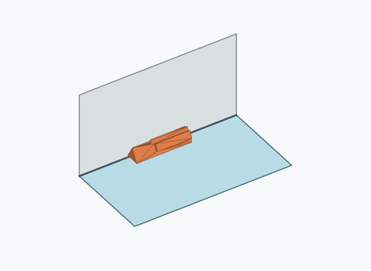 | 172 | 17.20 % | 14.99–19.66 % | 17.23 % |
| Dl1a_0014 | 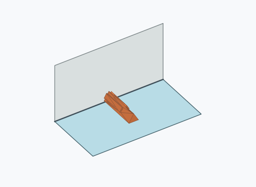 | 32 | 3.20 % | 2.28–4.48 % | 3.21 % |
| Dl1a_0008 | 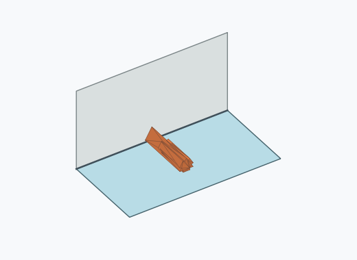 | 15 | 1.50 % | 0.91–2.46 % | 1.50 % |
| Dl1a_0009 | 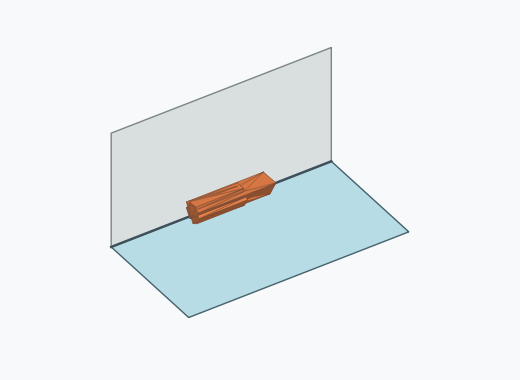 | 14 | 1.40 % | 0.84–2.34 % | 1.40 % |
| Dl1a_0010 | 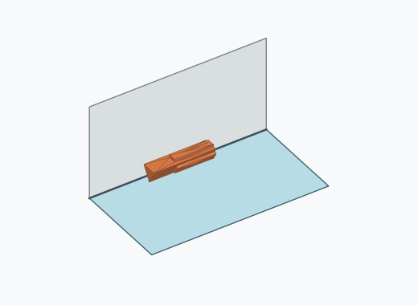 | 9 | 0.90 % | 0.47–1.70 % | 0.90 % |
| Dl1a_0001 | 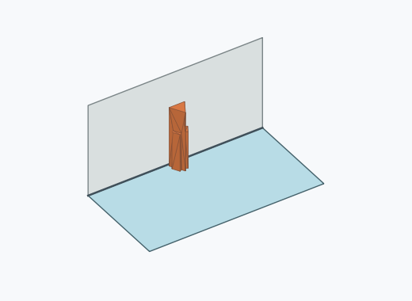 | 7 | 0.70 % | 0.34–1.44 % | 0.70 % |
| Dl1a_0003 | 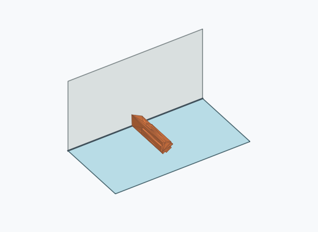 | 6 | 0.60 % | 0.28–1.30 % | 0.60 % |
| Dl1a_0013 | 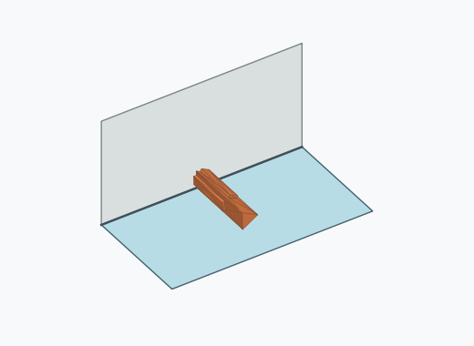 | 5 | 0.50 % | 0.21–1.17 % | 0.50 % |
| Dl1a_0002 | 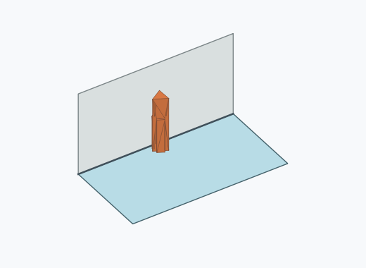 | 2 | 0.20 % | 0.05–0.73 % | 0.20 % |
| Dl1a_0011 | 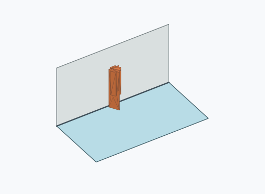 | 2 | 0.20 % | 0.05–0.73 % | 0.20 % |
| Dl1a_0012 | 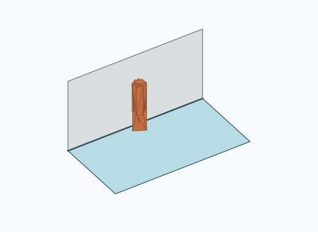 | 2 | 0.20 % | 0.05–0.73 % | 0.20 % |

Ergebnisstatus: settled: 998, unsettled: 2

Details und Erkennung: [JSON](poses.json), [YAML](poses.yaml). Quaternionen: xyzw, Bauteil → Rutsche. Symmetrieoperationen werden rechts an die Bauteilrotation multipliziert. Die kontinuierliche Symmetrieachse wird gerichtet verglichen. Orientierungsabstand ≤5°; bei konkurrierenden Treffern innerhalb 1° bleibt die Zuordnung mehrdeutig.

Die Pose-IDs bleiben über Läufe erhalten. Der Registereintrag einer früher beobachteten, aktuell nicht aufgetretenen Pose bleibt zur Wiedererkennung reserviert.
