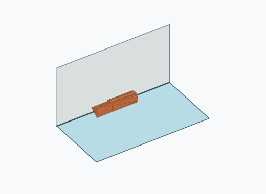
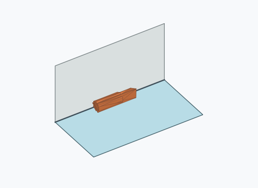

# Dl1a

10000 Fallversuche auf 500 mm Strecke; 9983 eingependelte Endlagen. Prozentangaben beziehen sich auf alle Fallversuche.

Dies sind beobachtete Simulationslagen unter den dokumentierten Parametern; Reibung und Unebenheitsmodell sind noch nicht an realen Häufigkeiten kalibriert.

| Pose | Bild | Anzahl | Anteil | 95-%-Intervall | Anteil eingependelt |
| --- | --- | ---: | ---: | ---: | ---: |
| Dl1a_0007 |  | 2965 | 29.65 % | 28.76–30.55 % | 29.70 % |
| Dl1a_0006 |  | 2569 | 25.69 % | 24.84–26.56 % | 25.73 % |
| Dl1a_0004 |  | 1924 | 19.24 % | 18.48–20.02 % | 19.27 % |
| Dl1a_0005 |  | 1667 | 16.67 % | 15.95–17.41 % | 16.70 % |
| Dl1a_0014 |  | 285 | 2.85 % | 2.54–3.19 % | 2.85 % |
| Dl1a_0009 |  | 121 | 1.21 % | 1.01–1.44 % | 1.21 % |
| Dl1a_0008 |  | 117 | 1.17 % | 0.98–1.40 % | 1.17 % |
| Dl1a_0001 |  | 91 | 0.91 % | 0.74–1.12 % | 0.91 % |
| Dl1a_0010 |  | 76 | 0.76 % | 0.61–0.95 % | 0.76 % |
| Dl1a_0013 |  | 47 | 0.47 % | 0.35–0.62 % | 0.47 % |
| Dl1a_0003 |  | 38 | 0.38 % | 0.28–0.52 % | 0.38 % |
| Dl1a_0002 |  | 22 | 0.22 % | 0.15–0.33 % | 0.22 % |
| Dl1a_0012 |  | 16 | 0.16 % | 0.10–0.26 % | 0.16 % |
| Dl1a_0016 |  | 16 | 0.16 % | 0.10–0.26 % | 0.16 % |
| Dl1a_0011 |  | 15 | 0.15 % | 0.09–0.25 % | 0.15 % |
| Dl1a_0015 |  | 14 | 0.14 % | 0.08–0.23 % | 0.14 % |

Ergebnisstatus: settled: 9983, unsettled: 17

Details und Erkennung: [JSON](poses.json), [YAML](poses.yaml). Quaternionen: xyzw, Bauteil → Rutsche. Symmetrieoperationen werden rechts an die Bauteilrotation multipliziert. Die kontinuierliche Symmetrieachse wird gerichtet verglichen. Orientierungsabstand ≤5°; bei konkurrierenden Treffern innerhalb 1° bleibt die Zuordnung mehrdeutig.

Die Pose-IDs bleiben über Läufe erhalten. Der Registereintrag einer früher beobachteten, aktuell nicht aufgetretenen Pose bleibt zur Wiedererkennung reserviert.
