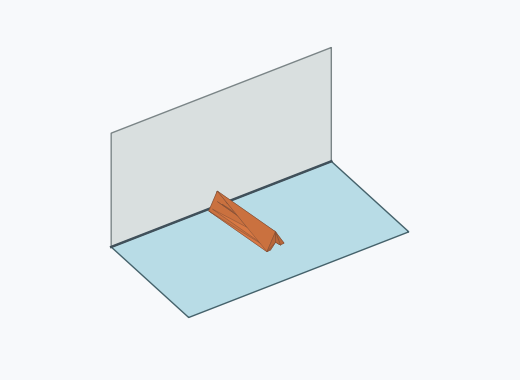
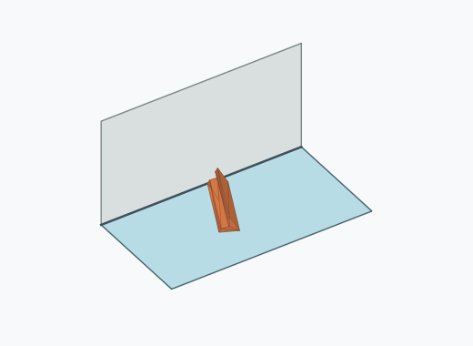
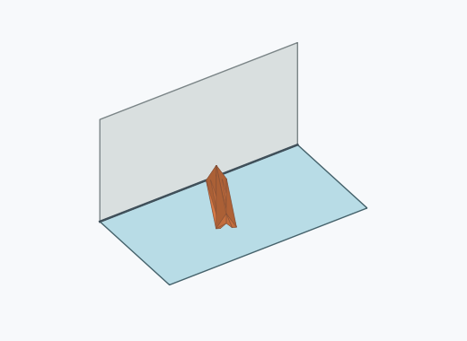

# Dl2i

10000 Fallversuche auf 500 mm Strecke; 9965 eingependelte Endlagen. Prozentangaben beziehen sich auf alle Fallversuche.

Dies sind beobachtete Simulationslagen unter den dokumentierten Parametern; Reibung und Unebenheitsmodell sind noch nicht an realen Häufigkeiten kalibriert.

| Pose | Bild | Anzahl | Anteil | 95-%-Intervall | Anteil eingependelt |
| --- | --- | ---: | ---: | ---: | ---: |
| Dl2i_0003 |  | 1926 | 19.26 % | 18.50–20.04 % | 19.33 % |
| Dl2i_0008 |  | 1837 | 18.37 % | 17.62–19.14 % | 18.43 % |
| Dl2i_0006 |  | 1703 | 17.03 % | 16.31–17.78 % | 17.09 % |
| Dl2i_0013 |  | 1623 | 16.23 % | 15.52–16.97 % | 16.29 % |
| Dl2i_0012 |  | 1188 | 11.88 % | 11.26–12.53 % | 11.92 % |
| Dl2i_0009 |  | 1025 | 10.25 % | 9.67–10.86 % | 10.29 % |
| Dl2i_0007 |  | 173 | 1.73 % | 1.49–2.00 % | 1.74 % |
| Dl2i_0005 |  | 145 | 1.45 % | 1.23–1.70 % | 1.46 % |
| Dl2i_0010 |  | 143 | 1.43 % | 1.22–1.68 % | 1.44 % |
| Dl2i_0001 |  | 95 | 0.95 % | 0.78–1.16 % | 0.95 % |
| Dl2i_0002 |  | 46 | 0.46 % | 0.35–0.61 % | 0.46 % |
| Dl2i_0011 |  | 46 | 0.46 % | 0.35–0.61 % | 0.46 % |
| Dl2i_0015 |  | 3 | 0.03 % | 0.01–0.09 % | 0.03 % |
| Dl2i_0016 |  | 3 | 0.03 % | 0.01–0.09 % | 0.03 % |
| Dl2i_0019 |  | 3 | 0.03 % | 0.01–0.09 % | 0.03 % |
| Dl2i_0018 |  | 2 | 0.02 % | 0.01–0.07 % | 0.02 % |
| Dl2i_0020 |  | 2 | 0.02 % | 0.01–0.07 % | 0.02 % |
| Dl2i_0014 |  | 1 | 0.01 % | 0.00–0.06 % | 0.01 % |
| Dl2i_0017 |  | 1 | 0.01 % | 0.00–0.06 % | 0.01 % |

Ergebnisstatus: settled: 9965, unsettled: 35

Details und Erkennung: [JSON](poses.json), [YAML](poses.yaml). Quaternionen: xyzw, Bauteil → Rutsche. Symmetrieoperationen werden rechts an die Bauteilrotation multipliziert. Die kontinuierliche Symmetrieachse wird gerichtet verglichen. Orientierungsabstand ≤5°; bei konkurrierenden Treffern innerhalb 1° bleibt die Zuordnung mehrdeutig.

Die Pose-IDs bleiben über Läufe erhalten. Der Registereintrag einer früher beobachteten, aktuell nicht aufgetretenen Pose bleibt zur Wiedererkennung reserviert.
