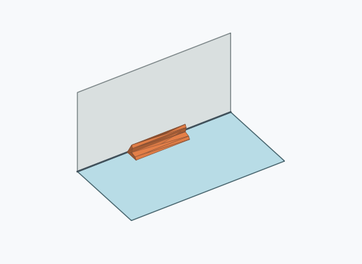
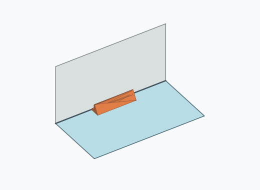
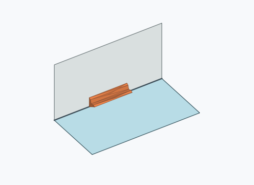
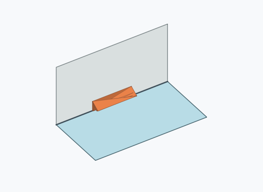
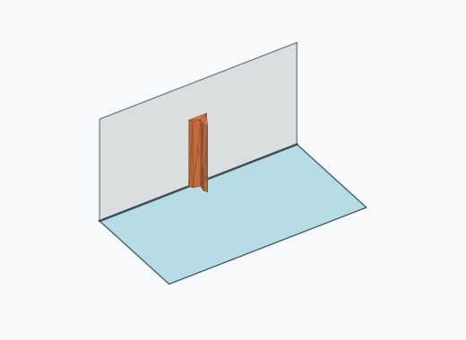
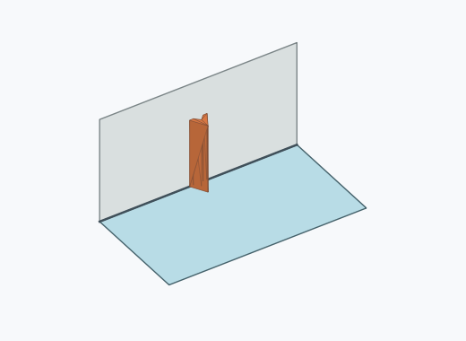

# Dl2i

1000 Fallversuche auf 500 mm Strecke; 999 eingependelte Endlagen. Prozentangaben beziehen sich auf alle Fallversuche.

Dies sind beobachtete Simulationslagen unter den dokumentierten Parametern; Reibung und Unebenheitsmodell sind noch nicht an realen Häufigkeiten kalibriert.

| Pose | Bild | Anzahl | Anteil | 95-%-Intervall | Anteil eingependelt |
| --- | --- | ---: | ---: | ---: | ---: |
| Dl2i_0003 |  | 207 | 20.70 % | 18.30–23.32 % | 20.72 % |
| Dl2i_0008 |  | 191 | 19.10 % | 16.78–21.65 % | 19.12 % |
| Dl2i_0006 |  | 177 | 17.70 % | 15.46–20.19 % | 17.72 % |
| Dl2i_0013 |  | 141 | 14.10 % | 12.08–16.39 % | 14.11 % |
| Dl2i_0009 |  | 107 | 10.70 % | 8.93–12.77 % | 10.71 % |
| Dl2i_0012 |  | 105 | 10.50 % | 8.75–12.55 % | 10.51 % |
| Dl2i_0007 |  | 23 | 2.30 % | 1.54–3.43 % | 2.30 % |
| Dl2i_0005 |  | 18 | 1.80 % | 1.14–2.83 % | 1.80 % |
| Dl2i_0010 |  | 11 | 1.10 % | 0.62–1.96 % | 1.10 % |
| Dl2i_0001 |  | 10 | 1.00 % | 0.54–1.83 % | 1.00 % |
| Dl2i_0002 |  | 6 | 0.60 % | 0.28–1.30 % | 0.60 % |
| Dl2i_0011 |  | 2 | 0.20 % | 0.05–0.73 % | 0.20 % |
| Dl2i_0004 |  | 1 | 0.10 % | 0.02–0.56 % | 0.10 % |

Ergebnisstatus: settled: 999, unsettled: 1

Details und Erkennung: [JSON](poses.json), [YAML](poses.yaml). Quaternionen: xyzw, Bauteil → Rutsche. Symmetrieoperationen werden rechts an die Bauteilrotation multipliziert. Die kontinuierliche Symmetrieachse wird gerichtet verglichen. Orientierungsabstand ≤5°; bei konkurrierenden Treffern innerhalb 1° bleibt die Zuordnung mehrdeutig.

Die Pose-IDs bleiben über Läufe erhalten. Der Registereintrag einer früher beobachteten, aktuell nicht aufgetretenen Pose bleibt zur Wiedererkennung reserviert.
