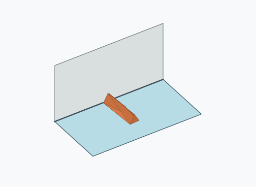
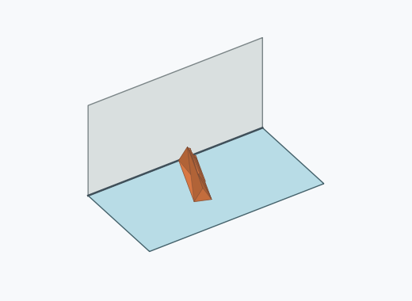

# Dl4a

10000 Fallversuche auf 500 mm Strecke; 9973 eingependelte Endlagen. Prozentangaben beziehen sich auf alle Fallversuche.

Dies sind beobachtete Simulationslagen unter den dokumentierten Parametern; Reibung und Unebenheitsmodell sind noch nicht an realen Häufigkeiten kalibriert.

| Pose | Bild | Anzahl | Anteil | 95-%-Intervall | Anteil eingependelt |
| --- | --- | ---: | ---: | ---: | ---: |
| Dl4a_0004 |  | 1611 | 16.11 % | 15.40–16.84 % | 16.15 % |
| Dl4a_0011 |  | 1541 | 15.41 % | 14.72–16.13 % | 15.45 % |
| Dl4a_0002 |  | 1503 | 15.03 % | 14.34–15.74 % | 15.07 % |
| Dl4a_0021 |  | 1470 | 14.70 % | 14.02–15.41 % | 14.74 % |
| Dl4a_0022 |  | 816 | 8.16 % | 7.64–8.71 % | 8.18 % |
| Dl4a_0009 |  | 797 | 7.97 % | 7.46–8.52 % | 7.99 % |
| Dl4a_0010 |  | 730 | 7.30 % | 6.81–7.83 % | 7.32 % |
| Dl4a_0024 |  | 717 | 7.17 % | 6.68–7.69 % | 7.19 % |
| Dl4a_0018 |  | 95 | 0.95 % | 0.78–1.16 % | 0.95 % |
| Dl4a_0007 |  | 84 | 0.84 % | 0.68–1.04 % | 0.84 % |
| Dl4a_0019 |  | 79 | 0.79 % | 0.63–0.98 % | 0.79 % |
| Dl4a_0030 |  | 79 | 0.79 % | 0.63–0.98 % | 0.79 % |
| Dl4a_0006 |  | 69 | 0.69 % | 0.55–0.87 % | 0.69 % |
| Dl4a_0012 |  | 69 | 0.69 % | 0.55–0.87 % | 0.69 % |
| Dl4a_0003 |  | 63 | 0.63 % | 0.49–0.81 % | 0.63 % |
| Dl4a_0008 |  | 43 | 0.43 % | 0.32–0.58 % | 0.43 % |
| Dl4a_0001 |  | 31 | 0.31 % | 0.22–0.44 % | 0.31 % |
| Dl4a_0013 |  | 31 | 0.31 % | 0.22–0.44 % | 0.31 % |
| Dl4a_0023 |  | 29 | 0.29 % | 0.20–0.42 % | 0.29 % |
| Dl4a_0016 |  | 27 | 0.27 % | 0.19–0.39 % | 0.27 % |
| Dl4a_0026 |  | 26 | 0.26 % | 0.18–0.38 % | 0.26 % |
| Dl4a_0015 |  | 20 | 0.20 % | 0.13–0.31 % | 0.20 % |
| Dl4a_0005 |  | 16 | 0.16 % | 0.10–0.26 % | 0.16 % |
| Dl4a_0014 |  | 16 | 0.16 % | 0.10–0.26 % | 0.16 % |
| Dl4a_0017 |  | 4 | 0.04 % | 0.02–0.10 % | 0.04 % |
| Dl4a_0029 |  | 4 | 0.04 % | 0.02–0.10 % | 0.04 % |
| Dl4a_0020 |  | 1 | 0.01 % | 0.00–0.06 % | 0.01 % |
| Dl4a_0027 |  | 1 | 0.01 % | 0.00–0.06 % | 0.01 % |
| Dl4a_0028 |  | 1 | 0.01 % | 0.00–0.06 % | 0.01 % |

Ergebnisstatus: settled: 9973, unsettled: 27

Details und Erkennung: [JSON](poses.json), [YAML](poses.yaml). Quaternionen: xyzw, Bauteil → Rutsche. Symmetrieoperationen werden rechts an die Bauteilrotation multipliziert. Die kontinuierliche Symmetrieachse wird gerichtet verglichen. Orientierungsabstand ≤5°; bei konkurrierenden Treffern innerhalb 1° bleibt die Zuordnung mehrdeutig.

Die Pose-IDs bleiben über Läufe erhalten. Der Registereintrag einer früher beobachteten, aktuell nicht aufgetretenen Pose bleibt zur Wiedererkennung reserviert.
