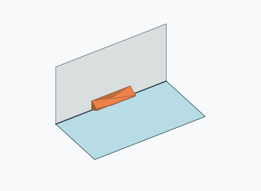
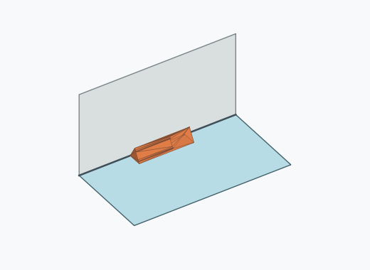
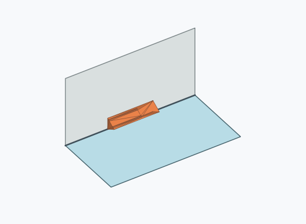
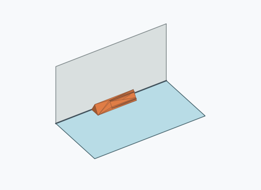
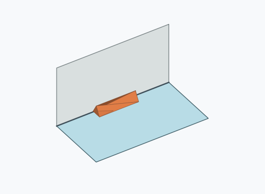
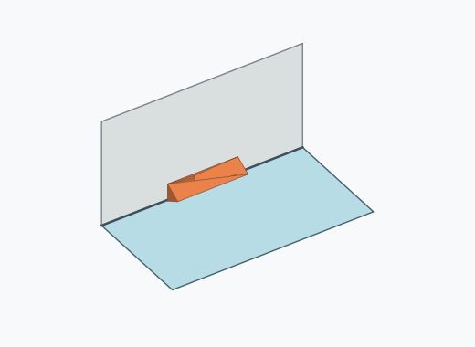
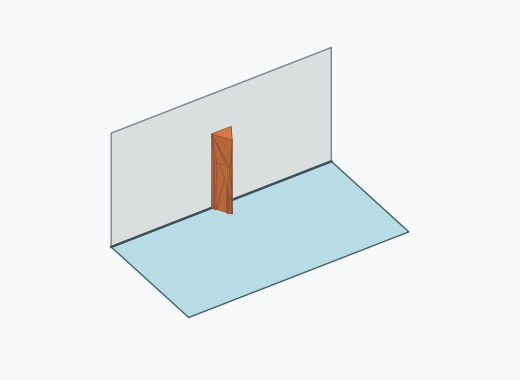
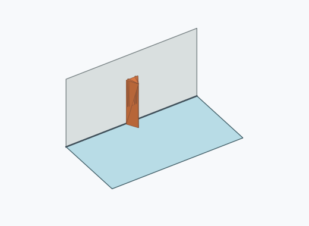
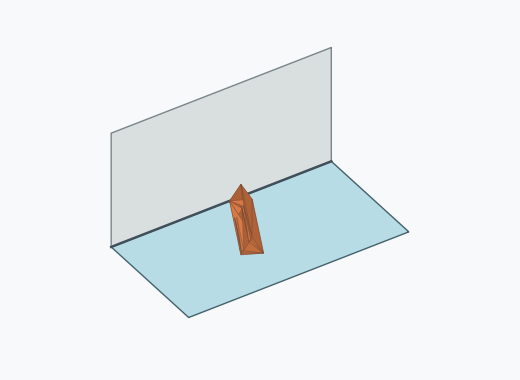

# Dl4a

1000 Fallversuche auf 500 mm Strecke; 1000 eingependelte Endlagen. Prozentangaben beziehen sich auf alle Fallversuche.

Dies sind beobachtete Simulationslagen unter den dokumentierten Parametern; Reibung und Unebenheitsmodell sind noch nicht an realen Häufigkeiten kalibriert.

| Pose | Bild | Anzahl | Anteil | 95-%-Intervall | Anteil eingependelt |
| --- | --- | ---: | ---: | ---: | ---: |
| Dl4a_0004 |  | 179 | 17.90 % | 15.65–20.40 % | 17.90 % |
| Dl4a_0002 |  | 156 | 15.60 % | 13.48–17.98 % | 15.60 % |
| Dl4a_0011 |  | 146 | 14.60 % | 12.55–16.92 % | 14.60 % |
| Dl4a_0021 |  | 127 | 12.70 % | 10.78–14.91 % | 12.70 % |
| Dl4a_0009 |  | 92 | 9.20 % | 7.56–11.15 % | 9.20 % |
| Dl4a_0010 |  | 80 | 8.00 % | 6.47–9.85 % | 8.00 % |
| Dl4a_0022 |  | 68 | 6.80 % | 5.40–8.53 % | 6.80 % |
| Dl4a_0024 |  | 65 | 6.50 % | 5.13–8.20 % | 6.50 % |
| Dl4a_0019 |  | 13 | 1.30 % | 0.76–2.21 % | 1.30 % |
| Dl4a_0018 |  | 12 | 1.20 % | 0.69–2.09 % | 1.20 % |
| Dl4a_0003 |  | 9 | 0.90 % | 0.47–1.70 % | 0.90 % |
| Dl4a_0007 |  | 9 | 0.90 % | 0.47–1.70 % | 0.90 % |
| Dl4a_0012 |  | 9 | 0.90 % | 0.47–1.70 % | 0.90 % |
| Dl4a_0006 |  | 7 | 0.70 % | 0.34–1.44 % | 0.70 % |
| Dl4a_0001 |  | 5 | 0.50 % | 0.21–1.17 % | 0.50 % |
| Dl4a_0008 |  | 4 | 0.40 % | 0.16–1.02 % | 0.40 % |
| Dl4a_0013 |  | 4 | 0.40 % | 0.16–1.02 % | 0.40 % |
| Dl4a_0023 |  | 3 | 0.30 % | 0.10–0.88 % | 0.30 % |
| Dl4a_0025 |  | 3 | 0.30 % | 0.10–0.88 % | 0.30 % |
| Dl4a_0005 |  | 2 | 0.20 % | 0.05–0.73 % | 0.20 % |
| Dl4a_0015 |  | 2 | 0.20 % | 0.05–0.73 % | 0.20 % |
| Dl4a_0014 |  | 1 | 0.10 % | 0.02–0.56 % | 0.10 % |
| Dl4a_0016 |  | 1 | 0.10 % | 0.02–0.56 % | 0.10 % |
| Dl4a_0017 |  | 1 | 0.10 % | 0.02–0.56 % | 0.10 % |
| Dl4a_0020 |  | 1 | 0.10 % | 0.02–0.56 % | 0.10 % |
| Dl4a_0026 |  | 1 | 0.10 % | 0.02–0.56 % | 0.10 % |

Ergebnisstatus: settled: 1000

Details und Erkennung: [JSON](poses.json), [YAML](poses.yaml). Quaternionen: xyzw, Bauteil → Rutsche. Symmetrieoperationen werden rechts an die Bauteilrotation multipliziert. Die kontinuierliche Symmetrieachse wird gerichtet verglichen. Orientierungsabstand ≤5°; bei konkurrierenden Treffern innerhalb 1° bleibt die Zuordnung mehrdeutig.

Die Pose-IDs bleiben über Läufe erhalten. Der Registereintrag einer früher beobachteten, aktuell nicht aufgetretenen Pose bleibt zur Wiedererkennung reserviert.
