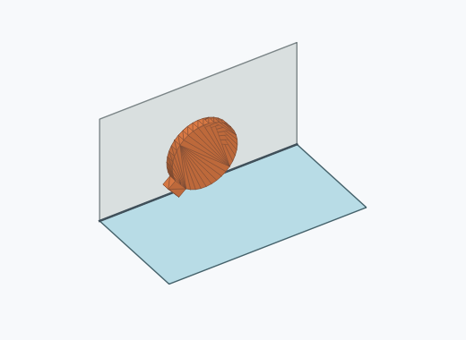
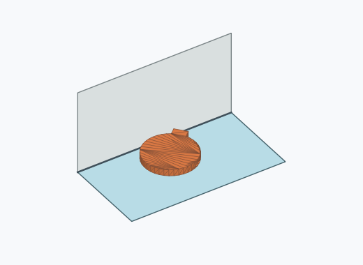
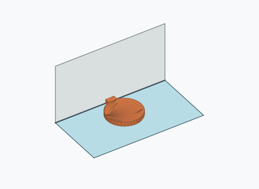

# Kf2a

1000 Fallversuche auf 500 mm Strecke; 762 eingependelte Endlagen. Prozentangaben beziehen sich auf alle Fallversuche.

Dies sind beobachtete Simulationslagen unter den dokumentierten Parametern; Reibung und Unebenheitsmodell sind noch nicht an realen Häufigkeiten kalibriert.

| Pose | Bild | Anzahl | Anteil | 95-%-Intervall | Anteil eingependelt |
| --- | --- | ---: | ---: | ---: | ---: |
| Kf2a_0003 |  | 541 | 54.10 % | 51.00–57.17 % | 71.00 % |
| Kf2a_0001 |  | 216 | 21.60 % | 19.16–24.26 % | 28.35 % |
| Kf2a_0002 |  | 5 | 0.50 % | 0.21–1.17 % | 0.66 % |

Ergebnisstatus: settled: 762, unsettled: 238

Details und Erkennung: [JSON](poses.json), [YAML](poses.yaml). Quaternionen: xyzw, Bauteil → Rutsche. Symmetrieoperationen werden rechts an die Bauteilrotation multipliziert. Die kontinuierliche Symmetrieachse wird gerichtet verglichen. Orientierungsabstand ≤5°; bei konkurrierenden Treffern innerhalb 1° bleibt die Zuordnung mehrdeutig.

Die Pose-IDs bleiben über Läufe erhalten. Der Registereintrag einer früher beobachteten, aktuell nicht aufgetretenen Pose bleibt zur Wiedererkennung reserviert.
