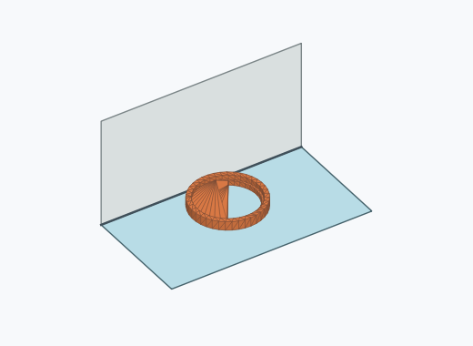
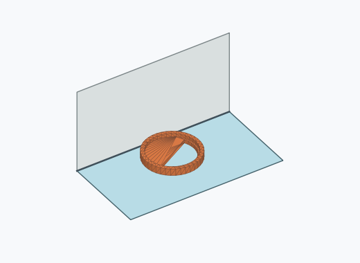
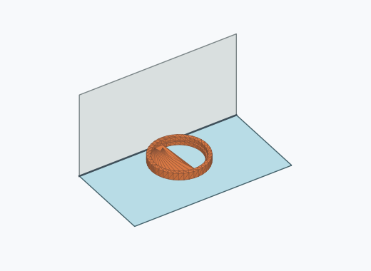
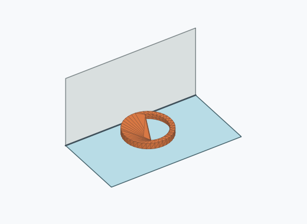
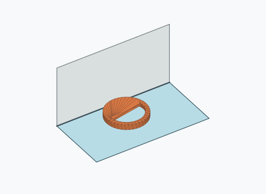
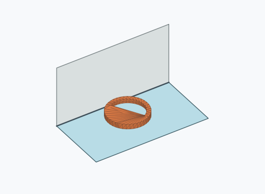
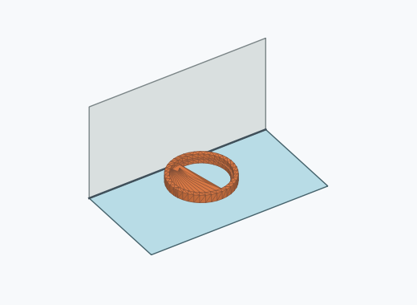
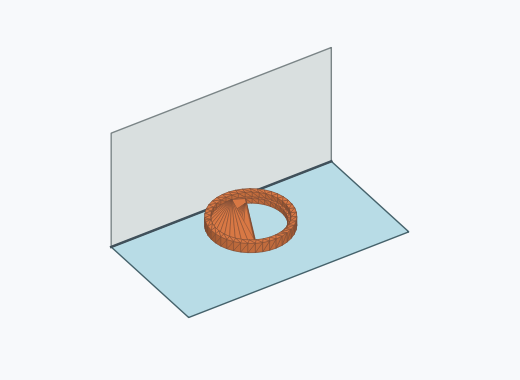
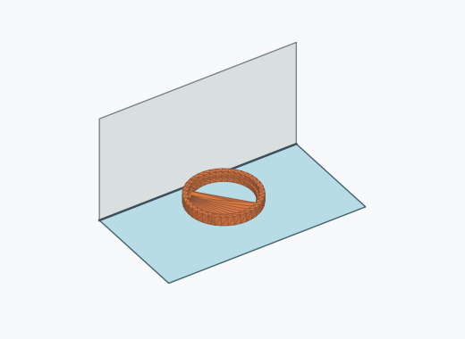
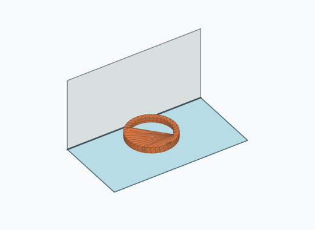

# Kf4i

1000 Fallversuche auf 500 mm Strecke; 132 eingependelte Endlagen. Prozentangaben beziehen sich auf alle Fallversuche.

Dies sind beobachtete Simulationslagen unter den dokumentierten Parametern; Reibung und Unebenheitsmodell sind noch nicht an realen Häufigkeiten kalibriert.

| Pose | Bild | Anzahl | Anteil | 95-%-Intervall | Anteil eingependelt |
| --- | --- | ---: | ---: | ---: | ---: |
| Kf4i_0021 |  | 12 | 1.20 % | 0.69–2.09 % | 9.09 % |
| Kf4i_0024 |  | 11 | 1.10 % | 0.62–1.96 % | 8.33 % |
| Kf4i_0002 |  | 10 | 1.00 % | 0.54–1.83 % | 7.58 % |
| Kf4i_0005 |  | 10 | 1.00 % | 0.54–1.83 % | 7.58 % |
| Kf4i_0004 |  | 8 | 0.80 % | 0.41–1.57 % | 6.06 % |
| Kf4i_0003 |  | 7 | 0.70 % | 0.34–1.44 % | 5.30 % |
| Kf4i_0018 |  | 7 | 0.70 % | 0.34–1.44 % | 5.30 % |
| Kf4i_0014 |  | 6 | 0.60 % | 0.28–1.30 % | 4.55 % |
| Kf4i_0006 |  | 5 | 0.50 % | 0.21–1.17 % | 3.79 % |
| Kf4i_0008 |  | 5 | 0.50 % | 0.21–1.17 % | 3.79 % |
| Kf4i_0013 |  | 5 | 0.50 % | 0.21–1.17 % | 3.79 % |
| Kf4i_0015 |  | 5 | 0.50 % | 0.21–1.17 % | 3.79 % |
| Kf4i_0023 |  | 5 | 0.50 % | 0.21–1.17 % | 3.79 % |
| Kf4i_0001 |  | 4 | 0.40 % | 0.16–1.02 % | 3.03 % |
| Kf4i_0007 |  | 4 | 0.40 % | 0.16–1.02 % | 3.03 % |
| Kf4i_0010 |  | 4 | 0.40 % | 0.16–1.02 % | 3.03 % |
| Kf4i_0011 |  | 4 | 0.40 % | 0.16–1.02 % | 3.03 % |
| Kf4i_0017 |  | 3 | 0.30 % | 0.10–0.88 % | 2.27 % |
| Kf4i_0019 |  | 3 | 0.30 % | 0.10–0.88 % | 2.27 % |
| Kf4i_0022 |  | 3 | 0.30 % | 0.10–0.88 % | 2.27 % |
| Kf4i_0025 |  | 3 | 0.30 % | 0.10–0.88 % | 2.27 % |
| Kf4i_0009 |  | 2 | 0.20 % | 0.05–0.73 % | 1.52 % |
| Kf4i_0016 |  | 2 | 0.20 % | 0.05–0.73 % | 1.52 % |
| Kf4i_0020 |  | 2 | 0.20 % | 0.05–0.73 % | 1.52 % |
| Kf4i_0012 |  | 1 | 0.10 % | 0.02–0.56 % | 0.76 % |
| Kf4i_0026 |  | 1 | 0.10 % | 0.02–0.56 % | 0.76 % |

Ergebnisstatus: unsettled: 868, settled: 132

Details und Erkennung: [JSON](poses.json), [YAML](poses.yaml). Quaternionen: xyzw, Bauteil → Rutsche. Symmetrieoperationen werden rechts an die Bauteilrotation multipliziert. Die kontinuierliche Symmetrieachse wird gerichtet verglichen. Orientierungsabstand ≤5°; bei konkurrierenden Treffern innerhalb 1° bleibt die Zuordnung mehrdeutig.

Die Pose-IDs bleiben über Läufe erhalten. Der Registereintrag einer früher beobachteten, aktuell nicht aufgetretenen Pose bleibt zur Wiedererkennung reserviert.
