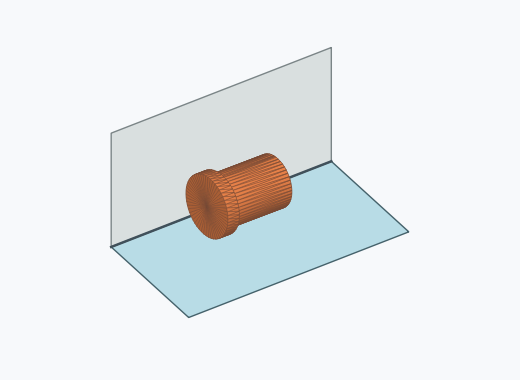
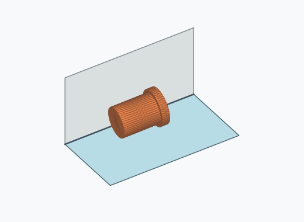
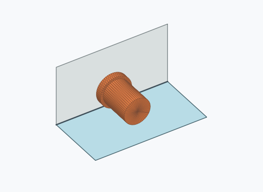

# Kk1a

10000 Fallversuche auf 500 mm Strecke; 2887 eingependelte Endlagen. Prozentangaben beziehen sich auf alle Fallversuche.

Dies sind beobachtete Simulationslagen unter den dokumentierten Parametern; Reibung und Unebenheitsmodell sind noch nicht an realen Häufigkeiten kalibriert.

| Pose | Bild | Anzahl | Anteil | 95-%-Intervall | Anteil eingependelt |
| --- | --- | ---: | ---: | ---: | ---: |
| Kk1a_0001 |  | 1585 | 15.85 % | 15.15–16.58 % | 54.90 % |
| Kk1a_0002 |  | 1294 | 12.94 % | 12.30–13.61 % | 44.82 % |
| Kk1a_0003 |  | 8 | 0.08 % | 0.04–0.16 % | 0.28 % |

Ergebnisstatus: settled: 2887, unsettled: 7113

Details und Erkennung: [JSON](poses.json), [YAML](poses.yaml). Quaternionen: xyzw, Bauteil → Rutsche. Symmetrieoperationen werden rechts an die Bauteilrotation multipliziert. Die kontinuierliche Symmetrieachse wird gerichtet verglichen. Orientierungsabstand ≤5°; bei konkurrierenden Treffern innerhalb 1° bleibt die Zuordnung mehrdeutig.

Die Pose-IDs bleiben über Läufe erhalten. Der Registereintrag einer früher beobachteten, aktuell nicht aufgetretenen Pose bleibt zur Wiedererkennung reserviert.
