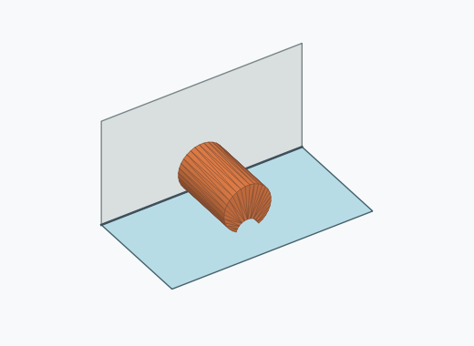
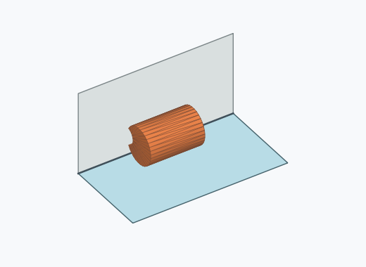
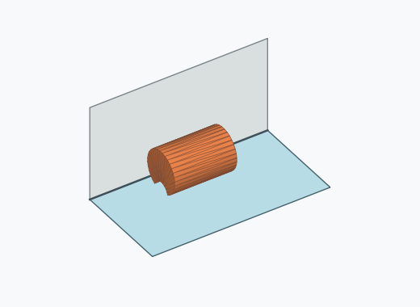
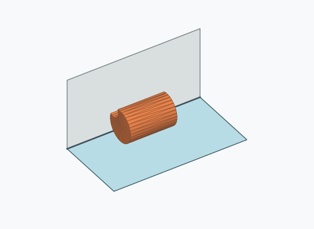
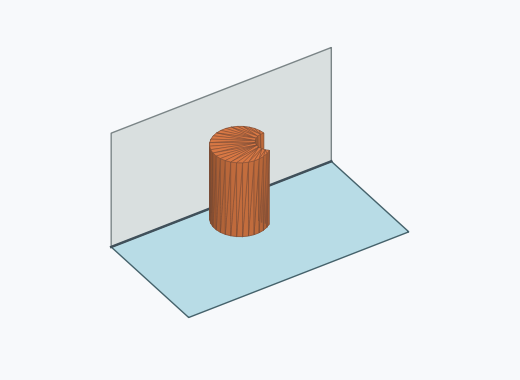
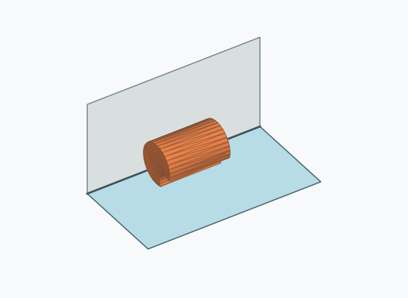

# Kk2i

1000 Fallversuche auf 500 mm Strecke; 840 eingependelte Endlagen. Prozentangaben beziehen sich auf alle Fallversuche.

Dies sind beobachtete Simulationslagen unter den dokumentierten Parametern; Reibung und Unebenheitsmodell sind noch nicht an realen Häufigkeiten kalibriert.

| Pose | Bild | Anzahl | Anteil | 95-%-Intervall | Anteil eingependelt |
| --- | --- | ---: | ---: | ---: | ---: |
| Kk2i_0018 |  | 202 | 20.20 % | 17.83–22.80 % | 24.05 % |
| Kk2i_0017 |  | 76 | 7.60 % | 6.11–9.41 % | 9.05 % |
| Kk2i_0003 |  | 66 | 6.60 % | 5.22–8.31 % | 7.86 % |
| Kk2i_0004 |  | 66 | 6.60 % | 5.22–8.31 % | 7.86 % |
| Kk2i_0016 |  | 34 | 3.40 % | 2.44–4.71 % | 4.05 % |
| Kk2i_0026 |  | 31 | 3.10 % | 2.19–4.37 % | 3.69 % |
| Kk2i_0024 |  | 29 | 2.90 % | 2.03–4.13 % | 3.45 % |
| Kk2i_0005 |  | 27 | 2.70 % | 1.86–3.90 % | 3.21 % |
| Kk2i_0020 |  | 27 | 2.70 % | 1.86–3.90 % | 3.21 % |
| Kk2i_0022 |  | 27 | 2.70 % | 1.86–3.90 % | 3.21 % |
| Kk2i_0015 |  | 25 | 2.50 % | 1.70–3.66 % | 2.98 % |
| Kk2i_0021 |  | 25 | 2.50 % | 1.70–3.66 % | 2.98 % |
| Kk2i_0029 |  | 25 | 2.50 % | 1.70–3.66 % | 2.98 % |
| Kk2i_0030 |  | 25 | 2.50 % | 1.70–3.66 % | 2.98 % |
| Kk2i_0010 |  | 22 | 2.20 % | 1.46–3.31 % | 2.62 % |
| Kk2i_0019 |  | 21 | 2.10 % | 1.38–3.19 % | 2.50 % |
| Kk2i_0008 |  | 19 | 1.90 % | 1.22–2.95 % | 2.26 % |
| Kk2i_0028 |  | 19 | 1.90 % | 1.22–2.95 % | 2.26 % |
| Kk2i_0006 |  | 18 | 1.80 % | 1.14–2.83 % | 2.14 % |
| Kk2i_0027 |  | 12 | 1.20 % | 0.69–2.09 % | 1.43 % |
| Kk2i_0013 |  | 9 | 0.90 % | 0.47–1.70 % | 1.07 % |
| Kk2i_0023 |  | 8 | 0.80 % | 0.41–1.57 % | 0.95 % |
| Kk2i_0025 |  | 7 | 0.70 % | 0.34–1.44 % | 0.83 % |
| Kk2i_0007 |  | 4 | 0.40 % | 0.16–1.02 % | 0.48 % |
| Kk2i_0009 |  | 4 | 0.40 % | 0.16–1.02 % | 0.48 % |
| Kk2i_0012 |  | 4 | 0.40 % | 0.16–1.02 % | 0.48 % |
| Kk2i_0002 |  | 3 | 0.30 % | 0.10–0.88 % | 0.36 % |
| Kk2i_0011 |  | 2 | 0.20 % | 0.05–0.73 % | 0.24 % |
| Kk2i_0014 |  | 2 | 0.20 % | 0.05–0.73 % | 0.24 % |
| Kk2i_0001 |  | 1 | 0.10 % | 0.02–0.56 % | 0.12 % |

Ergebnisstatus: settled: 840, unsettled: 160

Details und Erkennung: [JSON](poses.json), [YAML](poses.yaml). Quaternionen: xyzw, Bauteil → Rutsche. Symmetrieoperationen werden rechts an die Bauteilrotation multipliziert. Die kontinuierliche Symmetrieachse wird gerichtet verglichen. Orientierungsabstand ≤5°; bei konkurrierenden Treffern innerhalb 1° bleibt die Zuordnung mehrdeutig.

Die Pose-IDs bleiben über Läufe erhalten. Der Registereintrag einer früher beobachteten, aktuell nicht aufgetretenen Pose bleibt zur Wiedererkennung reserviert.
