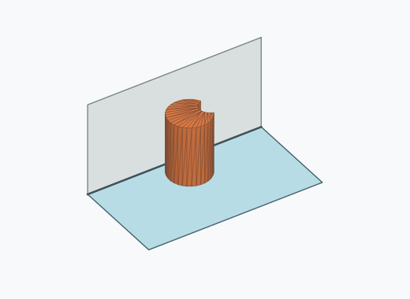

# Kk2i

10000 Fallversuche auf 500 mm Strecke; 8448 eingependelte Endlagen. Prozentangaben beziehen sich auf alle Fallversuche.

Dies sind beobachtete Simulationslagen unter den dokumentierten Parametern; Reibung und Unebenheitsmodell sind noch nicht an realen Häufigkeiten kalibriert.

| Pose | Bild | Anzahl | Anteil | 95-%-Intervall | Anteil eingependelt |
| --- | --- | ---: | ---: | ---: | ---: |
| Kk2i_0018 |  | 2023 | 20.23 % | 19.45–21.03 % | 23.95 % |
| Kk2i_0017 |  | 833 | 8.33 % | 7.80–8.89 % | 9.86 % |
| Kk2i_0003 |  | 773 | 7.73 % | 7.22–8.27 % | 9.15 % |
| Kk2i_0004 |  | 661 | 6.61 % | 6.14–7.11 % | 7.82 % |
| Kk2i_0024 |  | 321 | 3.21 % | 2.88–3.57 % | 3.80 % |
| Kk2i_0026 |  | 315 | 3.15 % | 2.83–3.51 % | 3.73 % |
| Kk2i_0015 |  | 253 | 2.53 % | 2.24–2.86 % | 2.99 % |
| Kk2i_0021 |  | 253 | 2.53 % | 2.24–2.86 % | 2.99 % |
| Kk2i_0016 |  | 246 | 2.46 % | 2.17–2.78 % | 2.91 % |
| Kk2i_0029 |  | 242 | 2.42 % | 2.14–2.74 % | 2.86 % |
| Kk2i_0030 |  | 242 | 2.42 % | 2.14–2.74 % | 2.86 % |
| Kk2i_0020 |  | 236 | 2.36 % | 2.08–2.68 % | 2.79 % |
| Kk2i_0028 |  | 236 | 2.36 % | 2.08–2.68 % | 2.79 % |
| Kk2i_0022 |  | 233 | 2.33 % | 2.05–2.64 % | 2.76 % |
| Kk2i_0019 |  | 223 | 2.23 % | 1.96–2.54 % | 2.64 % |
| Kk2i_0005 |  | 210 | 2.10 % | 1.84–2.40 % | 2.49 % |
| Kk2i_0006 |  | 209 | 2.09 % | 1.83–2.39 % | 2.47 % |
| Kk2i_0008 |  | 184 | 1.84 % | 1.59–2.12 % | 2.18 % |
| Kk2i_0010 |  | 165 | 1.65 % | 1.42–1.92 % | 1.95 % |
| Kk2i_0027 |  | 123 | 1.23 % | 1.03–1.47 % | 1.46 % |
| Kk2i_0012 |  | 91 | 0.91 % | 0.74–1.12 % | 1.08 % |
| Kk2i_0023 |  | 83 | 0.83 % | 0.67–1.03 % | 0.98 % |
| Kk2i_0025 |  | 79 | 0.79 % | 0.63–0.98 % | 0.94 % |
| Kk2i_0013 |  | 77 | 0.77 % | 0.62–0.96 % | 0.91 % |
| Kk2i_0007 |  | 44 | 0.44 % | 0.33–0.59 % | 0.52 % |
| Kk2i_0011 |  | 34 | 0.34 % | 0.24–0.47 % | 0.40 % |
| Kk2i_0009 |  | 28 | 0.28 % | 0.19–0.40 % | 0.33 % |
| Kk2i_0014 |  | 21 | 0.21 % | 0.14–0.32 % | 0.25 % |
| Kk2i_0001 |  | 5 | 0.05 % | 0.02–0.12 % | 0.06 % |
| Kk2i_0002 |  | 4 | 0.04 % | 0.02–0.10 % | 0.05 % |
| Kk2i_0031 |  | 1 | 0.01 % | 0.00–0.06 % | 0.01 % |

Ergebnisstatus: settled: 8448, unsettled: 1552

Details und Erkennung: [JSON](poses.json), [YAML](poses.yaml). Quaternionen: xyzw, Bauteil → Rutsche. Symmetrieoperationen werden rechts an die Bauteilrotation multipliziert. Die kontinuierliche Symmetrieachse wird gerichtet verglichen. Orientierungsabstand ≤5°; bei konkurrierenden Treffern innerhalb 1° bleibt die Zuordnung mehrdeutig.

Die Pose-IDs bleiben über Läufe erhalten. Der Registereintrag einer früher beobachteten, aktuell nicht aufgetretenen Pose bleibt zur Wiedererkennung reserviert.
