# Kk4a

10000 Fallversuche auf 500 mm Strecke; 7726 eingependelte Endlagen. Prozentangaben beziehen sich auf alle Fallversuche.

Dies sind beobachtete Simulationslagen unter den dokumentierten Parametern; Reibung und Unebenheitsmodell sind noch nicht an realen Häufigkeiten kalibriert.

| Pose | Bild | Anzahl | Anteil | 95-%-Intervall | Anteil eingependelt |
| --- | --- | ---: | ---: | ---: | ---: |
| Kk4a_0018 |  | 173 | 1.73 % | 1.49–2.00 % | 2.24 % |
| Kk4a_0053 |  | 123 | 1.23 % | 1.03–1.47 % | 1.59 % |
| Kk4a_0097 |  | 106 | 1.06 % | 0.88–1.28 % | 1.37 % |
| Kk4a_0009 |  | 102 | 1.02 % | 0.84–1.24 % | 1.32 % |
| Kk4a_0089 |  | 99 | 0.99 % | 0.81–1.20 % | 1.28 % |
| Kk4a_0093 |  | 98 | 0.98 % | 0.80–1.19 % | 1.27 % |
| Kk4a_0050 |  | 94 | 0.94 % | 0.77–1.15 % | 1.22 % |
| Kk4a_0070 |  | 94 | 0.94 % | 0.77–1.15 % | 1.22 % |
| Kk4a_0109 |  | 94 | 0.94 % | 0.77–1.15 % | 1.22 % |
| Kk4a_0033 |  | 89 | 0.89 % | 0.72–1.09 % | 1.15 % |
| Kk4a_0038 |  | 89 | 0.89 % | 0.72–1.09 % | 1.15 % |
| Kk4a_0014 |  | 88 | 0.88 % | 0.71–1.08 % | 1.14 % |
| Kk4a_0066 |  | 88 | 0.88 % | 0.71–1.08 % | 1.14 % |
| Kk4a_0103 |  | 88 | 0.88 % | 0.71–1.08 % | 1.14 % |
| Kk4a_0057 |  | 87 | 0.87 % | 0.71–1.07 % | 1.13 % |
| Kk4a_0021 |  | 86 | 0.86 % | 0.70–1.06 % | 1.11 % |
| Kk4a_0113 |  | 86 | 0.86 % | 0.70–1.06 % | 1.11 % |
| Kk4a_0046 |  | 83 | 0.83 % | 0.67–1.03 % | 1.07 % |
| Kk4a_0105 |  | 83 | 0.83 % | 0.67–1.03 % | 1.07 % |
| Kk4a_0006 |  | 82 | 0.82 % | 0.66–1.02 % | 1.06 % |
| Kk4a_0061 | 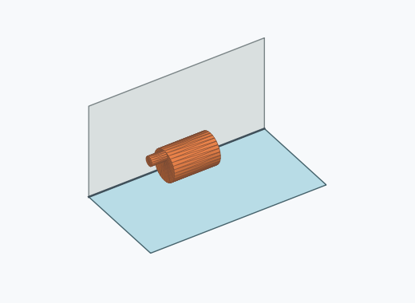 | 81 | 0.81 % | 0.65–1.01 % | 1.05 % |
| Kk4a_0013 |  | 80 | 0.80 % | 0.64–0.99 % | 1.04 % |
| Kk4a_0025 |  | 79 | 0.79 % | 0.63–0.98 % | 1.02 % |
| Kk4a_0102 |  | 78 | 0.78 % | 0.63–0.97 % | 1.01 % |
| Kk4a_0002 |  | 76 | 0.76 % | 0.61–0.95 % | 0.98 % |
| Kk4a_0008 |  | 76 | 0.76 % | 0.61–0.95 % | 0.98 % |
| Kk4a_0010 |  | 76 | 0.76 % | 0.61–0.95 % | 0.98 % |
| Kk4a_0035 |  | 76 | 0.76 % | 0.61–0.95 % | 0.98 % |
| Kk4a_0074 |  | 76 | 0.76 % | 0.61–0.95 % | 0.98 % |
| Kk4a_0077 |  | 76 | 0.76 % | 0.61–0.95 % | 0.98 % |
| Kk4a_0078 |  | 76 | 0.76 % | 0.61–0.95 % | 0.98 % |
| Kk4a_0082 |  | 76 | 0.76 % | 0.61–0.95 % | 0.98 % |
| Kk4a_0118 |  | 76 | 0.76 % | 0.61–0.95 % | 0.98 % |
| Kk4a_0017 |  | 75 | 0.75 % | 0.60–0.94 % | 0.97 % |
| Kk4a_0030 |  | 74 | 0.74 % | 0.59–0.93 % | 0.96 % |
| Kk4a_0022 |  | 73 | 0.73 % | 0.58–0.92 % | 0.94 % |
| Kk4a_0086 |  | 72 | 0.72 % | 0.57–0.91 % | 0.93 % |
| Kk4a_0099 | 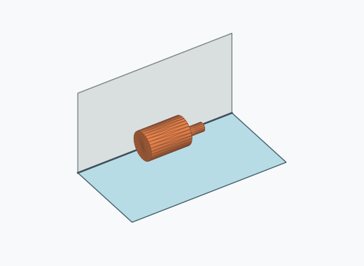 | 72 | 0.72 % | 0.57–0.91 % | 0.93 % |
| Kk4a_0012 |  | 71 | 0.71 % | 0.56–0.89 % | 0.92 % |
| Kk4a_0029 | 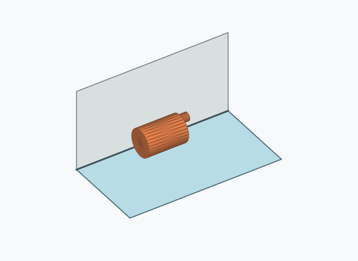 | 71 | 0.71 % | 0.56–0.89 % | 0.92 % |
| Kk4a_0031 |  | 71 | 0.71 % | 0.56–0.89 % | 0.92 % |
| Kk4a_0095 |  | 71 | 0.71 % | 0.56–0.89 % | 0.92 % |
| Kk4a_0020 |  | 70 | 0.70 % | 0.55–0.88 % | 0.91 % |
| Kk4a_0048 |  | 70 | 0.70 % | 0.55–0.88 % | 0.91 % |
| Kk4a_0085 |  | 70 | 0.70 % | 0.55–0.88 % | 0.91 % |
| Kk4a_0026 |  | 69 | 0.69 % | 0.55–0.87 % | 0.89 % |
| Kk4a_0041 |  | 69 | 0.69 % | 0.55–0.87 % | 0.89 % |
| Kk4a_0005 |  | 68 | 0.68 % | 0.54–0.86 % | 0.88 % |
| Kk4a_0037 |  | 66 | 0.66 % | 0.52–0.84 % | 0.85 % |
| Kk4a_0060 |  | 66 | 0.66 % | 0.52–0.84 % | 0.85 % |
| Kk4a_0117 |  | 66 | 0.66 % | 0.52–0.84 % | 0.85 % |
| Kk4a_0015 |  | 65 | 0.65 % | 0.51–0.83 % | 0.84 % |
| Kk4a_0019 | 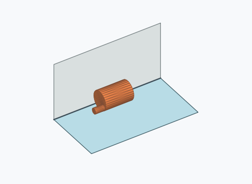 | 65 | 0.65 % | 0.51–0.83 % | 0.84 % |
| Kk4a_0027 |  | 65 | 0.65 % | 0.51–0.83 % | 0.84 % |
| Kk4a_0039 |  | 65 | 0.65 % | 0.51–0.83 % | 0.84 % |
| Kk4a_0094 | 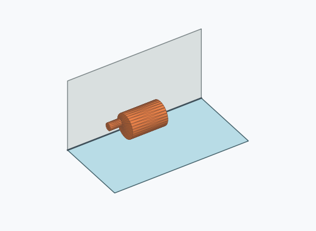 | 65 | 0.65 % | 0.51–0.83 % | 0.84 % |
| Kk4a_0107 |  | 64 | 0.64 % | 0.50–0.82 % | 0.83 % |
| Kk4a_0081 |  | 62 | 0.62 % | 0.48–0.79 % | 0.80 % |
| Kk4a_0090 |  | 62 | 0.62 % | 0.48–0.79 % | 0.80 % |
| Kk4a_0112 |  | 62 | 0.62 % | 0.48–0.79 % | 0.80 % |
| Kk4a_0054 |  | 61 | 0.61 % | 0.48–0.78 % | 0.79 % |
| Kk4a_0073 |  | 61 | 0.61 % | 0.48–0.78 % | 0.79 % |
| Kk4a_0016 |  | 60 | 0.60 % | 0.47–0.77 % | 0.78 % |
| Kk4a_0098 |  | 60 | 0.60 % | 0.47–0.77 % | 0.78 % |
| Kk4a_0114 |  | 60 | 0.60 % | 0.47–0.77 % | 0.78 % |
| Kk4a_0043 |  | 59 | 0.59 % | 0.46–0.76 % | 0.76 % |
| Kk4a_0072 |  | 59 | 0.59 % | 0.46–0.76 % | 0.76 % |
| Kk4a_0007 |  | 58 | 0.58 % | 0.45–0.75 % | 0.75 % |
| Kk4a_0024 |  | 58 | 0.58 % | 0.45–0.75 % | 0.75 % |
| Kk4a_0051 |  | 58 | 0.58 % | 0.45–0.75 % | 0.75 % |
| Kk4a_0119 |  | 58 | 0.58 % | 0.45–0.75 % | 0.75 % |
| Kk4a_0055 |  | 57 | 0.57 % | 0.44–0.74 % | 0.74 % |
| Kk4a_0106 |  | 57 | 0.57 % | 0.44–0.74 % | 0.74 % |
| Kk4a_0011 | 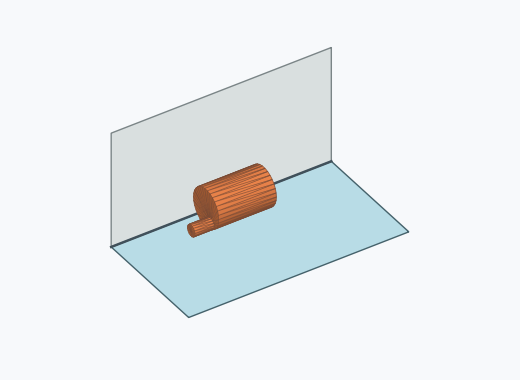 | 56 | 0.56 % | 0.43–0.73 % | 0.72 % |
| Kk4a_0049 |  | 56 | 0.56 % | 0.43–0.73 % | 0.72 % |
| Kk4a_0087 |  | 56 | 0.56 % | 0.43–0.73 % | 0.72 % |
| Kk4a_0004 |  | 55 | 0.55 % | 0.42–0.72 % | 0.71 % |
| Kk4a_0110 |  | 55 | 0.55 % | 0.42–0.72 % | 0.71 % |
| Kk4a_0003 |  | 54 | 0.54 % | 0.41–0.70 % | 0.70 % |
| Kk4a_0047 |  | 54 | 0.54 % | 0.41–0.70 % | 0.70 % |
| Kk4a_0120 |  | 54 | 0.54 % | 0.41–0.70 % | 0.70 % |
| Kk4a_0042 |  | 53 | 0.53 % | 0.41–0.69 % | 0.69 % |
| Kk4a_0084 |  | 53 | 0.53 % | 0.41–0.69 % | 0.69 % |
| Kk4a_0023 |  | 52 | 0.52 % | 0.40–0.68 % | 0.67 % |
| Kk4a_0028 |  | 52 | 0.52 % | 0.40–0.68 % | 0.67 % |
| Kk4a_0044 |  | 52 | 0.52 % | 0.40–0.68 % | 0.67 % |
| Kk4a_0065 |  | 52 | 0.52 % | 0.40–0.68 % | 0.67 % |
| Kk4a_0052 |  | 51 | 0.51 % | 0.39–0.67 % | 0.66 % |
| Kk4a_0064 |  | 51 | 0.51 % | 0.39–0.67 % | 0.66 % |
| Kk4a_0091 | 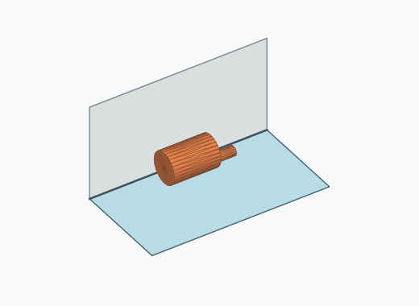 | 51 | 0.51 % | 0.39–0.67 % | 0.66 % |
| Kk4a_0101 |  | 51 | 0.51 % | 0.39–0.67 % | 0.66 % |
| Kk4a_0045 |  | 50 | 0.50 % | 0.38–0.66 % | 0.65 % |
| Kk4a_0076 |  | 50 | 0.50 % | 0.38–0.66 % | 0.65 % |
| Kk4a_0001 |  | 49 | 0.49 % | 0.37–0.65 % | 0.63 % |
| Kk4a_0056 |  | 48 | 0.48 % | 0.36–0.64 % | 0.62 % |
| Kk4a_0058 |  | 48 | 0.48 % | 0.36–0.64 % | 0.62 % |
| Kk4a_0071 |  | 48 | 0.48 % | 0.36–0.64 % | 0.62 % |
| Kk4a_0088 |  | 48 | 0.48 % | 0.36–0.64 % | 0.62 % |
| Kk4a_0096 |  | 48 | 0.48 % | 0.36–0.64 % | 0.62 % |
| Kk4a_0111 | 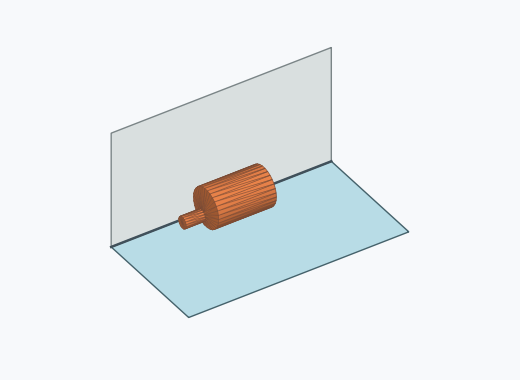 | 48 | 0.48 % | 0.36–0.64 % | 0.62 % |
| Kk4a_0069 |  | 47 | 0.47 % | 0.35–0.62 % | 0.61 % |
| Kk4a_0115 |  | 47 | 0.47 % | 0.35–0.62 % | 0.61 % |
| Kk4a_0080 |  | 46 | 0.46 % | 0.35–0.61 % | 0.60 % |
| Kk4a_0062 |  | 45 | 0.45 % | 0.34–0.60 % | 0.58 % |
| Kk4a_0034 |  | 44 | 0.44 % | 0.33–0.59 % | 0.57 % |
| Kk4a_0068 |  | 44 | 0.44 % | 0.33–0.59 % | 0.57 % |
| Kk4a_0079 | 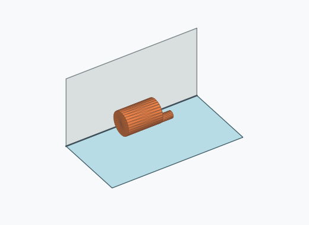 | 44 | 0.44 % | 0.33–0.59 % | 0.57 % |
| Kk4a_0100 |  | 43 | 0.43 % | 0.32–0.58 % | 0.56 % |
| Kk4a_0059 |  | 42 | 0.42 % | 0.31–0.57 % | 0.54 % |
| Kk4a_0108 |  | 41 | 0.41 % | 0.30–0.56 % | 0.53 % |
| Kk4a_0040 |  | 40 | 0.40 % | 0.29–0.54 % | 0.52 % |
| Kk4a_0104 | 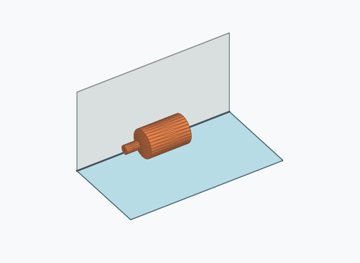 | 40 | 0.40 % | 0.29–0.54 % | 0.52 % |
| Kk4a_0116 |  | 40 | 0.40 % | 0.29–0.54 % | 0.52 % |
| Kk4a_0067 |  | 39 | 0.39 % | 0.29–0.53 % | 0.50 % |
| Kk4a_0036 |  | 35 | 0.35 % | 0.25–0.49 % | 0.45 % |
| Kk4a_0083 |  | 35 | 0.35 % | 0.25–0.49 % | 0.45 % |
| Kk4a_0092 |  | 34 | 0.34 % | 0.24–0.47 % | 0.44 % |
| Kk4a_0075 |  | 32 | 0.32 % | 0.23–0.45 % | 0.41 % |
| Kk4a_0032 |  | 29 | 0.29 % | 0.20–0.42 % | 0.38 % |
| Kk4a_0063 |  | 24 | 0.24 % | 0.16–0.36 % | 0.31 % |
| Kk4a_0121 | 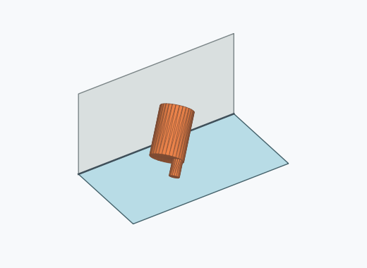 | 1 | 0.01 % | 0.00–0.06 % | 0.01 % |

Ergebnisstatus: settled: 7726, unsettled: 2274

Details und Erkennung: [JSON](poses.json), [YAML](poses.yaml). Quaternionen: xyzw, Bauteil → Rutsche. Symmetrieoperationen werden rechts an die Bauteilrotation multipliziert. Die kontinuierliche Symmetrieachse wird gerichtet verglichen. Orientierungsabstand ≤5°; bei konkurrierenden Treffern innerhalb 1° bleibt die Zuordnung mehrdeutig.

Die Pose-IDs bleiben über Läufe erhalten. Der Registereintrag einer früher beobachteten, aktuell nicht aufgetretenen Pose bleibt zur Wiedererkennung reserviert.
