# Kl2a

10000 Fallversuche auf 500 mm Strecke; 9912 eingependelte Endlagen. Prozentangaben beziehen sich auf alle Fallversuche.

Dies sind beobachtete Simulationslagen unter den dokumentierten Parametern; Reibung und Unebenheitsmodell sind noch nicht an realen Häufigkeiten kalibriert.

| Pose | Bild | Anzahl | Anteil | 95-%-Intervall | Anteil eingependelt |
| --- | --- | ---: | ---: | ---: | ---: |
| Kl2a_0007 |  | 1780 | 17.80 % | 17.06–18.56 % | 17.96 % |
| Kl2a_0008 | 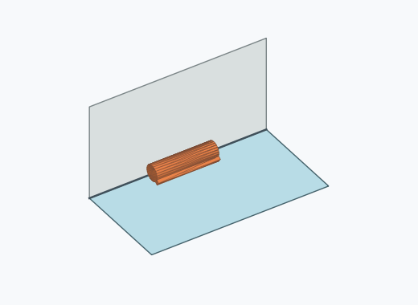 | 1195 | 11.95 % | 11.33–12.60 % | 12.06 % |
| Kl2a_0018 |  | 867 | 8.67 % | 8.13–9.24 % | 8.75 % |
| Kl2a_0009 |  | 628 | 6.28 % | 5.82–6.77 % | 6.34 % |
| Kl2a_0015 | 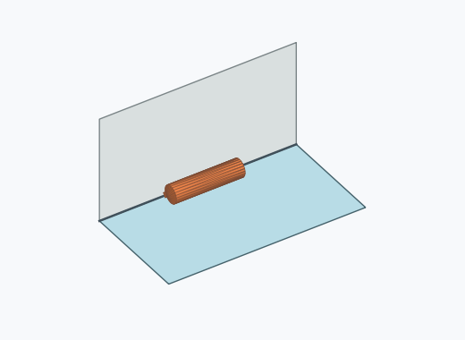 | 607 | 6.07 % | 5.62–6.56 % | 6.12 % |
| Kl2a_0006 |  | 518 | 5.18 % | 4.76–5.63 % | 5.23 % |
| Kl2a_0011 |  | 482 | 4.82 % | 4.42–5.26 % | 4.86 % |
| Kl2a_0019 | 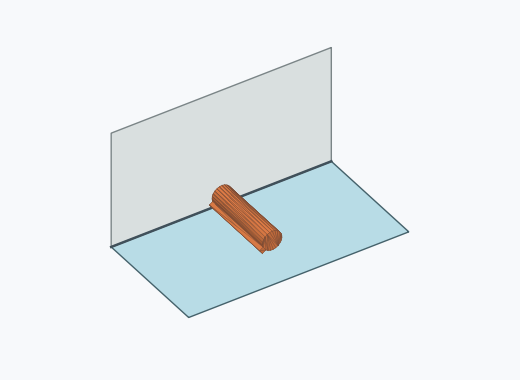 | 425 | 4.25 % | 3.87–4.66 % | 4.29 % |
| Kl2a_0017 | 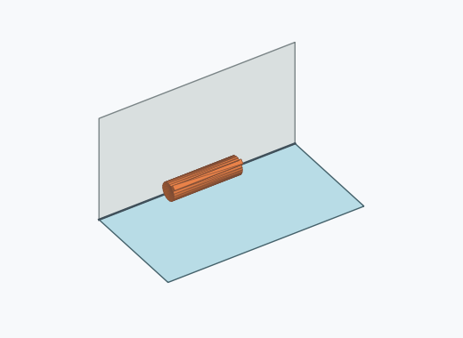 | 408 | 4.08 % | 3.71–4.49 % | 4.12 % |
| Kl2a_0003 |  | 395 | 3.95 % | 3.59–4.35 % | 3.99 % |
| Kl2a_0014 |  | 387 | 3.87 % | 3.51–4.27 % | 3.90 % |
| Kl2a_0013 | 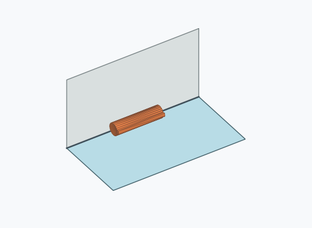 | 380 | 3.80 % | 3.44–4.19 % | 3.83 % |
| Kl2a_0020 |  | 374 | 3.74 % | 3.39–4.13 % | 3.77 % |
| Kl2a_0022 |  | 364 | 3.64 % | 3.29–4.03 % | 3.67 % |
| Kl2a_0002 |  | 354 | 3.54 % | 3.20–3.92 % | 3.57 % |
| Kl2a_0012 | 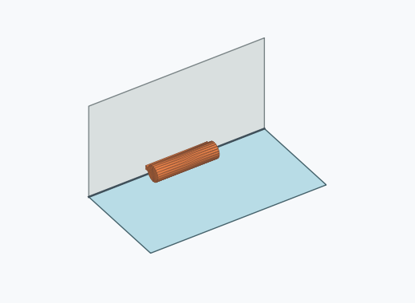 | 338 | 3.38 % | 3.04–3.75 % | 3.41 % |
| Kl2a_0001 |  | 187 | 1.87 % | 1.62–2.15 % | 1.89 % |
| Kl2a_0004 | 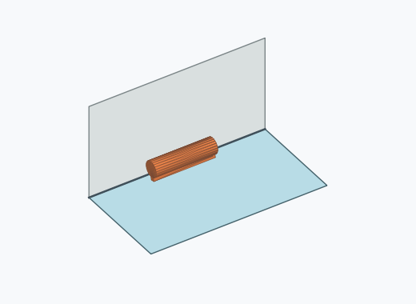 | 68 | 0.68 % | 0.54–0.86 % | 0.69 % |
| Kl2a_0021 |  | 58 | 0.58 % | 0.45–0.75 % | 0.59 % |
| Kl2a_0010 |  | 33 | 0.33 % | 0.24–0.46 % | 0.33 % |
| Kl2a_0005 | 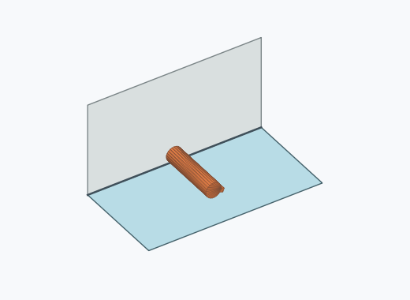 | 29 | 0.29 % | 0.20–0.42 % | 0.29 % |
| Kl2a_0016 |  | 16 | 0.16 % | 0.10–0.26 % | 0.16 % |
| Kl2a_0024 | 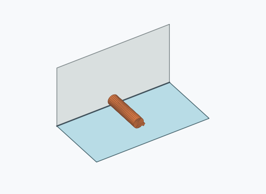 | 11 | 0.11 % | 0.06–0.20 % | 0.11 % |
| Kl2a_0025 | 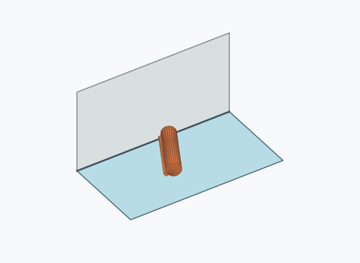 | 3 | 0.03 % | 0.01–0.09 % | 0.03 % |
| Kl2a_0026 |  | 2 | 0.02 % | 0.01–0.07 % | 0.02 % |
| Kl2a_0027 | 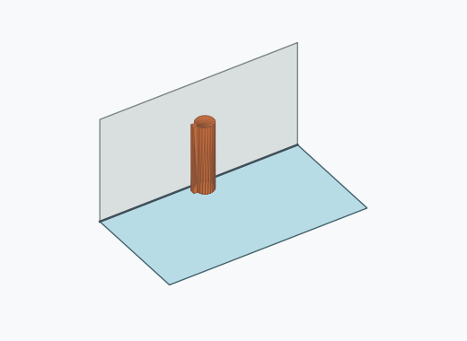 | 2 | 0.02 % | 0.01–0.07 % | 0.02 % |
| Kl2a_0023 |  | 1 | 0.01 % | 0.00–0.06 % | 0.01 % |

Ergebnisstatus: settled: 9912, unsettled: 88

Details und Erkennung: [JSON](poses.json), [YAML](poses.yaml). Quaternionen: xyzw, Bauteil → Rutsche. Symmetrieoperationen werden rechts an die Bauteilrotation multipliziert. Die kontinuierliche Symmetrieachse wird gerichtet verglichen. Orientierungsabstand ≤5°; bei konkurrierenden Treffern innerhalb 1° bleibt die Zuordnung mehrdeutig.

Die Pose-IDs bleiben über Läufe erhalten. Der Registereintrag einer früher beobachteten, aktuell nicht aufgetretenen Pose bleibt zur Wiedererkennung reserviert.
