# Kl4i

1000 Fallversuche auf 500 mm Strecke; 969 eingependelte Endlagen. Prozentangaben beziehen sich auf alle Fallversuche.

Dies sind beobachtete Simulationslagen unter den dokumentierten Parametern; Reibung und Unebenheitsmodell sind noch nicht an realen Häufigkeiten kalibriert.

| Pose | Bild | Anzahl | Anteil | 95-%-Intervall | Anteil eingependelt |
| --- | --- | ---: | ---: | ---: | ---: |
| Kl4i_0008 |  | 119 | 11.90 % | 10.04–14.05 % | 12.28 % |
| Kl4i_0028 |  | 79 | 7.90 % | 6.38–9.74 % | 8.15 % |
| Kl4i_0030 |  | 65 | 6.50 % | 5.13–8.20 % | 6.71 % |
| Kl4i_0010 | 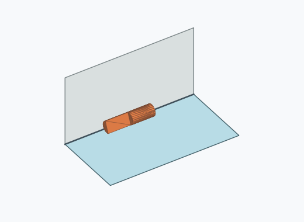 | 52 | 5.20 % | 3.99–6.76 % | 5.37 % |
| Kl4i_0012 | 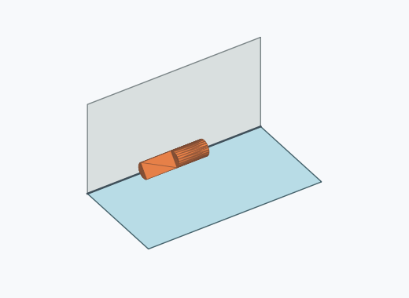 | 44 | 4.40 % | 3.29–5.86 % | 4.54 % |
| Kl4i_0014 |  | 39 | 3.90 % | 2.87–5.29 % | 4.02 % |
| Kl4i_0020 |  | 38 | 3.80 % | 2.78–5.17 % | 3.92 % |
| Kl4i_0024 | 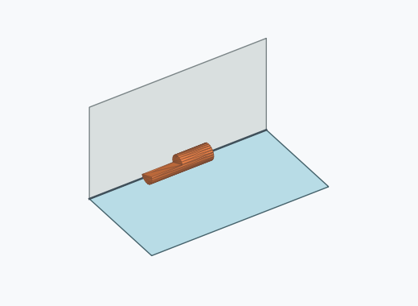 | 38 | 3.80 % | 2.78–5.17 % | 3.92 % |
| Kl4i_0034 |  | 35 | 3.50 % | 2.53–4.83 % | 3.61 % |
| Kl4i_0001 | 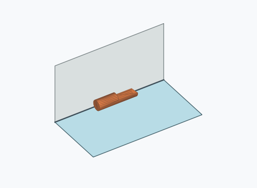 | 32 | 3.20 % | 2.28–4.48 % | 3.30 % |
| Kl4i_0032 | 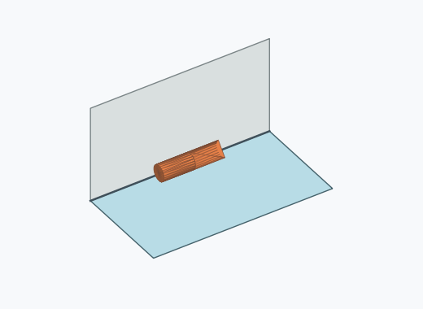 | 32 | 3.20 % | 2.28–4.48 % | 3.30 % |
| Kl4i_0017 |  | 30 | 3.00 % | 2.11–4.25 % | 3.10 % |
| Kl4i_0023 |  | 28 | 2.80 % | 1.94–4.02 % | 2.89 % |
| Kl4i_0038 |  | 28 | 2.80 % | 1.94–4.02 % | 2.89 % |
| Kl4i_0027 |  | 27 | 2.70 % | 1.86–3.90 % | 2.79 % |
| Kl4i_0018 |  | 23 | 2.30 % | 1.54–3.43 % | 2.37 % |
| Kl4i_0036 |  | 23 | 2.30 % | 1.54–3.43 % | 2.37 % |
| Kl4i_0002 | 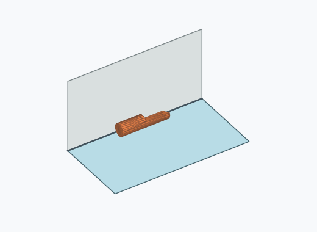 | 22 | 2.20 % | 1.46–3.31 % | 2.27 % |
| Kl4i_0005 |  | 20 | 2.00 % | 1.30–3.07 % | 2.06 % |
| Kl4i_0011 |  | 18 | 1.80 % | 1.14–2.83 % | 1.86 % |
| Kl4i_0003 | 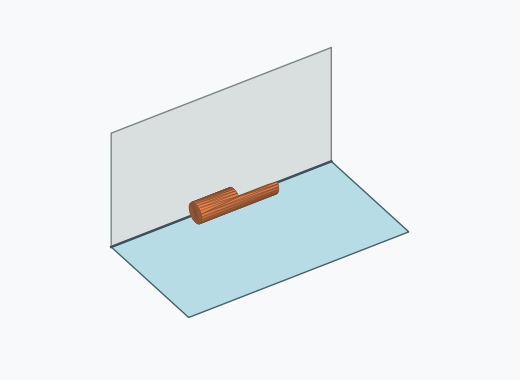 | 15 | 1.50 % | 0.91–2.46 % | 1.55 % |
| Kl4i_0004 |  | 14 | 1.40 % | 0.84–2.34 % | 1.44 % |
| Kl4i_0007 |  | 14 | 1.40 % | 0.84–2.34 % | 1.44 % |
| Kl4i_0013 |  | 14 | 1.40 % | 0.84–2.34 % | 1.44 % |
| Kl4i_0022 | 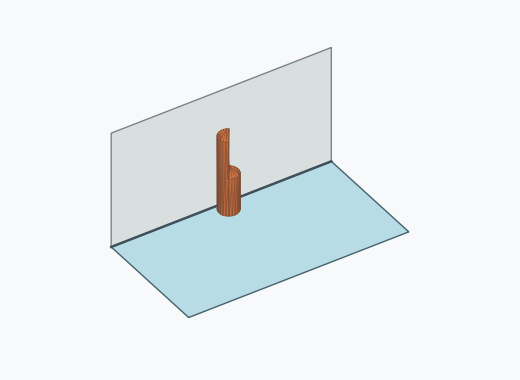 | 14 | 1.40 % | 0.84–2.34 % | 1.44 % |
| Kl4i_0009 | 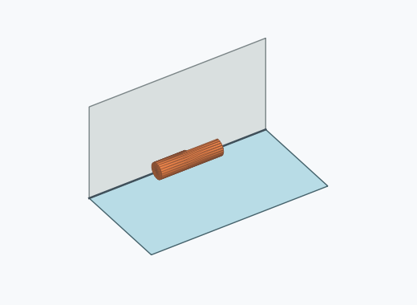 | 13 | 1.30 % | 0.76–2.21 % | 1.34 % |
| Kl4i_0006 | 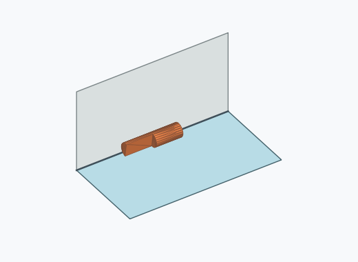 | 12 | 1.20 % | 0.69–2.09 % | 1.24 % |
| Kl4i_0031 |  | 11 | 1.10 % | 0.62–1.96 % | 1.14 % |
| Kl4i_0019 | 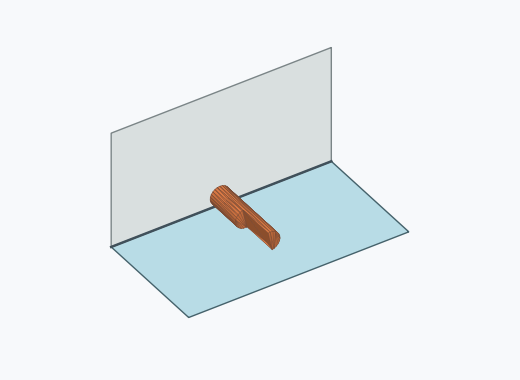 | 10 | 1.00 % | 0.54–1.83 % | 1.03 % |
| Kl4i_0035 | 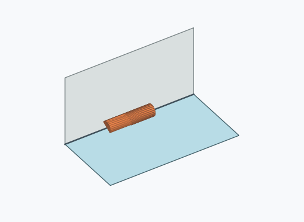 | 10 | 1.00 % | 0.54–1.83 % | 1.03 % |
| Kl4i_0016 |  | 9 | 0.90 % | 0.47–1.70 % | 0.93 % |
| Kl4i_0033 |  | 9 | 0.90 % | 0.47–1.70 % | 0.93 % |
| Kl4i_0025 |  | 8 | 0.80 % | 0.41–1.57 % | 0.83 % |
| Kl4i_0029 |  | 7 | 0.70 % | 0.34–1.44 % | 0.72 % |
| Kl4i_0015 |  | 5 | 0.50 % | 0.21–1.17 % | 0.52 % |
| Kl4i_0026 | 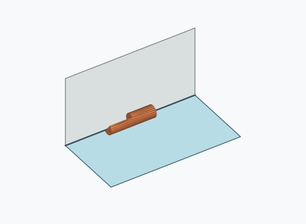 | 5 | 0.50 % | 0.21–1.17 % | 0.52 % |
| Kl4i_0021 | 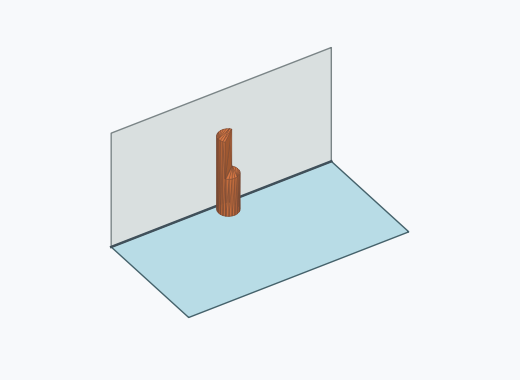 | 4 | 0.40 % | 0.16–1.02 % | 0.41 % |
| Kl4i_0037 |  | 3 | 0.30 % | 0.10–0.88 % | 0.31 % |

Ergebnisstatus: settled: 969, unsettled: 31

Details und Erkennung: [JSON](poses.json), [YAML](poses.yaml). Quaternionen: xyzw, Bauteil → Rutsche. Symmetrieoperationen werden rechts an die Bauteilrotation multipliziert. Die kontinuierliche Symmetrieachse wird gerichtet verglichen. Orientierungsabstand ≤5°; bei konkurrierenden Treffern innerhalb 1° bleibt die Zuordnung mehrdeutig.

Die Pose-IDs bleiben über Läufe erhalten. Der Registereintrag einer früher beobachteten, aktuell nicht aufgetretenen Pose bleibt zur Wiedererkennung reserviert.
