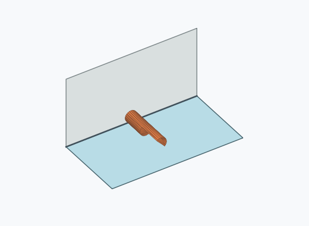

# Kl4i

10000 Fallversuche auf 500 mm Strecke; 9620 eingependelte Endlagen. Prozentangaben beziehen sich auf alle Fallversuche.

Dies sind beobachtete Simulationslagen unter den dokumentierten Parametern; Reibung und Unebenheitsmodell sind noch nicht an realen Häufigkeiten kalibriert.

| Pose | Bild | Anzahl | Anteil | 95-%-Intervall | Anteil eingependelt |
| --- | --- | ---: | ---: | ---: | ---: |
| Kl4i_0008 |  | 1117 | 11.17 % | 10.57–11.80 % | 11.61 % |
| Kl4i_0028 |  | 851 | 8.51 % | 7.98–9.07 % | 8.85 % |
| Kl4i_0030 |  | 746 | 7.46 % | 6.96–7.99 % | 7.75 % |
| Kl4i_0010 |  | 420 | 4.20 % | 3.82–4.61 % | 4.37 % |
| Kl4i_0023 |  | 388 | 3.88 % | 3.52–4.28 % | 4.03 % |
| Kl4i_0024 |  | 373 | 3.73 % | 3.38–4.12 % | 3.88 % |
| Kl4i_0012 |  | 372 | 3.72 % | 3.37–4.11 % | 3.87 % |
| Kl4i_0020 |  | 369 | 3.69 % | 3.34–4.08 % | 3.84 % |
| Kl4i_0036 |  | 348 | 3.48 % | 3.14–3.86 % | 3.62 % |
| Kl4i_0034 |  | 347 | 3.47 % | 3.13–3.85 % | 3.61 % |
| Kl4i_0032 |  | 331 | 3.31 % | 2.98–3.68 % | 3.44 % |
| Kl4i_0038 |  | 327 | 3.27 % | 2.94–3.64 % | 3.40 % |
| Kl4i_0014 |  | 325 | 3.25 % | 2.92–3.62 % | 3.38 % |
| Kl4i_0027 |  | 316 | 3.16 % | 2.83–3.52 % | 3.28 % |
| Kl4i_0017 |  | 305 | 3.05 % | 2.73–3.41 % | 3.17 % |
| Kl4i_0001 |  | 260 | 2.60 % | 2.31–2.93 % | 2.70 % |
| Kl4i_0002 |  | 204 | 2.04 % | 1.78–2.34 % | 2.12 % |
| Kl4i_0018 |  | 171 | 1.71 % | 1.47–1.98 % | 1.78 % |
| Kl4i_0003 |  | 152 | 1.52 % | 1.30–1.78 % | 1.58 % |
| Kl4i_0007 |  | 145 | 1.45 % | 1.23–1.70 % | 1.51 % |
| Kl4i_0005 |  | 140 | 1.40 % | 1.19–1.65 % | 1.46 % |
| Kl4i_0022 |  | 137 | 1.37 % | 1.16–1.62 % | 1.42 % |
| Kl4i_0004 |  | 131 | 1.31 % | 1.11–1.55 % | 1.36 % |
| Kl4i_0029 |  | 127 | 1.27 % | 1.07–1.51 % | 1.32 % |
| Kl4i_0009 |  | 124 | 1.24 % | 1.04–1.48 % | 1.29 % |
| Kl4i_0006 |  | 118 | 1.18 % | 0.99–1.41 % | 1.23 % |
| Kl4i_0011 |  | 113 | 1.13 % | 0.94–1.36 % | 1.17 % |
| Kl4i_0031 |  | 109 | 1.09 % | 0.90–1.31 % | 1.13 % |
| Kl4i_0019 |  | 107 | 1.07 % | 0.89–1.29 % | 1.11 % |
| Kl4i_0026 |  | 103 | 1.03 % | 0.85–1.25 % | 1.07 % |
| Kl4i_0013 |  | 86 | 0.86 % | 0.70–1.06 % | 0.89 % |
| Kl4i_0033 |  | 85 | 0.85 % | 0.69–1.05 % | 0.88 % |
| Kl4i_0016 |  | 83 | 0.83 % | 0.67–1.03 % | 0.86 % |
| Kl4i_0035 |  | 79 | 0.79 % | 0.63–0.98 % | 0.82 % |
| Kl4i_0025 |  | 73 | 0.73 % | 0.58–0.92 % | 0.76 % |
| Kl4i_0015 |  | 52 | 0.52 % | 0.40–0.68 % | 0.54 % |
| Kl4i_0037 |  | 52 | 0.52 % | 0.40–0.68 % | 0.54 % |
| Kl4i_0021 |  | 18 | 0.18 % | 0.11–0.28 % | 0.19 % |
| Kl4i_0041 |  | 13 | 0.13 % | 0.08–0.22 % | 0.14 % |
| Kl4i_0040 |  | 2 | 0.02 % | 0.01–0.07 % | 0.02 % |
| Kl4i_0039 |  | 1 | 0.01 % | 0.00–0.06 % | 0.01 % |

Ergebnisstatus: settled: 9620, unsettled: 380

Details und Erkennung: [JSON](poses.json), [YAML](poses.yaml). Quaternionen: xyzw, Bauteil → Rutsche. Symmetrieoperationen werden rechts an die Bauteilrotation multipliziert. Die kontinuierliche Symmetrieachse wird gerichtet verglichen. Orientierungsabstand ≤5°; bei konkurrierenden Treffern innerhalb 1° bleibt die Zuordnung mehrdeutig.

Die Pose-IDs bleiben über Läufe erhalten. Der Registereintrag einer früher beobachteten, aktuell nicht aufgetretenen Pose bleibt zur Wiedererkennung reserviert.
