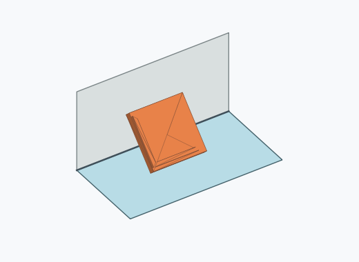

# Qf1i

1000 Fallversuche auf 500 mm Strecke; 989 eingependelte Endlagen. Prozentangaben beziehen sich auf alle Fallversuche.

Dies sind beobachtete Simulationslagen unter den dokumentierten Parametern; Reibung und Unebenheitsmodell sind noch nicht an realen Häufigkeiten kalibriert.

| Pose | Bild | Anzahl | Anteil | 95-%-Intervall | Anteil eingependelt |
| --- | --- | ---: | ---: | ---: | ---: |
| Qf1i_0006 |  | 265 | 26.50 % | 23.86–29.32 % | 26.79 % |
| Qf1i_0002 |  | 246 | 24.60 % | 22.03–27.36 % | 24.87 % |
| Qf1i_0005 |  | 235 | 23.50 % | 20.98–26.23 % | 23.76 % |
| Qf1i_0001 |  | 234 | 23.40 % | 20.88–26.12 % | 23.66 % |
| Qf1i_0004 |  | 4 | 0.40 % | 0.16–1.02 % | 0.40 % |
| Qf1i_0007 |  | 3 | 0.30 % | 0.10–0.88 % | 0.30 % |
| Qf1i_0003 |  | 2 | 0.20 % | 0.05–0.73 % | 0.20 % |

Ergebnisstatus: settled: 989, unsettled: 11

Details und Erkennung: [JSON](poses.json), [YAML](poses.yaml). Quaternionen: xyzw, Bauteil → Rutsche. Symmetrieoperationen werden rechts an die Bauteilrotation multipliziert. Die kontinuierliche Symmetrieachse wird gerichtet verglichen. Orientierungsabstand ≤5°; bei konkurrierenden Treffern innerhalb 1° bleibt die Zuordnung mehrdeutig.

Die Pose-IDs bleiben über Läufe erhalten. Der Registereintrag einer früher beobachteten, aktuell nicht aufgetretenen Pose bleibt zur Wiedererkennung reserviert.
