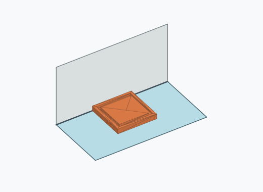
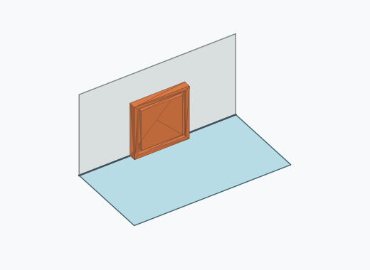
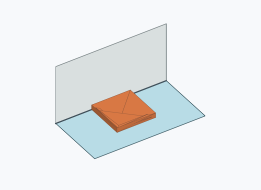
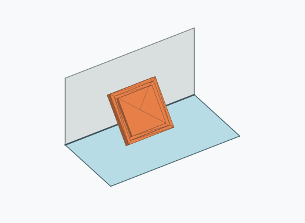
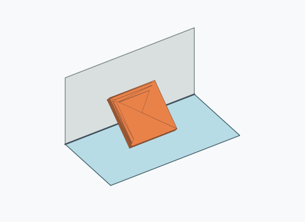
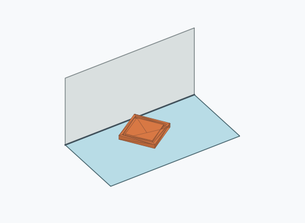
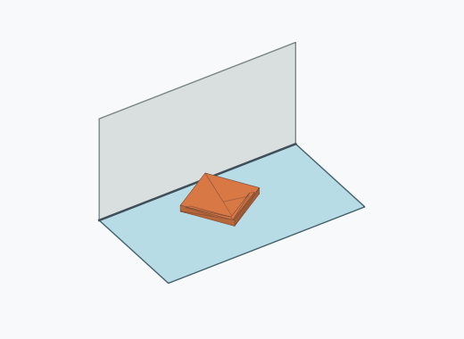

# Qf1i

10000 Fallversuche auf 500 mm Strecke; 9870 eingependelte Endlagen. Prozentangaben beziehen sich auf alle Fallversuche.

Dies sind beobachtete Simulationslagen unter den dokumentierten Parametern; Reibung und Unebenheitsmodell sind noch nicht an realen Häufigkeiten kalibriert.

| Pose | Bild | Anzahl | Anteil | 95-%-Intervall | Anteil eingependelt |
| --- | --- | ---: | ---: | ---: | ---: |
| Qf1i_0005 |  | 2546 | 25.46 % | 24.62–26.32 % | 25.80 % |
| Qf1i_0002 |  | 2524 | 25.24 % | 24.40–26.10 % | 25.57 % |
| Qf1i_0006 |  | 2410 | 24.10 % | 23.27–24.95 % | 24.42 % |
| Qf1i_0001 |  | 2311 | 23.11 % | 22.29–23.95 % | 23.41 % |
| Qf1i_0009 |  | 19 | 0.19 % | 0.12–0.30 % | 0.19 % |
| Qf1i_0013 |  | 18 | 0.18 % | 0.11–0.28 % | 0.18 % |
| Qf1i_0003 |  | 11 | 0.11 % | 0.06–0.20 % | 0.11 % |
| Qf1i_0010 |  | 9 | 0.09 % | 0.05–0.17 % | 0.09 % |
| Qf1i_0014 |  | 7 | 0.07 % | 0.03–0.14 % | 0.07 % |
| Qf1i_0012 |  | 6 | 0.06 % | 0.03–0.13 % | 0.06 % |
| Qf1i_0008 |  | 3 | 0.03 % | 0.01–0.09 % | 0.03 % |
| Qf1i_0011 |  | 3 | 0.03 % | 0.01–0.09 % | 0.03 % |
| Qf1i_0015 |  | 3 | 0.03 % | 0.01–0.09 % | 0.03 % |

Ergebnisstatus: settled: 9870, unsettled: 130

Details und Erkennung: [JSON](poses.json), [YAML](poses.yaml). Quaternionen: xyzw, Bauteil → Rutsche. Symmetrieoperationen werden rechts an die Bauteilrotation multipliziert. Die kontinuierliche Symmetrieachse wird gerichtet verglichen. Orientierungsabstand ≤5°; bei konkurrierenden Treffern innerhalb 1° bleibt die Zuordnung mehrdeutig.

Die Pose-IDs bleiben über Läufe erhalten. Der Registereintrag einer früher beobachteten, aktuell nicht aufgetretenen Pose bleibt zur Wiedererkennung reserviert.
