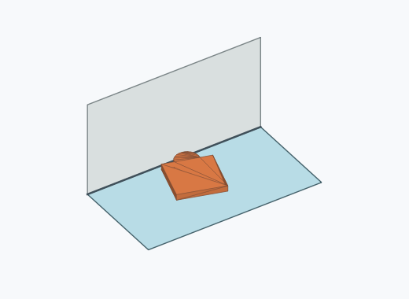
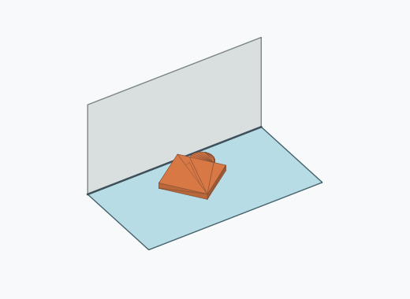
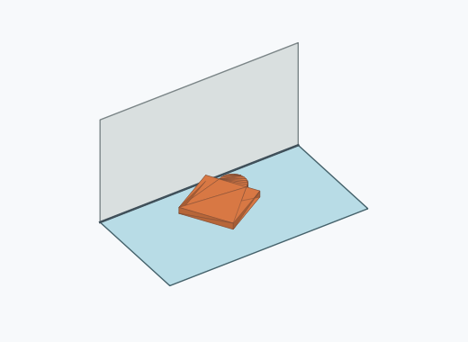
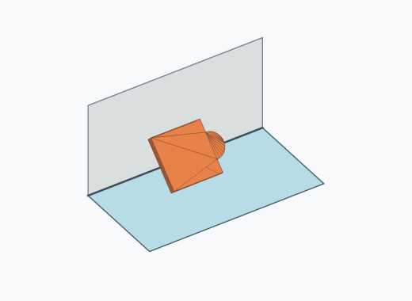
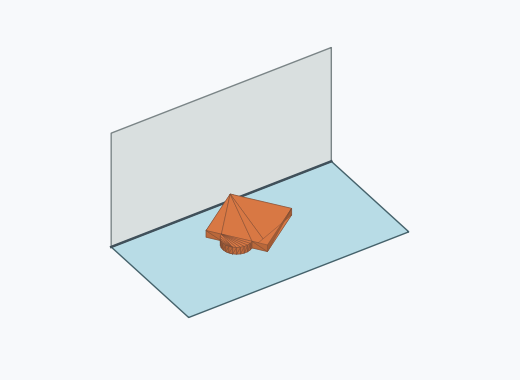
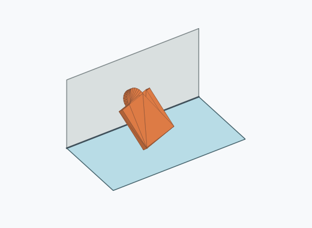
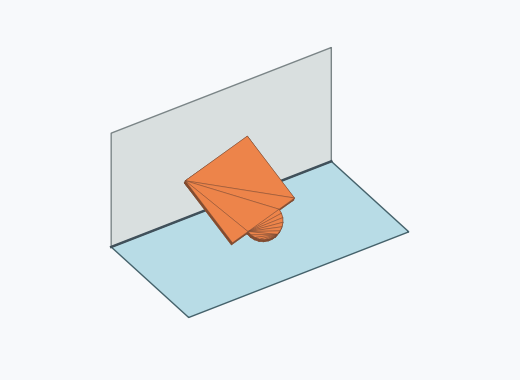
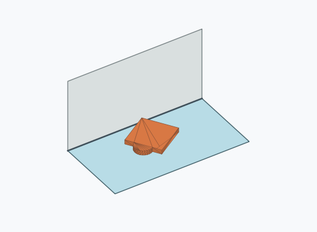

# Qf2a

10000 Fallversuche auf 500 mm Strecke; 9829 eingependelte Endlagen. Prozentangaben beziehen sich auf alle Fallversuche.

Dies sind beobachtete Simulationslagen unter den dokumentierten Parametern; Reibung und Unebenheitsmodell sind noch nicht an realen Häufigkeiten kalibriert.

| Pose | Bild | Anzahl | Anteil | 95-%-Intervall | Anteil eingependelt |
| --- | --- | ---: | ---: | ---: | ---: |
| Qf2a_0006 |  | 1483 | 14.83 % | 14.15–15.54 % | 15.09 % |
| Qf2a_0013 |  | 1370 | 13.70 % | 13.04–14.39 % | 13.94 % |
| Qf2a_0012 |  | 1292 | 12.92 % | 12.28–13.59 % | 13.14 % |
| Qf2a_0009 |  | 1247 | 12.47 % | 11.84–13.13 % | 12.69 % |
| Qf2a_0001 |  | 1191 | 11.91 % | 11.29–12.56 % | 12.12 % |
| Qf2a_0005 |  | 1114 | 11.14 % | 10.54–11.77 % | 11.33 % |
| Qf2a_0007 |  | 745 | 7.45 % | 6.95–7.98 % | 7.58 % |
| Qf2a_0008 |  | 530 | 5.30 % | 4.88–5.76 % | 5.39 % |
| Qf2a_0011 |  | 409 | 4.09 % | 3.72–4.50 % | 4.16 % |
| Qf2a_0002 |  | 362 | 3.62 % | 3.27–4.00 % | 3.68 % |
| Qf2a_0018 |  | 25 | 0.25 % | 0.17–0.37 % | 0.25 % |
| Qf2a_0014 |  | 18 | 0.18 % | 0.11–0.28 % | 0.18 % |
| Qf2a_0017 |  | 9 | 0.09 % | 0.05–0.17 % | 0.09 % |
| Qf2a_0016 |  | 7 | 0.07 % | 0.03–0.14 % | 0.07 % |
| Qf2a_0010 |  | 6 | 0.06 % | 0.03–0.13 % | 0.06 % |
| Qf2a_0019 |  | 4 | 0.04 % | 0.02–0.10 % | 0.04 % |
| Qf2a_0003 |  | 3 | 0.03 % | 0.01–0.09 % | 0.03 % |
| Qf2a_0015 |  | 3 | 0.03 % | 0.01–0.09 % | 0.03 % |
| Qf2a_0020 |  | 3 | 0.03 % | 0.01–0.09 % | 0.03 % |
| Qf2a_0023 |  | 3 | 0.03 % | 0.01–0.09 % | 0.03 % |
| Qf2a_0021 |  | 2 | 0.02 % | 0.01–0.07 % | 0.02 % |
| Qf2a_0022 |  | 1 | 0.01 % | 0.00–0.06 % | 0.01 % |
| Qf2a_0024 |  | 1 | 0.01 % | 0.00–0.06 % | 0.01 % |
| Qf2a_0025 |  | 1 | 0.01 % | 0.00–0.06 % | 0.01 % |

Ergebnisstatus: settled: 9829, unsettled: 171

Details und Erkennung: [JSON](poses.json), [YAML](poses.yaml). Quaternionen: xyzw, Bauteil → Rutsche. Symmetrieoperationen werden rechts an die Bauteilrotation multipliziert. Die kontinuierliche Symmetrieachse wird gerichtet verglichen. Orientierungsabstand ≤5°; bei konkurrierenden Treffern innerhalb 1° bleibt die Zuordnung mehrdeutig.

Die Pose-IDs bleiben über Läufe erhalten. Der Registereintrag einer früher beobachteten, aktuell nicht aufgetretenen Pose bleibt zur Wiedererkennung reserviert.
