# Qf2a

1000 Fallversuche auf 500 mm Strecke; 987 eingependelte Endlagen. Prozentangaben beziehen sich auf alle Fallversuche.

Dies sind beobachtete Simulationslagen unter den dokumentierten Parametern; Reibung und Unebenheitsmodell sind noch nicht an realen Häufigkeiten kalibriert.

| Pose | Bild | Anzahl | Anteil | 95-%-Intervall | Anteil eingependelt |
| --- | --- | ---: | ---: | ---: | ---: |
| Qf2a_0006 | 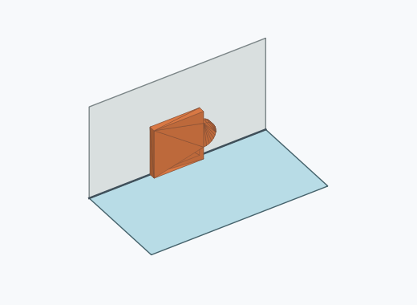 | 150 | 15.00 % | 12.92–17.35 % | 15.20 % |
| Qf2a_0012 | 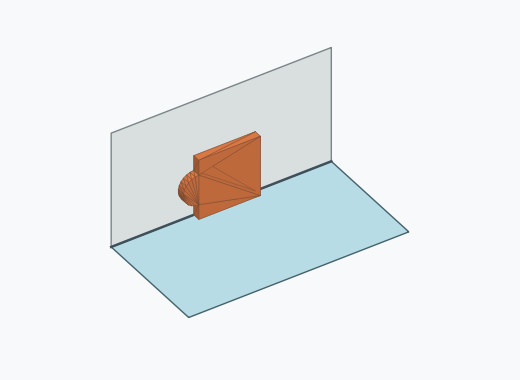 | 138 | 13.80 % | 11.80–16.08 % | 13.98 % |
| Qf2a_0013 | 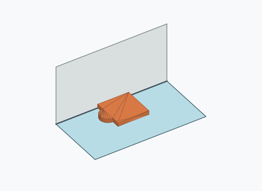 | 137 | 13.70 % | 11.71–15.97 % | 13.88 % |
| Qf2a_0009 | 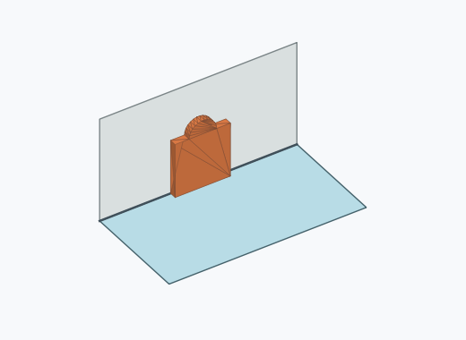 | 130 | 13.00 % | 11.06–15.23 % | 13.17 % |
| Qf2a_0001 | 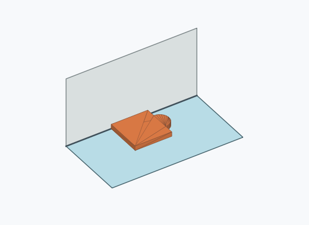 | 118 | 11.80 % | 9.95–13.95 % | 11.96 % |
| Qf2a_0005 | 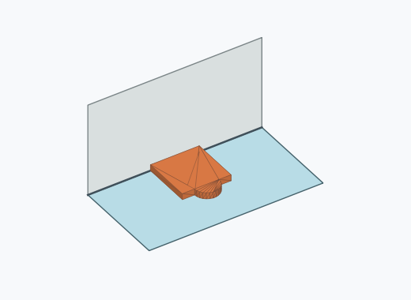 | 104 | 10.40 % | 8.66–12.45 % | 10.54 % |
| Qf2a_0007 | 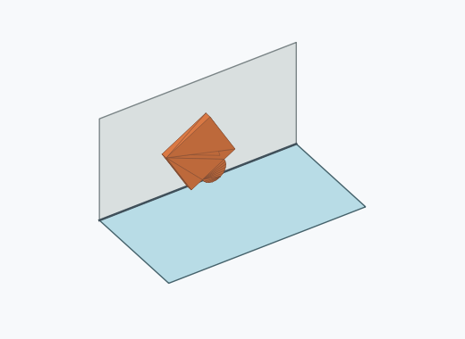 | 80 | 8.00 % | 6.47–9.85 % | 8.11 % |
| Qf2a_0002 | 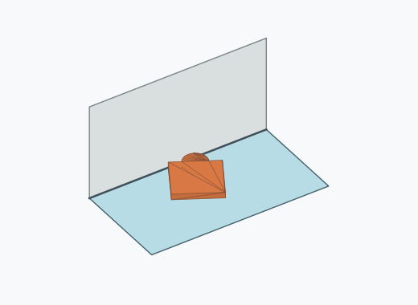 | 43 | 4.30 % | 3.21–5.74 % | 4.36 % |
| Qf2a_0008 | 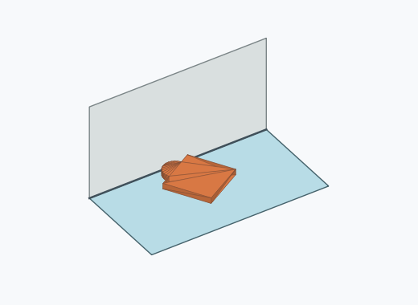 | 43 | 4.30 % | 3.21–5.74 % | 4.36 % |
| Qf2a_0011 | 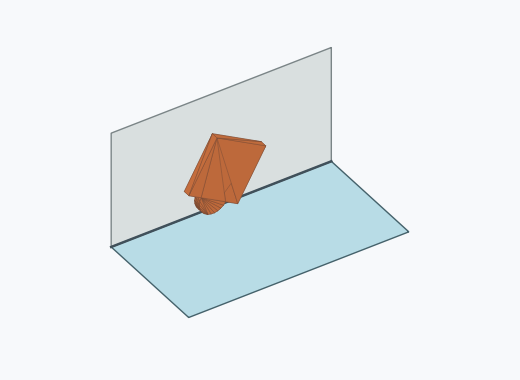 | 39 | 3.90 % | 2.87–5.29 % | 3.95 % |
| Qf2a_0004 | 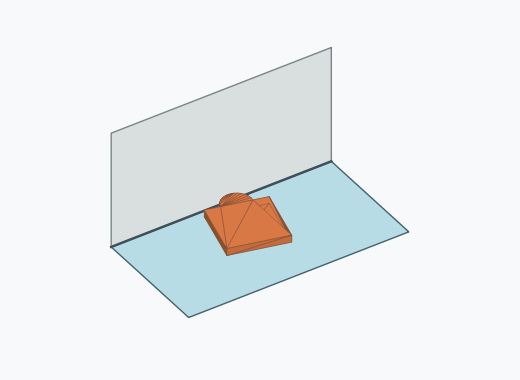 | 2 | 0.20 % | 0.05–0.73 % | 0.20 % |
| Qf2a_0003 | 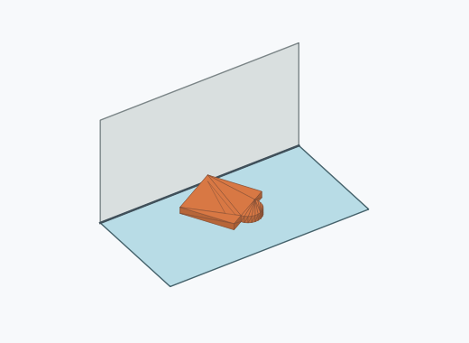 | 1 | 0.10 % | 0.02–0.56 % | 0.10 % |
| Qf2a_0010 | 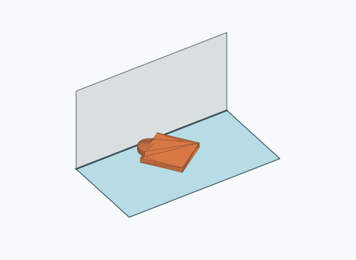 | 1 | 0.10 % | 0.02–0.56 % | 0.10 % |
| Qf2a_0014 | 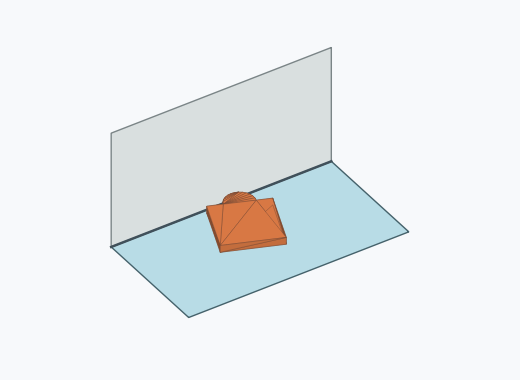 | 1 | 0.10 % | 0.02–0.56 % | 0.10 % |

Ergebnisstatus: settled: 987, unsettled: 13

Details und Erkennung: [JSON](poses.json), [YAML](poses.yaml). Quaternionen: xyzw, Bauteil → Rutsche. Symmetrieoperationen werden rechts an die Bauteilrotation multipliziert. Die kontinuierliche Symmetrieachse wird gerichtet verglichen. Orientierungsabstand ≤5°; bei konkurrierenden Treffern innerhalb 1° bleibt die Zuordnung mehrdeutig.

Die Pose-IDs bleiben über Läufe erhalten. Der Registereintrag einer früher beobachteten, aktuell nicht aufgetretenen Pose bleibt zur Wiedererkennung reserviert.
