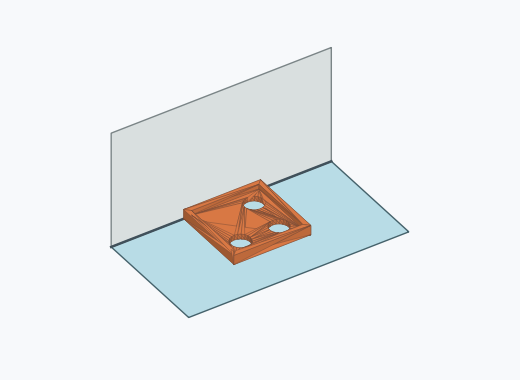
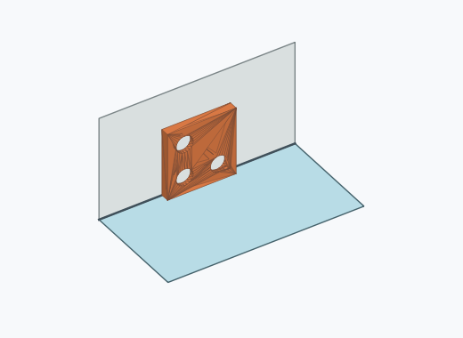
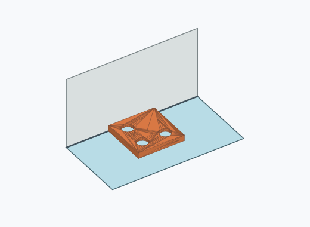
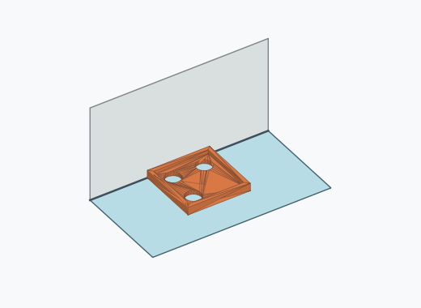
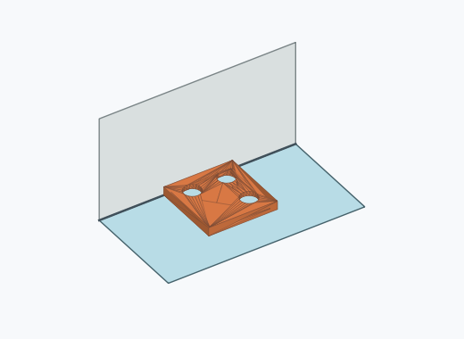
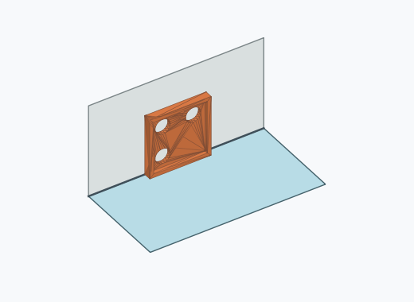

# Qf4i

1000 Fallversuche auf 500 mm Strecke; 982 eingependelte Endlagen. Prozentangaben beziehen sich auf alle Fallversuche.

Dies sind beobachtete Simulationslagen unter den dokumentierten Parametern; Reibung und Unebenheitsmodell sind noch nicht an realen Häufigkeiten kalibriert.

| Pose | Bild | Anzahl | Anteil | 95-%-Intervall | Anteil eingependelt |
| --- | --- | ---: | ---: | ---: | ---: |
| Qf4i_0007 |  | 75 | 7.50 % | 6.03–9.30 % | 7.64 % |
| Qf4i_0002 |  | 73 | 7.30 % | 5.85–9.08 % | 7.43 % |
| Qf4i_0015 |  | 72 | 7.20 % | 5.76–8.97 % | 7.33 % |
| Qf4i_0009 |  | 68 | 6.80 % | 5.40–8.53 % | 6.92 % |
| Qf4i_0011 |  | 68 | 6.80 % | 5.40–8.53 % | 6.92 % |
| Qf4i_0013 |  | 68 | 6.80 % | 5.40–8.53 % | 6.92 % |
| Qf4i_0005 |  | 67 | 6.70 % | 5.31–8.42 % | 6.82 % |
| Qf4i_0006 |  | 66 | 6.60 % | 5.22–8.31 % | 6.72 % |
| Qf4i_0010 |  | 58 | 5.80 % | 4.51–7.42 % | 5.91 % |
| Qf4i_0003 |  | 55 | 5.50 % | 4.25–7.09 % | 5.60 % |
| Qf4i_0016 |  | 55 | 5.50 % | 4.25–7.09 % | 5.60 % |
| Qf4i_0001 |  | 54 | 5.40 % | 4.16–6.98 % | 5.50 % |
| Qf4i_0012 |  | 53 | 5.30 % | 4.07–6.87 % | 5.40 % |
| Qf4i_0008 |  | 50 | 5.00 % | 3.81–6.53 % | 5.09 % |
| Qf4i_0017 |  | 50 | 5.00 % | 3.81–6.53 % | 5.09 % |
| Qf4i_0004 |  | 49 | 4.90 % | 3.73–6.42 % | 4.99 % |
| Qf4i_0014 |  | 1 | 0.10 % | 0.02–0.56 % | 0.10 % |

Ergebnisstatus: settled: 982, unsettled: 18

Details und Erkennung: [JSON](poses.json), [YAML](poses.yaml). Quaternionen: xyzw, Bauteil → Rutsche. Symmetrieoperationen werden rechts an die Bauteilrotation multipliziert. Die kontinuierliche Symmetrieachse wird gerichtet verglichen. Orientierungsabstand ≤5°; bei konkurrierenden Treffern innerhalb 1° bleibt die Zuordnung mehrdeutig.

Die Pose-IDs bleiben über Läufe erhalten. Der Registereintrag einer früher beobachteten, aktuell nicht aufgetretenen Pose bleibt zur Wiedererkennung reserviert.
