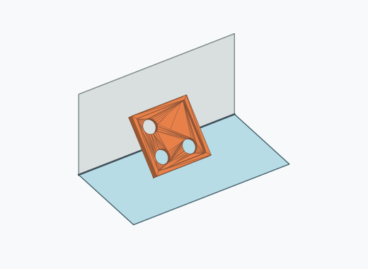
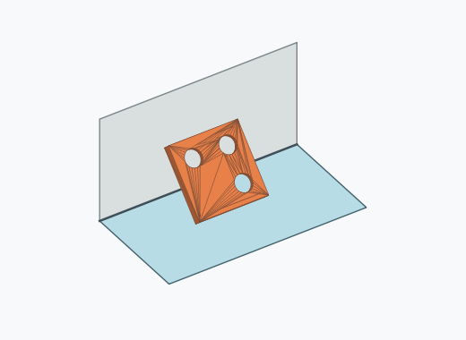
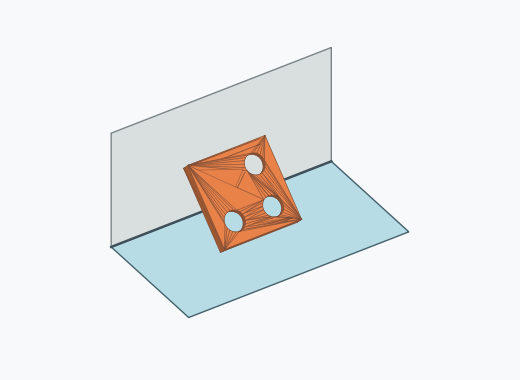
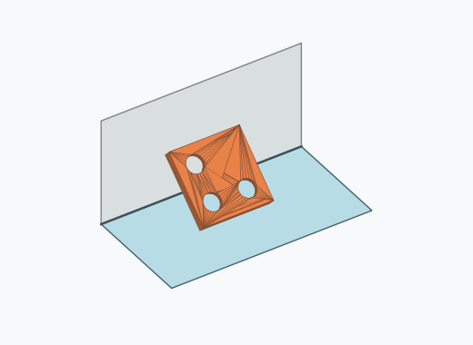
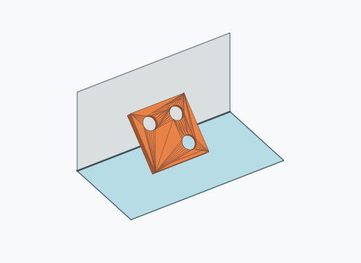
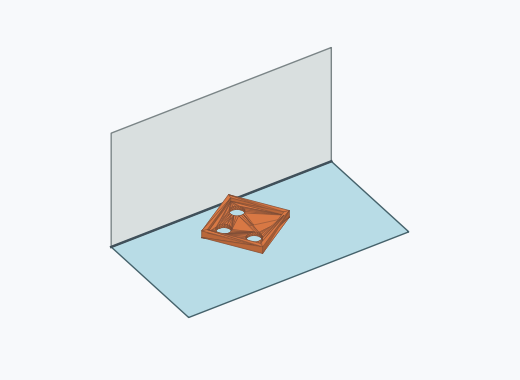
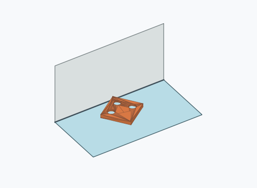

# Qf4i

10000 Fallversuche auf 500 mm Strecke; 9835 eingependelte Endlagen. Prozentangaben beziehen sich auf alle Fallversuche.

Dies sind beobachtete Simulationslagen unter den dokumentierten Parametern; Reibung und Unebenheitsmodell sind noch nicht an realen Häufigkeiten kalibriert.

| Pose | Bild | Anzahl | Anteil | 95-%-Intervall | Anteil eingependelt |
| --- | --- | ---: | ---: | ---: | ---: |
| Qf4i_0007 |  | 752 | 7.52 % | 7.02–8.05 % | 7.65 % |
| Qf4i_0012 |  | 706 | 7.06 % | 6.57–7.58 % | 7.18 % |
| Qf4i_0005 |  | 702 | 7.02 % | 6.54–7.54 % | 7.14 % |
| Qf4i_0009 |  | 702 | 7.02 % | 6.54–7.54 % | 7.14 % |
| Qf4i_0006 |  | 634 | 6.34 % | 5.88–6.83 % | 6.45 % |
| Qf4i_0013 |  | 616 | 6.16 % | 5.71–6.65 % | 6.26 % |
| Qf4i_0010 |  | 613 | 6.13 % | 5.68–6.62 % | 6.23 % |
| Qf4i_0015 |  | 610 | 6.10 % | 5.65–6.59 % | 6.20 % |
| Qf4i_0017 |  | 601 | 6.01 % | 5.56–6.49 % | 6.11 % |
| Qf4i_0002 |  | 594 | 5.94 % | 5.49–6.42 % | 6.04 % |
| Qf4i_0008 |  | 590 | 5.90 % | 5.45–6.38 % | 6.00 % |
| Qf4i_0003 |  | 568 | 5.68 % | 5.24–6.15 % | 5.78 % |
| Qf4i_0016 |  | 553 | 5.53 % | 5.10–6.00 % | 5.62 % |
| Qf4i_0011 |  | 547 | 5.47 % | 5.04–5.93 % | 5.56 % |
| Qf4i_0004 |  | 501 | 5.01 % | 4.60–5.46 % | 5.09 % |
| Qf4i_0001 |  | 498 | 4.98 % | 4.57–5.42 % | 5.06 % |
| Qf4i_0014 |  | 10 | 0.10 % | 0.05–0.18 % | 0.10 % |
| Qf4i_0020 |  | 7 | 0.07 % | 0.03–0.14 % | 0.07 % |
| Qf4i_0024 |  | 6 | 0.06 % | 0.03–0.13 % | 0.06 % |
| Qf4i_0027 |  | 6 | 0.06 % | 0.03–0.13 % | 0.06 % |
| Qf4i_0026 |  | 5 | 0.05 % | 0.02–0.12 % | 0.05 % |
| Qf4i_0019 |  | 3 | 0.03 % | 0.01–0.09 % | 0.03 % |
| Qf4i_0023 |  | 3 | 0.03 % | 0.01–0.09 % | 0.03 % |
| Qf4i_0022 |  | 2 | 0.02 % | 0.01–0.07 % | 0.02 % |
| Qf4i_0028 |  | 2 | 0.02 % | 0.01–0.07 % | 0.02 % |
| Qf4i_0018 |  | 1 | 0.01 % | 0.00–0.06 % | 0.01 % |
| Qf4i_0021 |  | 1 | 0.01 % | 0.00–0.06 % | 0.01 % |
| Qf4i_0025 |  | 1 | 0.01 % | 0.00–0.06 % | 0.01 % |
| Qf4i_0029 |  | 1 | 0.01 % | 0.00–0.06 % | 0.01 % |

Ergebnisstatus: settled: 9835, unsettled: 165

Details und Erkennung: [JSON](poses.json), [YAML](poses.yaml). Quaternionen: xyzw, Bauteil → Rutsche. Symmetrieoperationen werden rechts an die Bauteilrotation multipliziert. Die kontinuierliche Symmetrieachse wird gerichtet verglichen. Orientierungsabstand ≤5°; bei konkurrierenden Treffern innerhalb 1° bleibt die Zuordnung mehrdeutig.

Die Pose-IDs bleiben über Läufe erhalten. Der Registereintrag einer früher beobachteten, aktuell nicht aufgetretenen Pose bleibt zur Wiedererkennung reserviert.
