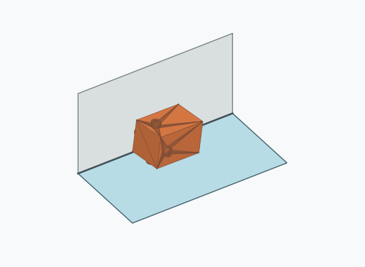
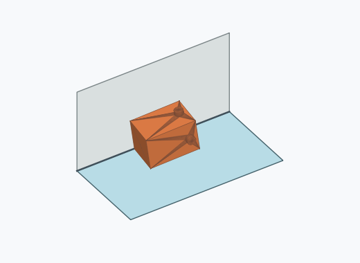
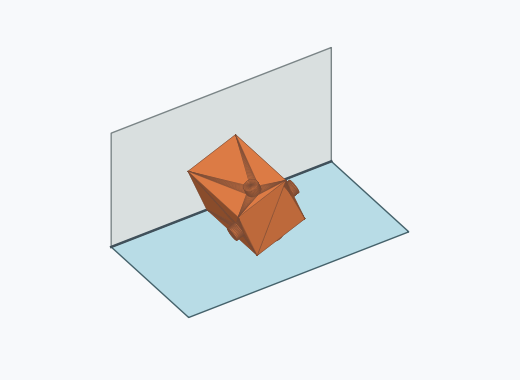
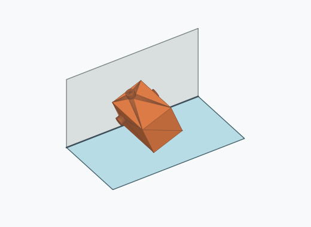
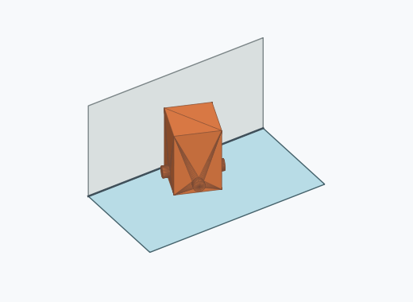
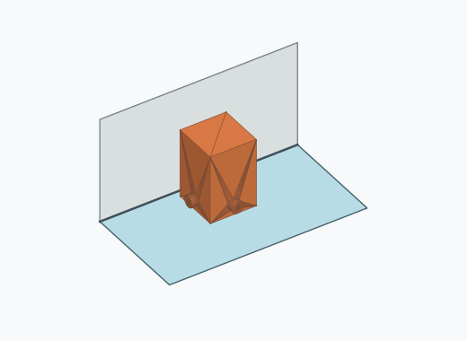
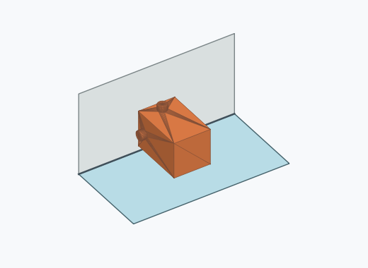
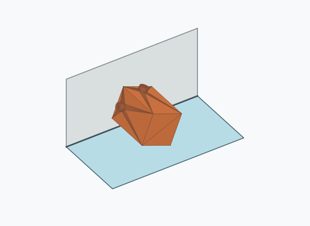
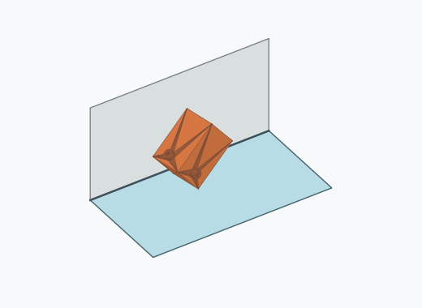
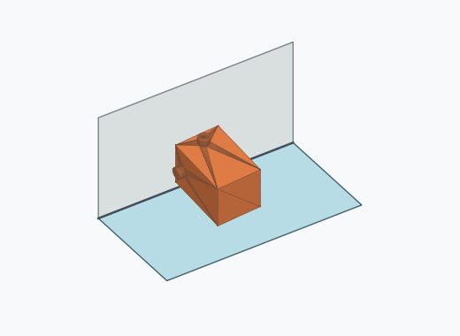

# Qk1a

10000 Fallversuche auf 500 mm Strecke; 9956 eingependelte Endlagen. Prozentangaben beziehen sich auf alle Fallversuche.

Dies sind beobachtete Simulationslagen unter den dokumentierten Parametern; Reibung und Unebenheitsmodell sind noch nicht an realen Häufigkeiten kalibriert.

| Pose | Bild | Anzahl | Anteil | 95-%-Intervall | Anteil eingependelt |
| --- | --- | ---: | ---: | ---: | ---: |
| Qk1a_0007 |  | 2279 | 22.79 % | 21.98–23.62 % | 22.89 % |
| Qk1a_0008 |  | 2187 | 21.87 % | 21.07–22.69 % | 21.97 % |
| Qk1a_0009 |  | 1372 | 13.72 % | 13.06–14.41 % | 13.78 % |
| Qk1a_0006 |  | 1280 | 12.80 % | 12.16–13.47 % | 12.86 % |
| Qk1a_0012 |  | 996 | 9.96 % | 9.39–10.56 % | 10.00 % |
| Qk1a_0004 |  | 469 | 4.69 % | 4.29–5.12 % | 4.71 % |
| Qk1a_0003 |  | 440 | 4.40 % | 4.02–4.82 % | 4.42 % |
| Qk1a_0001 |  | 436 | 4.36 % | 3.98–4.78 % | 4.38 % |
| Qk1a_0010 |  | 242 | 2.42 % | 2.14–2.74 % | 2.43 % |
| Qk1a_0011 |  | 190 | 1.90 % | 1.65–2.19 % | 1.91 % |
| Qk1a_0005 |  | 38 | 0.38 % | 0.28–0.52 % | 0.38 % |
| Qk1a_0002 |  | 25 | 0.25 % | 0.17–0.37 % | 0.25 % |
| Qk1a_0013 |  | 2 | 0.02 % | 0.01–0.07 % | 0.02 % |

Ergebnisstatus: settled: 9956, unsettled: 44

Details und Erkennung: [JSON](poses.json), [YAML](poses.yaml). Quaternionen: xyzw, Bauteil → Rutsche. Symmetrieoperationen werden rechts an die Bauteilrotation multipliziert. Die kontinuierliche Symmetrieachse wird gerichtet verglichen. Orientierungsabstand ≤5°; bei konkurrierenden Treffern innerhalb 1° bleibt die Zuordnung mehrdeutig.

Die Pose-IDs bleiben über Läufe erhalten. Der Registereintrag einer früher beobachteten, aktuell nicht aufgetretenen Pose bleibt zur Wiedererkennung reserviert.
