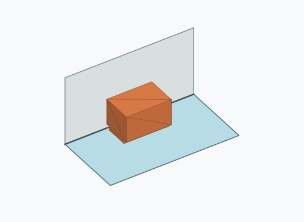
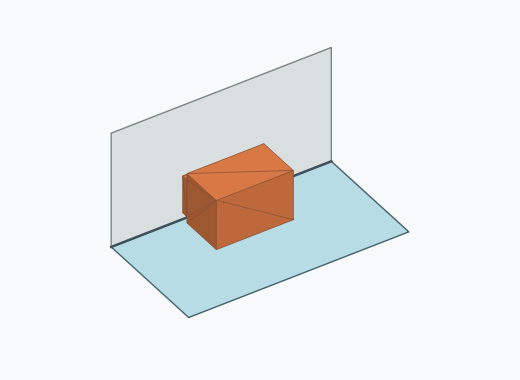
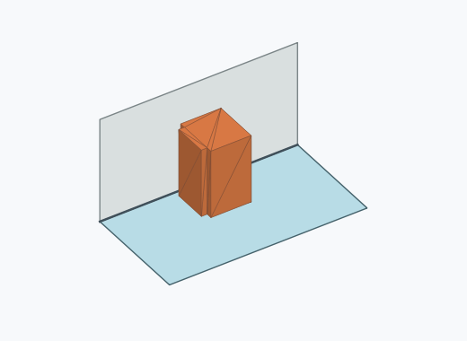
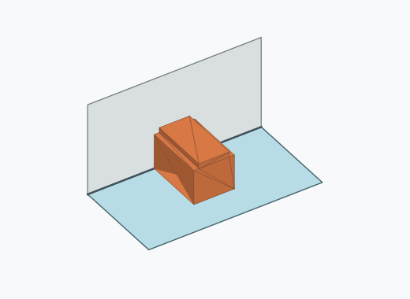
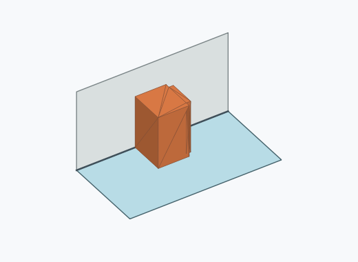
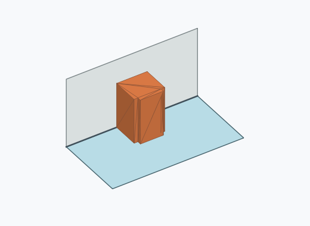
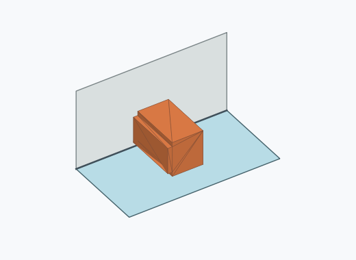
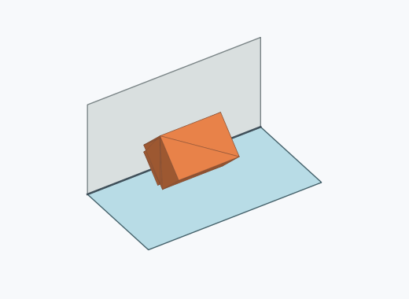
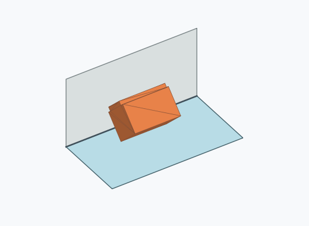
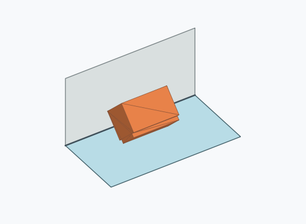

# Qk2i

1000 Fallversuche auf 500 mm Strecke; 1000 eingependelte Endlagen. Prozentangaben beziehen sich auf alle Fallversuche.

Dies sind beobachtete Simulationslagen unter den dokumentierten Parametern; Reibung und Unebenheitsmodell sind noch nicht an realen Häufigkeiten kalibriert.

| Pose | Bild | Anzahl | Anteil | 95-%-Intervall | Anteil eingependelt |
| --- | --- | ---: | ---: | ---: | ---: |
| Qk2i_0012 |  | 121 | 12.10 % | 10.22–14.27 % | 12.10 % |
| Qk2i_0004 |  | 112 | 11.20 % | 9.39–13.31 % | 11.20 % |
| Qk2i_0006 |  | 108 | 10.80 % | 9.02–12.88 % | 10.80 % |
| Qk2i_0011 |  | 106 | 10.60 % | 8.84–12.66 % | 10.60 % |
| Qk2i_0015 |  | 75 | 7.50 % | 6.03–9.30 % | 7.50 % |
| Qk2i_0009 |  | 72 | 7.20 % | 5.76–8.97 % | 7.20 % |
| Qk2i_0005 |  | 70 | 7.00 % | 5.58–8.75 % | 7.00 % |
| Qk2i_0001 |  | 68 | 6.80 % | 5.40–8.53 % | 6.80 % |
| Qk2i_0002 |  | 67 | 6.70 % | 5.31–8.42 % | 6.70 % |
| Qk2i_0003 |  | 64 | 6.40 % | 5.04–8.09 % | 6.40 % |
| Qk2i_0014 |  | 62 | 6.20 % | 4.87–7.87 % | 6.20 % |
| Qk2i_0010 |  | 59 | 5.90 % | 4.60–7.54 % | 5.90 % |
| Qk2i_0013 |  | 10 | 1.00 % | 0.54–1.83 % | 1.00 % |
| Qk2i_0007 |  | 4 | 0.40 % | 0.16–1.02 % | 0.40 % |
| Qk2i_0008 |  | 2 | 0.20 % | 0.05–0.73 % | 0.20 % |

Ergebnisstatus: settled: 1000

Details und Erkennung: [JSON](poses.json), [YAML](poses.yaml). Quaternionen: xyzw, Bauteil → Rutsche. Symmetrieoperationen werden rechts an die Bauteilrotation multipliziert. Die kontinuierliche Symmetrieachse wird gerichtet verglichen. Orientierungsabstand ≤5°; bei konkurrierenden Treffern innerhalb 1° bleibt die Zuordnung mehrdeutig.

Die Pose-IDs bleiben über Läufe erhalten. Der Registereintrag einer früher beobachteten, aktuell nicht aufgetretenen Pose bleibt zur Wiedererkennung reserviert.
