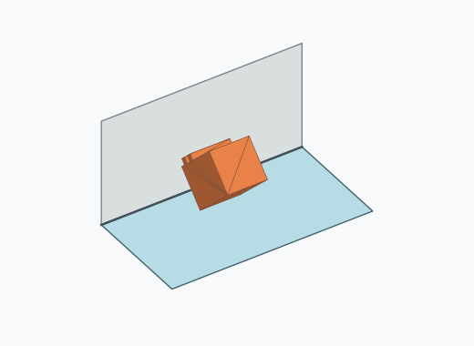

# Qk4a

10000 Fallversuche auf 500 mm Strecke; 9997 eingependelte Endlagen. Prozentangaben beziehen sich auf alle Fallversuche.

Dies sind beobachtete Simulationslagen unter den dokumentierten Parametern; Reibung und Unebenheitsmodell sind noch nicht an realen Häufigkeiten kalibriert.

| Pose | Bild | Anzahl | Anteil | 95-%-Intervall | Anteil eingependelt |
| --- | --- | ---: | ---: | ---: | ---: |
| Qk4a_0021 |  | 639 | 6.39 % | 5.93–6.89 % | 6.39 % |
| Qk4a_0019 |  | 629 | 6.29 % | 5.83–6.78 % | 6.29 % |
| Qk4a_0004 |  | 592 | 5.92 % | 5.47–6.40 % | 5.92 % |
| Qk4a_0014 |  | 579 | 5.79 % | 5.35–6.26 % | 5.79 % |
| Qk4a_0010 |  | 571 | 5.71 % | 5.27–6.18 % | 5.71 % |
| Qk4a_0006 |  | 570 | 5.70 % | 5.26–6.17 % | 5.70 % |
| Qk4a_0024 |  | 568 | 5.68 % | 5.24–6.15 % | 5.68 % |
| Qk4a_0007 |  | 478 | 4.78 % | 4.38–5.22 % | 4.78 % |
| Qk4a_0001 |  | 403 | 4.03 % | 3.66–4.43 % | 4.03 % |
| Qk4a_0017 |  | 382 | 3.82 % | 3.46–4.21 % | 3.82 % |
| Qk4a_0016 |  | 365 | 3.65 % | 3.30–4.04 % | 3.65 % |
| Qk4a_0002 |  | 363 | 3.63 % | 3.28–4.01 % | 3.63 % |
| Qk4a_0018 |  | 359 | 3.59 % | 3.24–3.97 % | 3.59 % |
| Qk4a_0020 |  | 358 | 3.58 % | 3.23–3.96 % | 3.58 % |
| Qk4a_0003 |  | 352 | 3.52 % | 3.18–3.90 % | 3.52 % |
| Qk4a_0013 |  | 348 | 3.48 % | 3.14–3.86 % | 3.48 % |
| Qk4a_0025 |  | 344 | 3.44 % | 3.10–3.82 % | 3.44 % |
| Qk4a_0022 |  | 340 | 3.40 % | 3.06–3.77 % | 3.40 % |
| Qk4a_0015 |  | 324 | 3.24 % | 2.91–3.61 % | 3.24 % |
| Qk4a_0009 |  | 308 | 3.08 % | 2.76–3.44 % | 3.08 % |
| Qk4a_0005 |  | 285 | 2.85 % | 2.54–3.19 % | 2.85 % |
| Qk4a_0023 |  | 282 | 2.82 % | 2.51–3.16 % | 2.82 % |
| Qk4a_0011 |  | 256 | 2.56 % | 2.27–2.89 % | 2.56 % |
| Qk4a_0012 |  | 253 | 2.53 % | 2.24–2.86 % | 2.53 % |
| Qk4a_0008 |  | 47 | 0.47 % | 0.35–0.62 % | 0.47 % |
| Qk4a_0026 |  | 2 | 0.02 % | 0.01–0.07 % | 0.02 % |

Ergebnisstatus: settled: 9997, unsettled: 3

Details und Erkennung: [JSON](poses.json), [YAML](poses.yaml). Quaternionen: xyzw, Bauteil → Rutsche. Symmetrieoperationen werden rechts an die Bauteilrotation multipliziert. Die kontinuierliche Symmetrieachse wird gerichtet verglichen. Orientierungsabstand ≤5°; bei konkurrierenden Treffern innerhalb 1° bleibt die Zuordnung mehrdeutig.

Die Pose-IDs bleiben über Läufe erhalten. Der Registereintrag einer früher beobachteten, aktuell nicht aufgetretenen Pose bleibt zur Wiedererkennung reserviert.
