# Qk4a

1000 Fallversuche auf 500 mm Strecke; 999 eingependelte Endlagen. Prozentangaben beziehen sich auf alle Fallversuche.

Dies sind beobachtete Simulationslagen unter den dokumentierten Parametern; Reibung und Unebenheitsmodell sind noch nicht an realen Häufigkeiten kalibriert.

| Pose | Bild | Anzahl | Anteil | 95-%-Intervall | Anteil eingependelt |
| --- | --- | ---: | ---: | ---: | ---: |
| Qk4a_0010 | 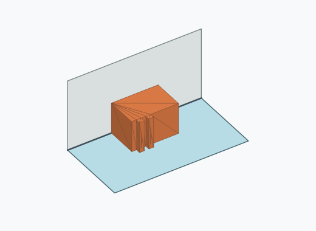 | 69 | 6.90 % | 5.49–8.64 % | 6.91 % |
| Qk4a_0014 | 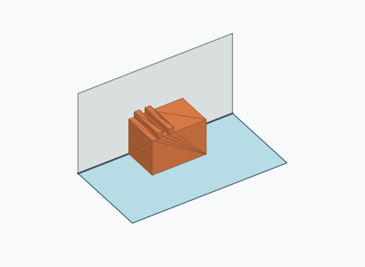 | 64 | 6.40 % | 5.04–8.09 % | 6.41 % |
| Qk4a_0006 | 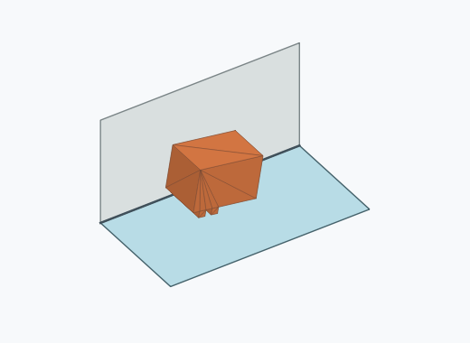 | 62 | 6.20 % | 4.87–7.87 % | 6.21 % |
| Qk4a_0007 |  | 55 | 5.50 % | 4.25–7.09 % | 5.51 % |
| Qk4a_0019 |  | 55 | 5.50 % | 4.25–7.09 % | 5.51 % |
| Qk4a_0004 | 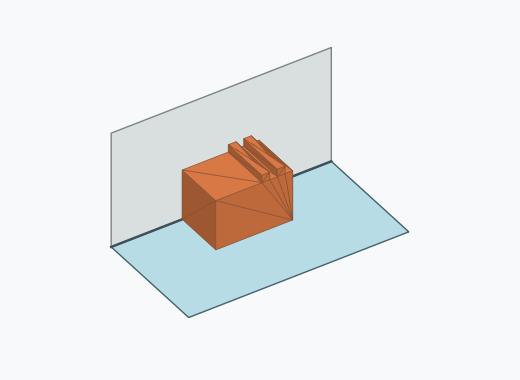 | 54 | 5.40 % | 4.16–6.98 % | 5.41 % |
| Qk4a_0024 |  | 52 | 5.20 % | 3.99–6.76 % | 5.21 % |
| Qk4a_0017 | 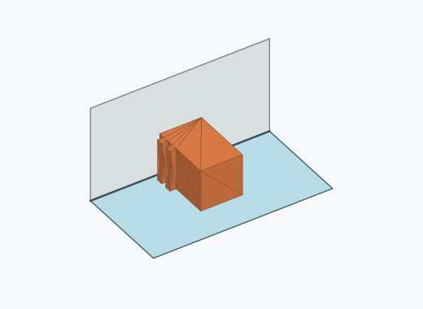 | 50 | 5.00 % | 3.81–6.53 % | 5.01 % |
| Qk4a_0021 | 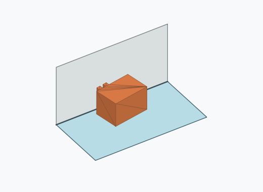 | 48 | 4.80 % | 3.64–6.31 % | 4.80 % |
| Qk4a_0003 |  | 44 | 4.40 % | 3.29–5.86 % | 4.40 % |
| Qk4a_0022 | 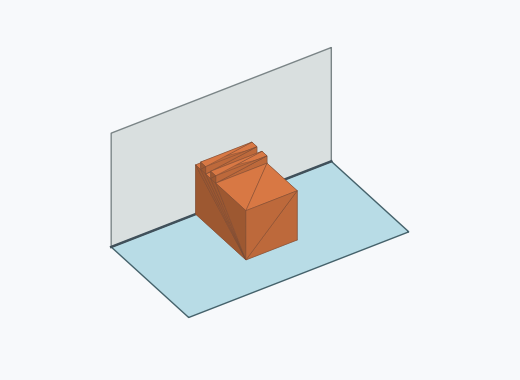 | 42 | 4.20 % | 3.12–5.63 % | 4.20 % |
| Qk4a_0013 | 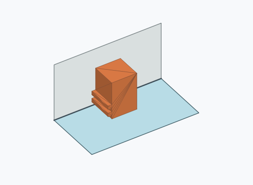 | 40 | 4.00 % | 2.95–5.40 % | 4.00 % |
| Qk4a_0001 | 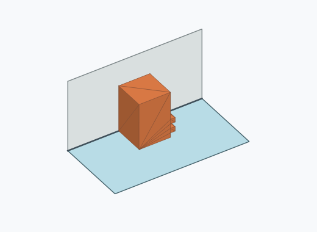 | 39 | 3.90 % | 2.87–5.29 % | 3.90 % |
| Qk4a_0016 | 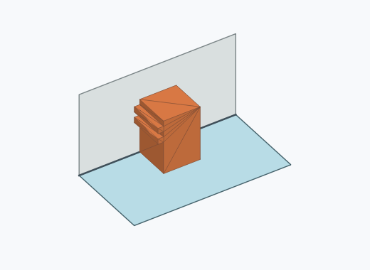 | 38 | 3.80 % | 2.78–5.17 % | 3.80 % |
| Qk4a_0018 |  | 36 | 3.60 % | 2.61–4.94 % | 3.60 % |
| Qk4a_0002 |  | 34 | 3.40 % | 2.44–4.71 % | 3.40 % |
| Qk4a_0020 | 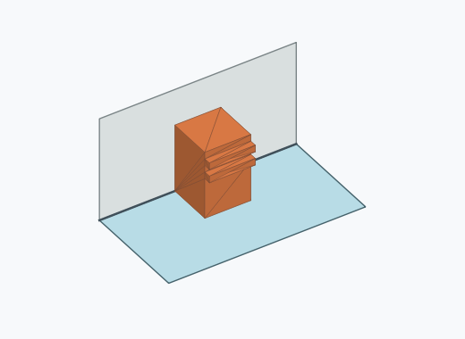 | 31 | 3.10 % | 2.19–4.37 % | 3.10 % |
| Qk4a_0009 | 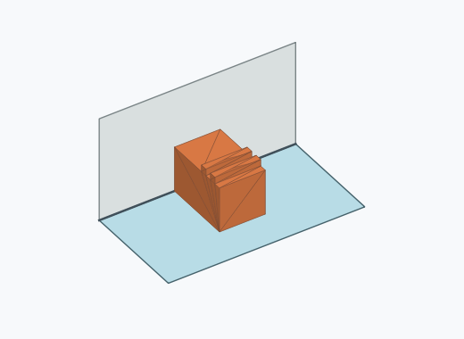 | 29 | 2.90 % | 2.03–4.13 % | 2.90 % |
| Qk4a_0012 | 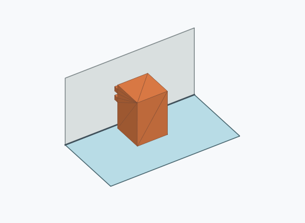 | 27 | 2.70 % | 1.86–3.90 % | 2.70 % |
| Qk4a_0025 |  | 27 | 2.70 % | 1.86–3.90 % | 2.70 % |
| Qk4a_0011 |  | 25 | 2.50 % | 1.70–3.66 % | 2.50 % |
| Qk4a_0015 |  | 25 | 2.50 % | 1.70–3.66 % | 2.50 % |
| Qk4a_0023 | 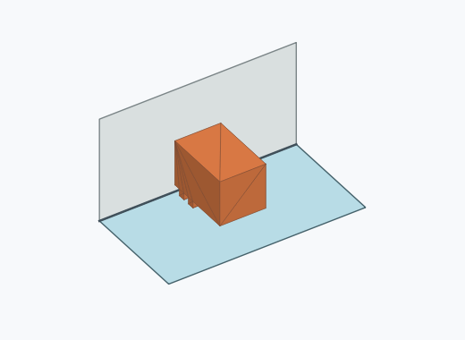 | 25 | 2.50 % | 1.70–3.66 % | 2.50 % |
| Qk4a_0005 |  | 24 | 2.40 % | 1.62–3.55 % | 2.40 % |
| Qk4a_0008 | 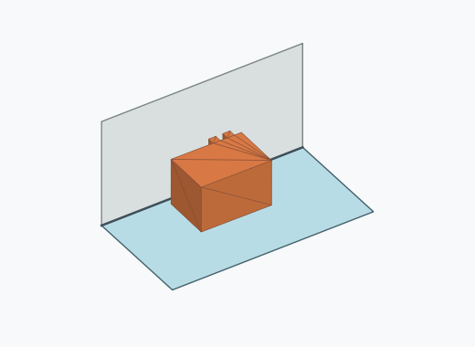 | 4 | 0.40 % | 0.16–1.02 % | 0.40 % |

Ergebnisstatus: settled: 999, unsettled: 1

Details und Erkennung: [JSON](poses.json), [YAML](poses.yaml). Quaternionen: xyzw, Bauteil → Rutsche. Symmetrieoperationen werden rechts an die Bauteilrotation multipliziert. Die kontinuierliche Symmetrieachse wird gerichtet verglichen. Orientierungsabstand ≤5°; bei konkurrierenden Treffern innerhalb 1° bleibt die Zuordnung mehrdeutig.

Die Pose-IDs bleiben über Läufe erhalten. Der Registereintrag einer früher beobachteten, aktuell nicht aufgetretenen Pose bleibt zur Wiedererkennung reserviert.
