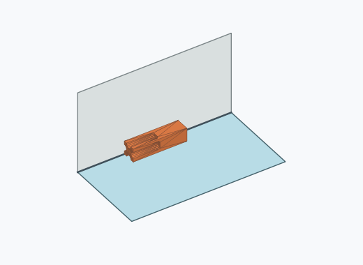
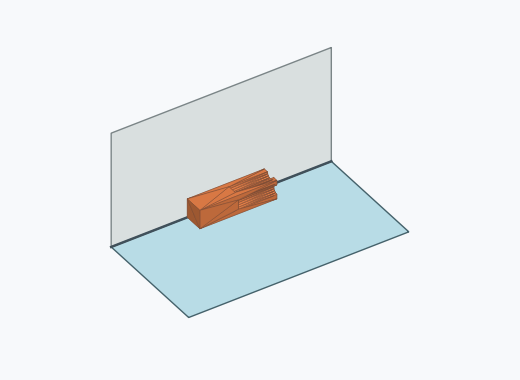
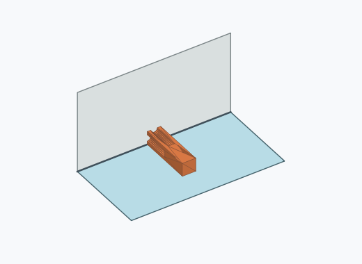
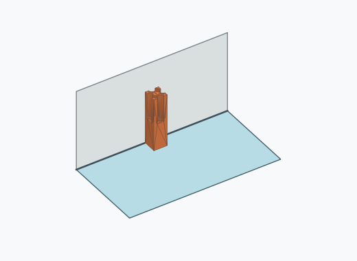
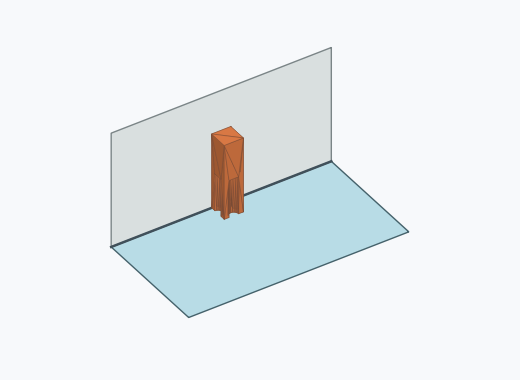

# Ql1i

1000 Fallversuche auf 500 mm Strecke; 1000 eingependelte Endlagen. Prozentangaben beziehen sich auf alle Fallversuche.

Dies sind beobachtete Simulationslagen unter den dokumentierten Parametern; Reibung und Unebenheitsmodell sind noch nicht an realen Häufigkeiten kalibriert.

| Pose | Bild | Anzahl | Anteil | 95-%-Intervall | Anteil eingependelt |
| --- | --- | ---: | ---: | ---: | ---: |
| Ql1i_0002 |  | 459 | 45.90 % | 42.83–49.00 % | 45.90 % |
| Ql1i_0003 |  | 429 | 42.90 % | 39.87–45.99 % | 42.90 % |
| Ql1i_0004 |  | 54 | 5.40 % | 4.16–6.98 % | 5.40 % |
| Ql1i_0006 |  | 28 | 2.80 % | 1.94–4.02 % | 2.80 % |
| Ql1i_0005 |  | 25 | 2.50 % | 1.70–3.66 % | 2.50 % |
| Ql1i_0001 |  | 5 | 0.50 % | 0.21–1.17 % | 0.50 % |

Ergebnisstatus: settled: 1000

Details und Erkennung: [JSON](poses.json), [YAML](poses.yaml). Quaternionen: xyzw, Bauteil → Rutsche. Symmetrieoperationen werden rechts an die Bauteilrotation multipliziert. Die kontinuierliche Symmetrieachse wird gerichtet verglichen. Orientierungsabstand ≤5°; bei konkurrierenden Treffern innerhalb 1° bleibt die Zuordnung mehrdeutig.

Die Pose-IDs bleiben über Läufe erhalten. Der Registereintrag einer früher beobachteten, aktuell nicht aufgetretenen Pose bleibt zur Wiedererkennung reserviert.
