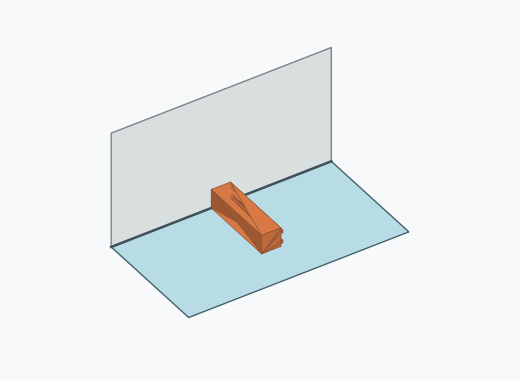

# Ql2a

1000 Fallversuche auf 500 mm Strecke; 996 eingependelte Endlagen. Prozentangaben beziehen sich auf alle Fallversuche.

Dies sind beobachtete Simulationslagen unter den dokumentierten Parametern; Reibung und Unebenheitsmodell sind noch nicht an realen Häufigkeiten kalibriert.

| Pose | Bild | Anzahl | Anteil | 95-%-Intervall | Anteil eingependelt |
| --- | --- | ---: | ---: | ---: | ---: |
| Ql2a_0002 |  | 241 | 24.10 % | 21.55–26.85 % | 24.20 % |
| Ql2a_0003 |  | 230 | 23.00 % | 20.50–25.71 % | 23.09 % |
| Ql2a_0008 |  | 216 | 21.60 % | 19.16–24.26 % | 21.69 % |
| Ql2a_0007 |  | 205 | 20.50 % | 18.11–23.11 % | 20.58 % |
| Ql2a_0009 |  | 22 | 2.20 % | 1.46–3.31 % | 2.21 % |
| Ql2a_0012 |  | 20 | 2.00 % | 1.30–3.07 % | 2.01 % |
| Ql2a_0004 |  | 15 | 1.50 % | 0.91–2.46 % | 1.51 % |
| Ql2a_0010 |  | 14 | 1.40 % | 0.84–2.34 % | 1.41 % |
| Ql2a_0013 |  | 9 | 0.90 % | 0.47–1.70 % | 0.90 % |
| Ql2a_0001 |  | 7 | 0.70 % | 0.34–1.44 % | 0.70 % |
| Ql2a_0005 |  | 7 | 0.70 % | 0.34–1.44 % | 0.70 % |
| Ql2a_0006 |  | 4 | 0.40 % | 0.16–1.02 % | 0.40 % |
| Ql2a_0014 |  | 4 | 0.40 % | 0.16–1.02 % | 0.40 % |
| Ql2a_0011 |  | 2 | 0.20 % | 0.05–0.73 % | 0.20 % |

Ergebnisstatus: settled: 996, unsettled: 4

Details und Erkennung: [JSON](poses.json), [YAML](poses.yaml). Quaternionen: xyzw, Bauteil → Rutsche. Symmetrieoperationen werden rechts an die Bauteilrotation multipliziert. Die kontinuierliche Symmetrieachse wird gerichtet verglichen. Orientierungsabstand ≤5°; bei konkurrierenden Treffern innerhalb 1° bleibt die Zuordnung mehrdeutig.

Die Pose-IDs bleiben über Läufe erhalten. Der Registereintrag einer früher beobachteten, aktuell nicht aufgetretenen Pose bleibt zur Wiedererkennung reserviert.
