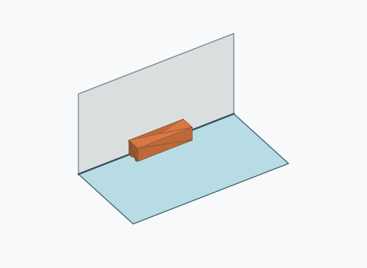
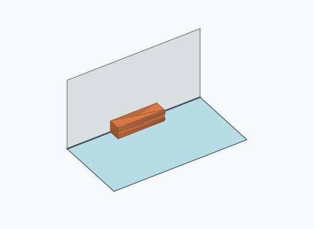
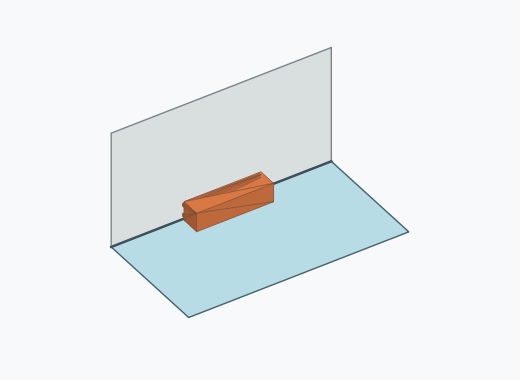
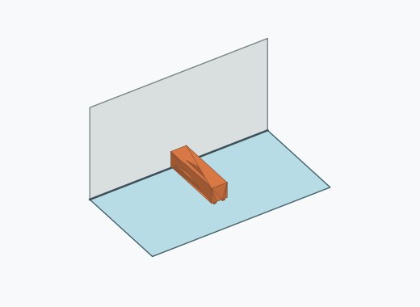
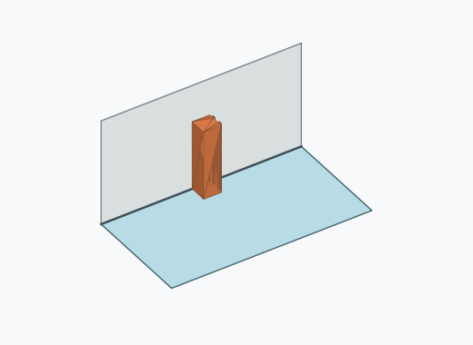
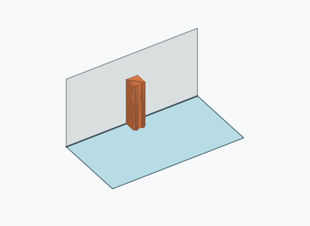
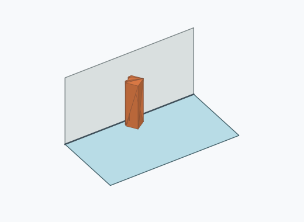
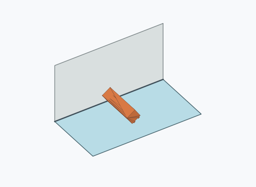
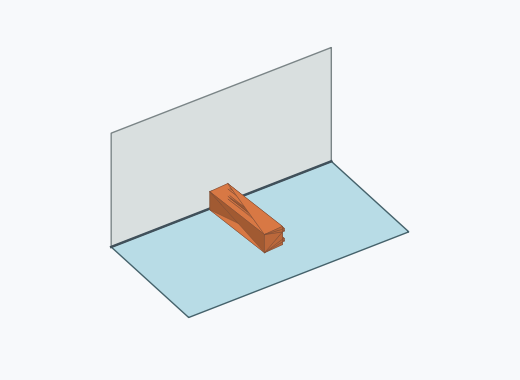
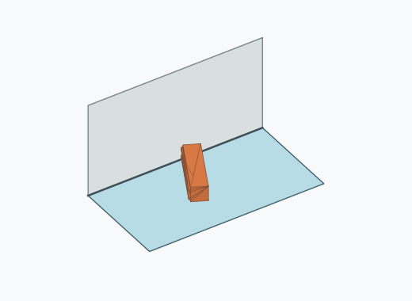

# Ql2a

10000 Fallversuche auf 500 mm Strecke; 9942 eingependelte Endlagen. Prozentangaben beziehen sich auf alle Fallversuche.

Dies sind beobachtete Simulationslagen unter den dokumentierten Parametern; Reibung und Unebenheitsmodell sind noch nicht an realen Häufigkeiten kalibriert.

| Pose | Bild | Anzahl | Anteil | 95-%-Intervall | Anteil eingependelt |
| --- | --- | ---: | ---: | ---: | ---: |
| Ql2a_0002 |  | 2355 | 23.55 % | 22.73–24.39 % | 23.69 % |
| Ql2a_0008 |  | 2260 | 22.60 % | 21.79–23.43 % | 22.73 % |
| Ql2a_0007 |  | 2191 | 21.91 % | 21.11–22.73 % | 22.04 % |
| Ql2a_0003 |  | 2176 | 21.76 % | 20.96–22.58 % | 21.89 % |
| Ql2a_0015 |  | 171 | 1.71 % | 1.47–1.98 % | 1.72 % |
| Ql2a_0021 |  | 169 | 1.69 % | 1.46–1.96 % | 1.70 % |
| Ql2a_0009 |  | 165 | 1.65 % | 1.42–1.92 % | 1.66 % |
| Ql2a_0010 |  | 158 | 1.58 % | 1.35–1.84 % | 1.59 % |
| Ql2a_0013 |  | 89 | 0.89 % | 0.72–1.09 % | 0.90 % |
| Ql2a_0005 |  | 70 | 0.70 % | 0.55–0.88 % | 0.70 % |
| Ql2a_0001 |  | 57 | 0.57 % | 0.44–0.74 % | 0.57 % |
| Ql2a_0014 |  | 41 | 0.41 % | 0.30–0.56 % | 0.41 % |
| Ql2a_0011 |  | 14 | 0.14 % | 0.08–0.23 % | 0.14 % |
| Ql2a_0006 |  | 12 | 0.12 % | 0.07–0.21 % | 0.12 % |
| Ql2a_0020 |  | 6 | 0.06 % | 0.03–0.13 % | 0.06 % |
| Ql2a_0016 |  | 5 | 0.05 % | 0.02–0.12 % | 0.05 % |
| Ql2a_0017 |  | 1 | 0.01 % | 0.00–0.06 % | 0.01 % |
| Ql2a_0018 |  | 1 | 0.01 % | 0.00–0.06 % | 0.01 % |
| Ql2a_0019 |  | 1 | 0.01 % | 0.00–0.06 % | 0.01 % |

Ergebnisstatus: settled: 9942, unsettled: 58

Details und Erkennung: [JSON](poses.json), [YAML](poses.yaml). Quaternionen: xyzw, Bauteil → Rutsche. Symmetrieoperationen werden rechts an die Bauteilrotation multipliziert. Die kontinuierliche Symmetrieachse wird gerichtet verglichen. Orientierungsabstand ≤5°; bei konkurrierenden Treffern innerhalb 1° bleibt die Zuordnung mehrdeutig.

Die Pose-IDs bleiben über Läufe erhalten. Der Registereintrag einer früher beobachteten, aktuell nicht aufgetretenen Pose bleibt zur Wiedererkennung reserviert.
