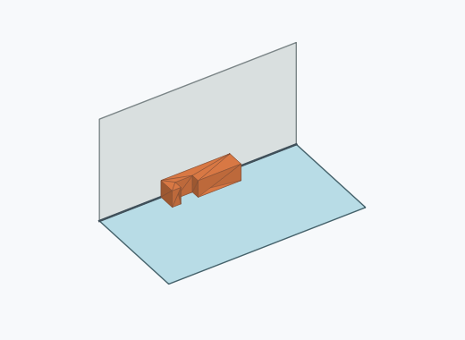
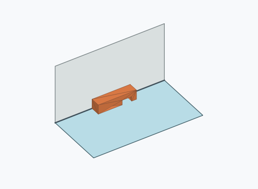
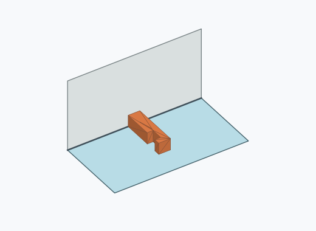
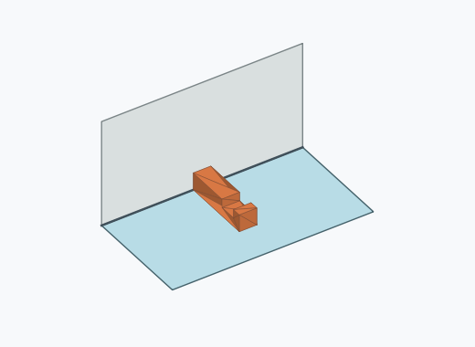
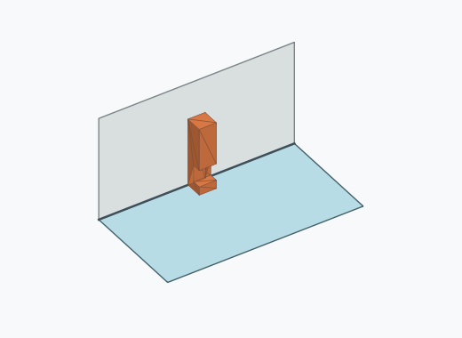

# Ql4i

1000 Fallversuche auf 500 mm Strecke; 997 eingependelte Endlagen. Prozentangaben beziehen sich auf alle Fallversuche.

Dies sind beobachtete Simulationslagen unter den dokumentierten Parametern; Reibung und Unebenheitsmodell sind noch nicht an realen Häufigkeiten kalibriert.

| Pose | Bild | Anzahl | Anteil | 95-%-Intervall | Anteil eingependelt |
| --- | --- | ---: | ---: | ---: | ---: |
| Ql4i_0013 |  | 128 | 12.80 % | 10.87–15.01 % | 12.84 % |
| Ql4i_0003 |  | 126 | 12.60 % | 10.69–14.80 % | 12.64 % |
| Ql4i_0012 |  | 125 | 12.50 % | 10.59–14.69 % | 12.54 % |
| Ql4i_0008 |  | 115 | 11.50 % | 9.67–13.63 % | 11.53 % |
| Ql4i_0002 |  | 110 | 11.00 % | 9.21–13.09 % | 11.03 % |
| Ql4i_0006 |  | 107 | 10.70 % | 8.93–12.77 % | 10.73 % |
| Ql4i_0018 |  | 97 | 9.70 % | 8.02–11.69 % | 9.73 % |
| Ql4i_0019 |  | 96 | 9.60 % | 7.93–11.58 % | 9.63 % |
| Ql4i_0011 |  | 18 | 1.80 % | 1.14–2.83 % | 1.81 % |
| Ql4i_0017 |  | 17 | 1.70 % | 1.06–2.71 % | 1.71 % |
| Ql4i_0020 |  | 8 | 0.80 % | 0.41–1.57 % | 0.80 % |
| Ql4i_0005 |  | 7 | 0.70 % | 0.34–1.44 % | 0.70 % |
| Ql4i_0014 |  | 7 | 0.70 % | 0.34–1.44 % | 0.70 % |
| Ql4i_0007 |  | 6 | 0.60 % | 0.28–1.30 % | 0.60 % |
| Ql4i_0009 |  | 6 | 0.60 % | 0.28–1.30 % | 0.60 % |
| Ql4i_0022 |  | 6 | 0.60 % | 0.28–1.30 % | 0.60 % |
| Ql4i_0004 |  | 5 | 0.50 % | 0.21–1.17 % | 0.50 % |
| Ql4i_0015 |  | 4 | 0.40 % | 0.16–1.02 % | 0.40 % |
| Ql4i_0021 |  | 4 | 0.40 % | 0.16–1.02 % | 0.40 % |
| Ql4i_0001 |  | 2 | 0.20 % | 0.05–0.73 % | 0.20 % |
| Ql4i_0016 |  | 2 | 0.20 % | 0.05–0.73 % | 0.20 % |
| Ql4i_0010 |  | 1 | 0.10 % | 0.02–0.56 % | 0.10 % |

Ergebnisstatus: settled: 997, unsettled: 3

Details und Erkennung: [JSON](poses.json), [YAML](poses.yaml). Quaternionen: xyzw, Bauteil → Rutsche. Symmetrieoperationen werden rechts an die Bauteilrotation multipliziert. Die kontinuierliche Symmetrieachse wird gerichtet verglichen. Orientierungsabstand ≤5°; bei konkurrierenden Treffern innerhalb 1° bleibt die Zuordnung mehrdeutig.

Die Pose-IDs bleiben über Läufe erhalten. Der Registereintrag einer früher beobachteten, aktuell nicht aufgetretenen Pose bleibt zur Wiedererkennung reserviert.
