# Rf1a

1000 Fallversuche auf 500 mm Strecke; 997 eingependelte Endlagen. Prozentangaben beziehen sich auf alle Fallversuche.

Dies sind beobachtete Simulationslagen unter den dokumentierten Parametern; Reibung und Unebenheitsmodell sind noch nicht an realen Häufigkeiten kalibriert.

| Pose | Bild | Anzahl | Anteil | 95-%-Intervall | Anteil eingependelt |
| --- | --- | ---: | ---: | ---: | ---: |
| Rf1a_0007 | 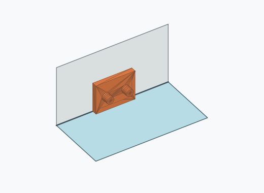 | 144 | 14.40 % | 12.36–16.71 % | 14.44 % |
| Rf1a_0012 | 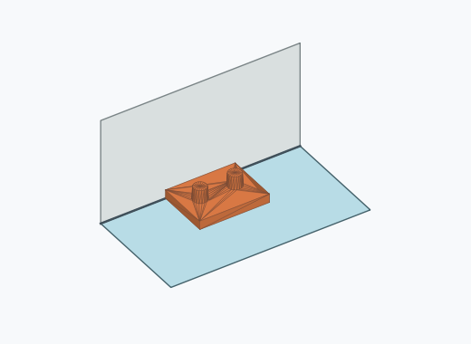 | 136 | 13.60 % | 11.61–15.86 % | 13.64 % |
| Rf1a_0005 | 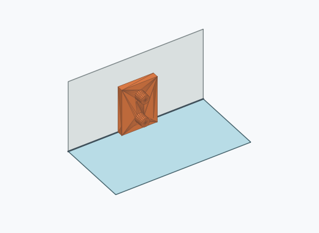 | 102 | 10.20 % | 8.47–12.23 % | 10.23 % |
| Rf1a_0017 | 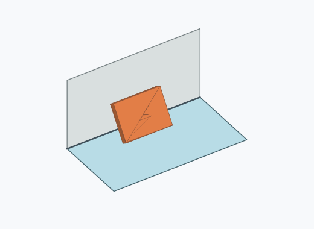 | 97 | 9.70 % | 8.02–11.69 % | 9.73 % |
| Rf1a_0013 | 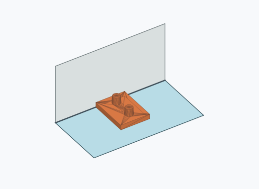 | 96 | 9.60 % | 7.93–11.58 % | 9.63 % |
| Rf1a_0004 | 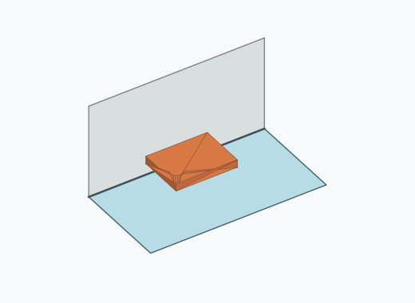 | 59 | 5.90 % | 4.60–7.54 % | 5.92 % |
| Rf1a_0018 | 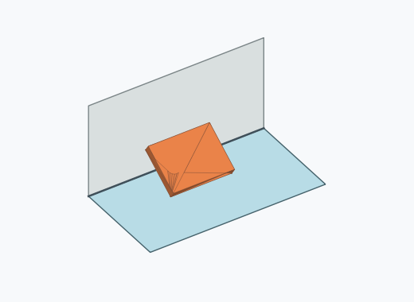 | 55 | 5.50 % | 4.25–7.09 % | 5.52 % |
| Rf1a_0016 | 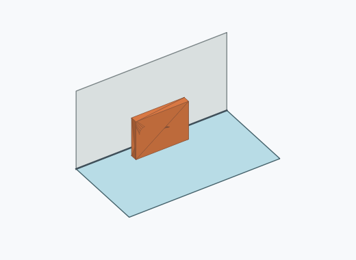 | 48 | 4.80 % | 3.64–6.31 % | 4.81 % |
| Rf1a_0011 | 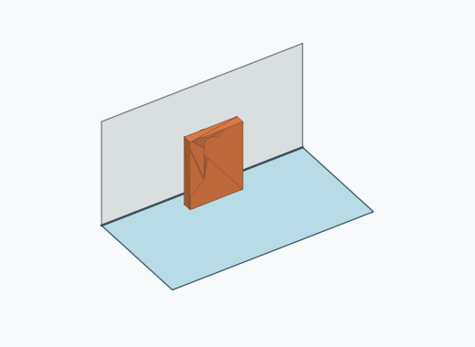 | 40 | 4.00 % | 2.95–5.40 % | 4.01 % |
| Rf1a_0001 | 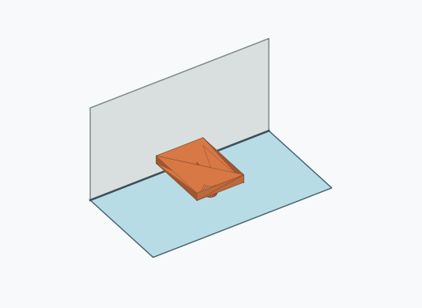 | 38 | 3.80 % | 2.78–5.17 % | 3.81 % |
| Rf1a_0003 |  | 35 | 3.50 % | 2.53–4.83 % | 3.51 % |
| Rf1a_0008 | 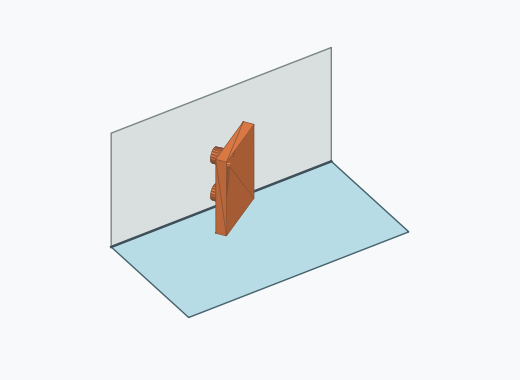 | 34 | 3.40 % | 2.44–4.71 % | 3.41 % |
| Rf1a_0006 | 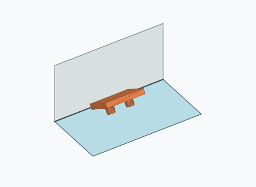 | 25 | 2.50 % | 1.70–3.66 % | 2.51 % |
| Rf1a_0015 | 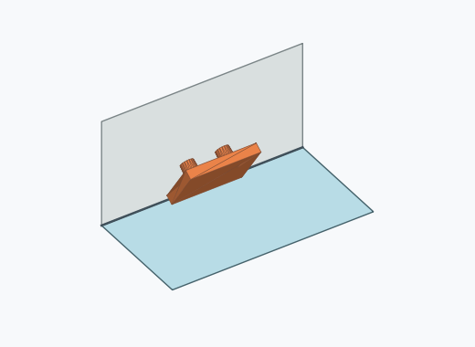 | 23 | 2.30 % | 1.54–3.43 % | 2.31 % |
| Rf1a_0009 | 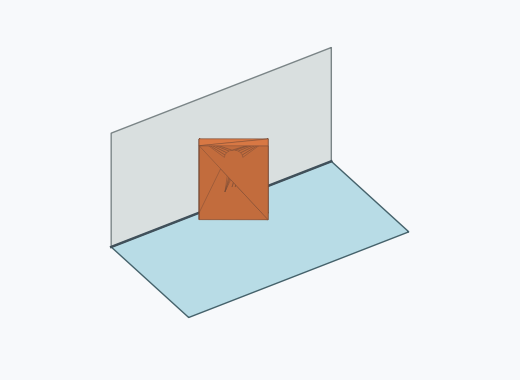 | 22 | 2.20 % | 1.46–3.31 % | 2.21 % |
| Rf1a_0014 | 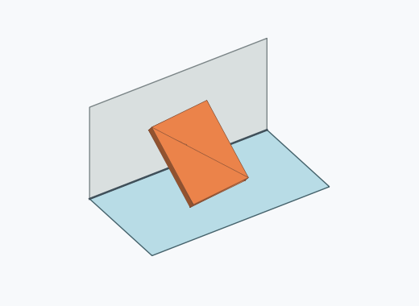 | 20 | 2.00 % | 1.30–3.07 % | 2.01 % |
| Rf1a_0002 | 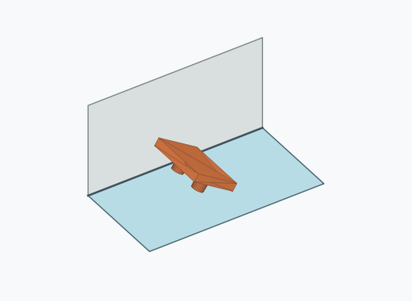 | 15 | 1.50 % | 0.91–2.46 % | 1.50 % |
| Rf1a_0010 | 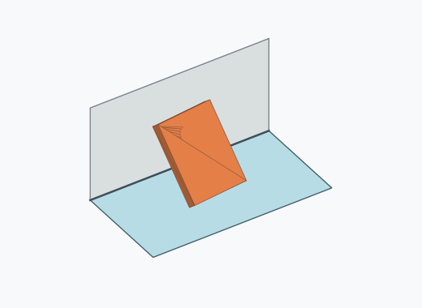 | 8 | 0.80 % | 0.41–1.57 % | 0.80 % |

Ergebnisstatus: settled: 997, unsettled: 3

Details und Erkennung: [JSON](poses.json), [YAML](poses.yaml). Quaternionen: xyzw, Bauteil → Rutsche. Symmetrieoperationen werden rechts an die Bauteilrotation multipliziert. Die kontinuierliche Symmetrieachse wird gerichtet verglichen. Orientierungsabstand ≤5°; bei konkurrierenden Treffern innerhalb 1° bleibt die Zuordnung mehrdeutig.

Die Pose-IDs bleiben über Läufe erhalten. Der Registereintrag einer früher beobachteten, aktuell nicht aufgetretenen Pose bleibt zur Wiedererkennung reserviert.
