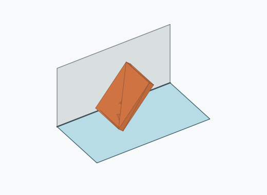
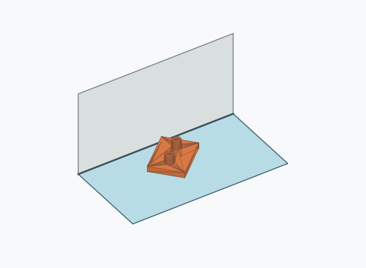
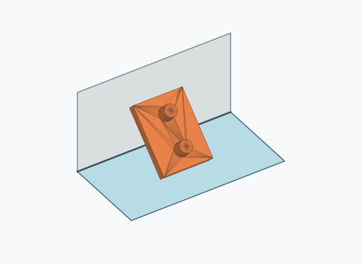
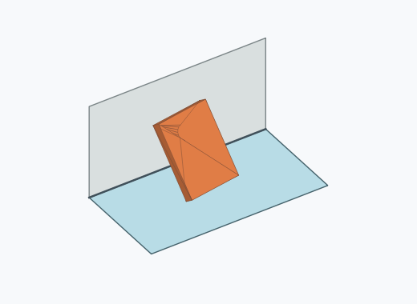
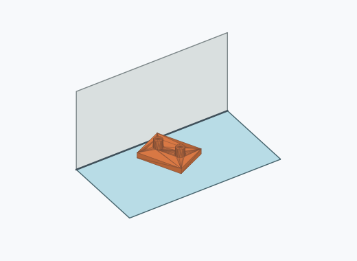
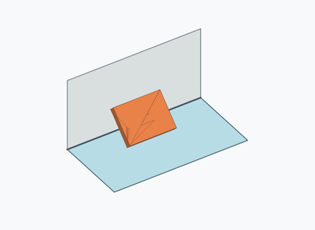

# Rf1a

10000 Fallversuche auf 500 mm Strecke; 9963 eingependelte Endlagen. Prozentangaben beziehen sich auf alle Fallversuche.

Dies sind beobachtete Simulationslagen unter den dokumentierten Parametern; Reibung und Unebenheitsmodell sind noch nicht an realen Häufigkeiten kalibriert.

| Pose | Bild | Anzahl | Anteil | 95-%-Intervall | Anteil eingependelt |
| --- | --- | ---: | ---: | ---: | ---: |
| Rf1a_0007 |  | 1529 | 15.29 % | 14.60–16.01 % | 15.35 % |
| Rf1a_0012 |  | 1409 | 14.09 % | 13.42–14.79 % | 14.14 % |
| Rf1a_0005 |  | 1033 | 10.33 % | 9.75–10.94 % | 10.37 % |
| Rf1a_0013 |  | 984 | 9.84 % | 9.27–10.44 % | 9.88 % |
| Rf1a_0017 |  | 852 | 8.52 % | 7.99–9.08 % | 8.55 % |
| Rf1a_0018 |  | 610 | 6.10 % | 5.65–6.59 % | 6.12 % |
| Rf1a_0004 |  | 601 | 6.01 % | 5.56–6.49 % | 6.03 % |
| Rf1a_0016 |  | 536 | 5.36 % | 4.94–5.82 % | 5.38 % |
| Rf1a_0011 |  | 418 | 4.18 % | 3.81–4.59 % | 4.20 % |
| Rf1a_0001 |  | 380 | 3.80 % | 3.44–4.19 % | 3.81 % |
| Rf1a_0003 |  | 365 | 3.65 % | 3.30–4.04 % | 3.66 % |
| Rf1a_0008 |  | 362 | 3.62 % | 3.27–4.00 % | 3.63 % |
| Rf1a_0006 |  | 212 | 2.12 % | 1.86–2.42 % | 2.13 % |
| Rf1a_0015 |  | 192 | 1.92 % | 1.67–2.21 % | 1.93 % |
| Rf1a_0009 |  | 168 | 1.68 % | 1.45–1.95 % | 1.69 % |
| Rf1a_0014 |  | 144 | 1.44 % | 1.22–1.69 % | 1.45 % |
| Rf1a_0002 |  | 78 | 0.78 % | 0.63–0.97 % | 0.78 % |
| Rf1a_0010 |  | 75 | 0.75 % | 0.60–0.94 % | 0.75 % |
| Rf1a_0019 |  | 6 | 0.06 % | 0.03–0.13 % | 0.06 % |
| Rf1a_0022 |  | 4 | 0.04 % | 0.02–0.10 % | 0.04 % |
| Rf1a_0020 |  | 1 | 0.01 % | 0.00–0.06 % | 0.01 % |
| Rf1a_0021 |  | 1 | 0.01 % | 0.00–0.06 % | 0.01 % |
| Rf1a_0023 |  | 1 | 0.01 % | 0.00–0.06 % | 0.01 % |
| Rf1a_0024 |  | 1 | 0.01 % | 0.00–0.06 % | 0.01 % |
| Rf1a_0025 |  | 1 | 0.01 % | 0.00–0.06 % | 0.01 % |

Ergebnisstatus: settled: 9963, unsettled: 37

Details und Erkennung: [JSON](poses.json), [YAML](poses.yaml). Quaternionen: xyzw, Bauteil → Rutsche. Symmetrieoperationen werden rechts an die Bauteilrotation multipliziert. Die kontinuierliche Symmetrieachse wird gerichtet verglichen. Orientierungsabstand ≤5°; bei konkurrierenden Treffern innerhalb 1° bleibt die Zuordnung mehrdeutig.

Die Pose-IDs bleiben über Läufe erhalten. Der Registereintrag einer früher beobachteten, aktuell nicht aufgetretenen Pose bleibt zur Wiedererkennung reserviert.
