# Rf2i

10000 Fallversuche auf 500 mm Strecke; 9839 eingependelte Endlagen. Prozentangaben beziehen sich auf alle Fallversuche.

Dies sind beobachtete Simulationslagen unter den dokumentierten Parametern; Reibung und Unebenheitsmodell sind noch nicht an realen Häufigkeiten kalibriert.

| Pose | Bild | Anzahl | Anteil | 95-%-Intervall | Anteil eingependelt |
| --- | --- | ---: | ---: | ---: | ---: |
| Rf2i_0006 | 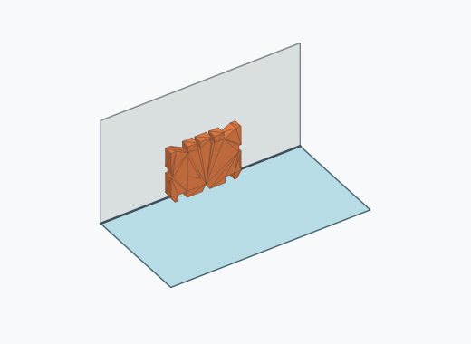 | 1592 | 15.92 % | 15.22–16.65 % | 16.18 % |
| Rf2i_0005 | 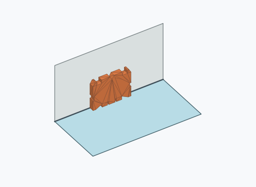 | 1554 | 15.54 % | 14.84–16.26 % | 15.79 % |
| Rf2i_0003 | 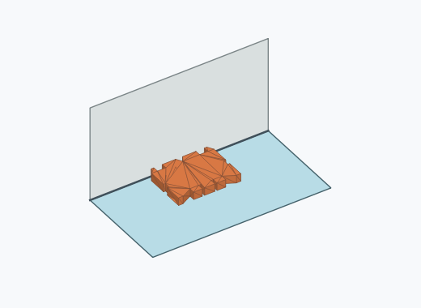 | 1515 | 15.15 % | 14.46–15.87 % | 15.40 % |
| Rf2i_0004 | 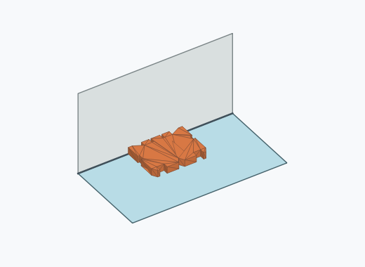 | 1391 | 13.91 % | 13.25–14.60 % | 14.14 % |
| Rf2i_0009 | 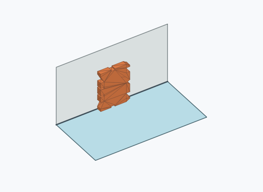 | 1061 | 10.61 % | 10.02–11.23 % | 10.78 % |
| Rf2i_0001 | 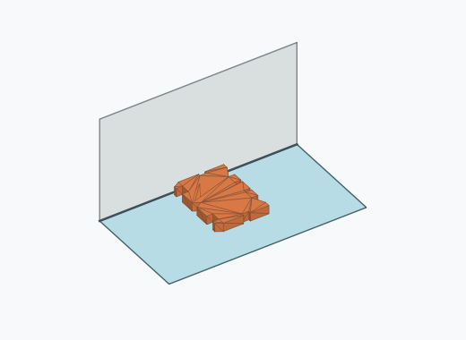 | 914 | 9.14 % | 8.59–9.72 % | 9.29 % |
| Rf2i_0010 |  | 882 | 8.82 % | 8.28–9.39 % | 8.96 % |
| Rf2i_0002 |  | 881 | 8.81 % | 8.27–9.38 % | 8.95 % |
| Rf2i_0017 |  | 9 | 0.09 % | 0.05–0.17 % | 0.09 % |
| Rf2i_0021 | 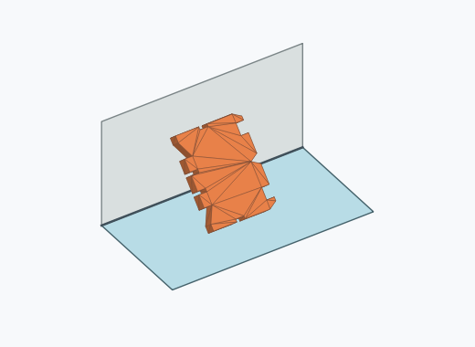 | 8 | 0.08 % | 0.04–0.16 % | 0.08 % |
| Rf2i_0011 | 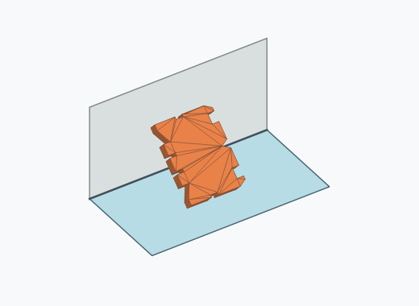 | 7 | 0.07 % | 0.03–0.14 % | 0.07 % |
| Rf2i_0014 | 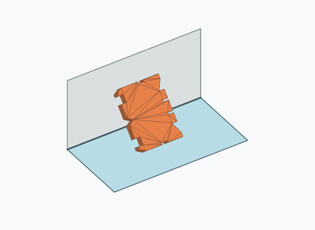 | 6 | 0.06 % | 0.03–0.13 % | 0.06 % |
| Rf2i_0016 |  | 5 | 0.05 % | 0.02–0.12 % | 0.05 % |
| Rf2i_0020 | 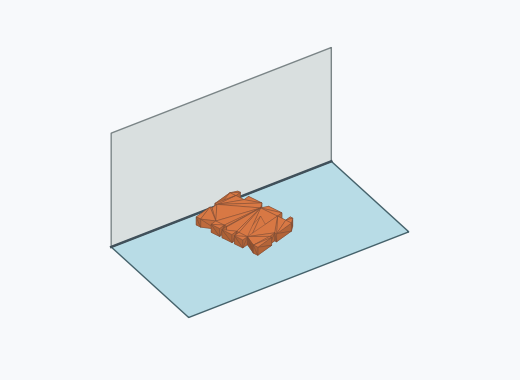 | 4 | 0.04 % | 0.02–0.10 % | 0.04 % |
| Rf2i_0018 |  | 3 | 0.03 % | 0.01–0.09 % | 0.03 % |
| Rf2i_0012 | 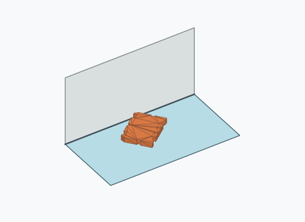 | 2 | 0.02 % | 0.01–0.07 % | 0.02 % |
| Rf2i_0013 | 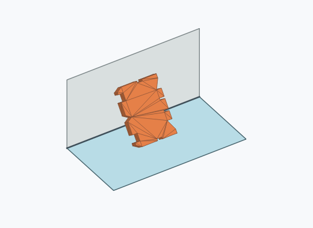 | 2 | 0.02 % | 0.01–0.07 % | 0.02 % |
| Rf2i_0015 |  | 2 | 0.02 % | 0.01–0.07 % | 0.02 % |
| Rf2i_0019 | 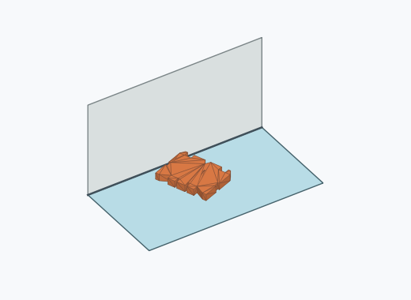 | 1 | 0.01 % | 0.00–0.06 % | 0.01 % |

Ergebnisstatus: unsettled: 161, settled: 9839

Details und Erkennung: [JSON](poses.json), [YAML](poses.yaml). Quaternionen: xyzw, Bauteil → Rutsche. Symmetrieoperationen werden rechts an die Bauteilrotation multipliziert. Die kontinuierliche Symmetrieachse wird gerichtet verglichen. Orientierungsabstand ≤5°; bei konkurrierenden Treffern innerhalb 1° bleibt die Zuordnung mehrdeutig.

Die Pose-IDs bleiben über Läufe erhalten. Der Registereintrag einer früher beobachteten, aktuell nicht aufgetretenen Pose bleibt zur Wiedererkennung reserviert.
