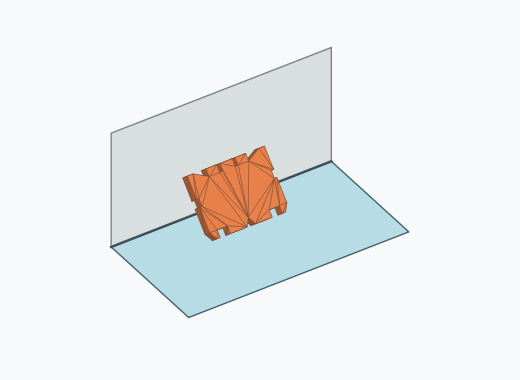

# Rf2i

1000 Fallversuche auf 500 mm Strecke; 983 eingependelte Endlagen. Prozentangaben beziehen sich auf alle Fallversuche.

Dies sind beobachtete Simulationslagen unter den dokumentierten Parametern; Reibung und Unebenheitsmodell sind noch nicht an realen Häufigkeiten kalibriert.

| Pose | Bild | Anzahl | Anteil | 95-%-Intervall | Anteil eingependelt |
| --- | --- | ---: | ---: | ---: | ---: |
| Rf2i_0006 |  | 165 | 16.50 % | 14.33–18.93 % | 16.79 % |
| Rf2i_0003 |  | 157 | 15.70 % | 13.58–18.09 % | 15.97 % |
| Rf2i_0005 |  | 151 | 15.10 % | 13.01–17.45 % | 15.36 % |
| Rf2i_0004 |  | 129 | 12.90 % | 10.96–15.12 % | 13.12 % |
| Rf2i_0009 |  | 102 | 10.20 % | 8.47–12.23 % | 10.38 % |
| Rf2i_0001 |  | 94 | 9.40 % | 7.74–11.37 % | 9.56 % |
| Rf2i_0010 |  | 92 | 9.20 % | 7.56–11.15 % | 9.36 % |
| Rf2i_0002 |  | 90 | 9.00 % | 7.38–10.93 % | 9.16 % |
| Rf2i_0007 |  | 1 | 0.10 % | 0.02–0.56 % | 0.10 % |
| Rf2i_0008 |  | 1 | 0.10 % | 0.02–0.56 % | 0.10 % |
| Rf2i_0011 |  | 1 | 0.10 % | 0.02–0.56 % | 0.10 % |

Ergebnisstatus: unsettled: 17, settled: 983

Details und Erkennung: [JSON](poses.json), [YAML](poses.yaml). Quaternionen: xyzw, Bauteil → Rutsche. Symmetrieoperationen werden rechts an die Bauteilrotation multipliziert. Die kontinuierliche Symmetrieachse wird gerichtet verglichen. Orientierungsabstand ≤5°; bei konkurrierenden Treffern innerhalb 1° bleibt die Zuordnung mehrdeutig.

Die Pose-IDs bleiben über Läufe erhalten. Der Registereintrag einer früher beobachteten, aktuell nicht aufgetretenen Pose bleibt zur Wiedererkennung reserviert.
