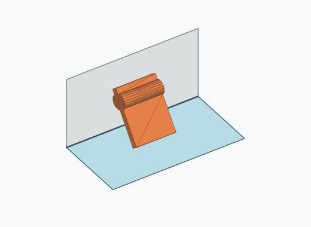
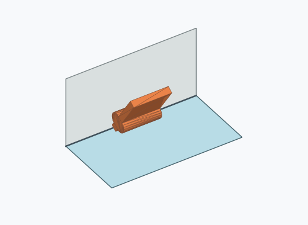
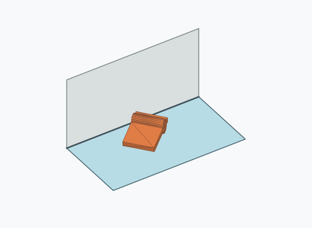
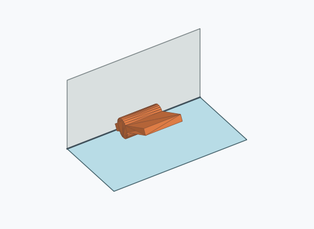
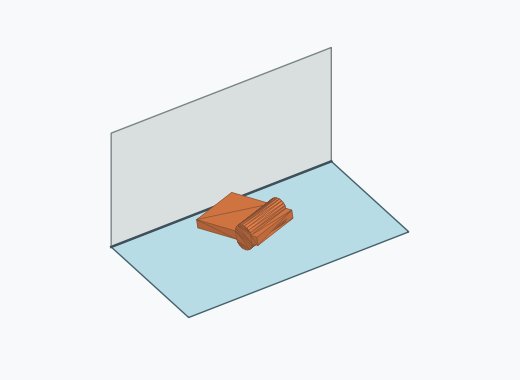
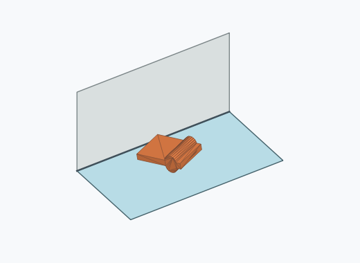

# Rf3a

10000 Fallversuche auf 500 mm Strecke; 9965 eingependelte Endlagen. Prozentangaben beziehen sich auf alle Fallversuche.

Dies sind beobachtete Simulationslagen unter den dokumentierten Parametern; Reibung und Unebenheitsmodell sind noch nicht an realen Häufigkeiten kalibriert.

| Pose | Bild | Anzahl | Anteil | 95-%-Intervall | Anteil eingependelt |
| --- | --- | ---: | ---: | ---: | ---: |
| Rf3a_0001 |  | 1843 | 18.43 % | 17.68–19.20 % | 18.49 % |
| Rf3a_0009 |  | 1569 | 15.69 % | 14.99–16.42 % | 15.75 % |
| Rf3a_0012 |  | 1519 | 15.19 % | 14.50–15.91 % | 15.24 % |
| Rf3a_0002 |  | 1372 | 13.72 % | 13.06–14.41 % | 13.77 % |
| Rf3a_0003 |  | 1363 | 13.63 % | 12.97–14.32 % | 13.68 % |
| Rf3a_0006 |  | 1191 | 11.91 % | 11.29–12.56 % | 11.95 % |
| Rf3a_0011 |  | 435 | 4.35 % | 3.97–4.77 % | 4.37 % |
| Rf3a_0007 |  | 427 | 4.27 % | 3.89–4.68 % | 4.28 % |
| Rf3a_0013 |  | 118 | 1.18 % | 0.99–1.41 % | 1.18 % |
| Rf3a_0005 |  | 96 | 0.96 % | 0.79–1.17 % | 0.96 % |
| Rf3a_0021 |  | 9 | 0.09 % | 0.05–0.17 % | 0.09 % |
| Rf3a_0008 |  | 6 | 0.06 % | 0.03–0.13 % | 0.06 % |
| Rf3a_0020 |  | 5 | 0.05 % | 0.02–0.12 % | 0.05 % |
| Rf3a_0014 |  | 4 | 0.04 % | 0.02–0.10 % | 0.04 % |
| Rf3a_0019 |  | 3 | 0.03 % | 0.01–0.09 % | 0.03 % |
| Rf3a_0018 |  | 2 | 0.02 % | 0.01–0.07 % | 0.02 % |
| Rf3a_0015 |  | 1 | 0.01 % | 0.00–0.06 % | 0.01 % |
| Rf3a_0016 |  | 1 | 0.01 % | 0.00–0.06 % | 0.01 % |
| Rf3a_0017 |  | 1 | 0.01 % | 0.00–0.06 % | 0.01 % |

Ergebnisstatus: settled: 9965, unsettled: 35

Details und Erkennung: [JSON](poses.json), [YAML](poses.yaml). Quaternionen: xyzw, Bauteil → Rutsche. Symmetrieoperationen werden rechts an die Bauteilrotation multipliziert. Die kontinuierliche Symmetrieachse wird gerichtet verglichen. Orientierungsabstand ≤5°; bei konkurrierenden Treffern innerhalb 1° bleibt die Zuordnung mehrdeutig.

Die Pose-IDs bleiben über Läufe erhalten. Der Registereintrag einer früher beobachteten, aktuell nicht aufgetretenen Pose bleibt zur Wiedererkennung reserviert.
