# Rf3a

1000 Fallversuche auf 500 mm Strecke; 997 eingependelte Endlagen. Prozentangaben beziehen sich auf alle Fallversuche.

Dies sind beobachtete Simulationslagen unter den dokumentierten Parametern; Reibung und Unebenheitsmodell sind noch nicht an realen Häufigkeiten kalibriert.

| Pose | Bild | Anzahl | Anteil | 95-%-Intervall | Anteil eingependelt |
| --- | --- | ---: | ---: | ---: | ---: |
| Rf3a_0001 | 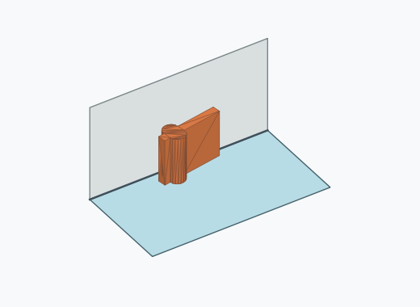 | 186 | 18.60 % | 16.31–21.13 % | 18.66 % |
| Rf3a_0012 | 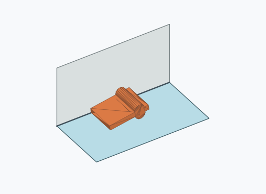 | 163 | 16.30 % | 14.14–18.72 % | 16.35 % |
| Rf3a_0009 | 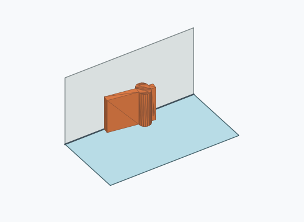 | 159 | 15.90 % | 13.76–18.30 % | 15.95 % |
| Rf3a_0003 | 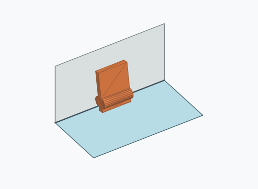 | 133 | 13.30 % | 11.34–15.55 % | 13.34 % |
| Rf3a_0006 | 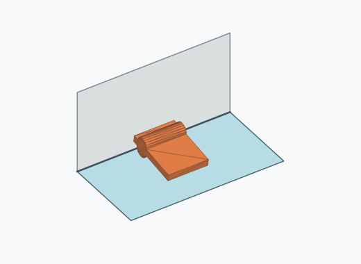 | 128 | 12.80 % | 10.87–15.01 % | 12.84 % |
| Rf3a_0002 | 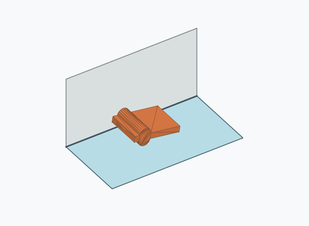 | 122 | 12.20 % | 10.31–14.37 % | 12.24 % |
| Rf3a_0011 | 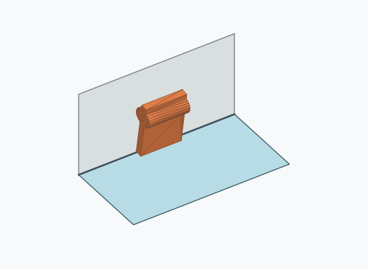 | 49 | 4.90 % | 3.73–6.42 % | 4.91 % |
| Rf3a_0007 | 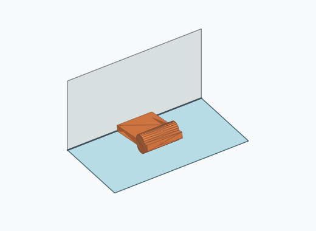 | 39 | 3.90 % | 2.87–5.29 % | 3.91 % |
| Rf3a_0004 |  | 8 | 0.80 % | 0.41–1.57 % | 0.80 % |
| Rf3a_0005 | 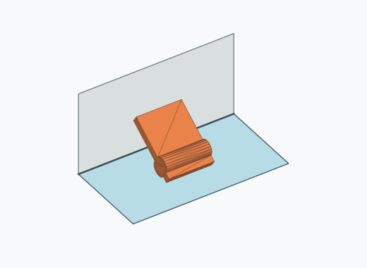 | 6 | 0.60 % | 0.28–1.30 % | 0.60 % |
| Rf3a_0010 | 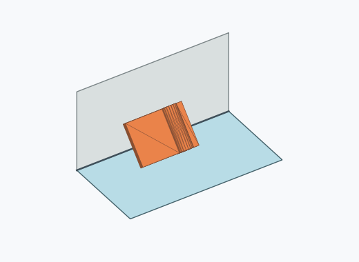 | 3 | 0.30 % | 0.10–0.88 % | 0.30 % |
| Rf3a_0008 | 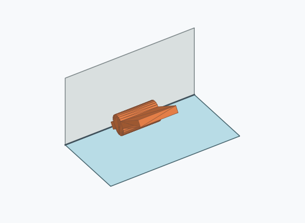 | 1 | 0.10 % | 0.02–0.56 % | 0.10 % |

Ergebnisstatus: settled: 997, unsettled: 3

Details und Erkennung: [JSON](poses.json), [YAML](poses.yaml). Quaternionen: xyzw, Bauteil → Rutsche. Symmetrieoperationen werden rechts an die Bauteilrotation multipliziert. Die kontinuierliche Symmetrieachse wird gerichtet verglichen. Orientierungsabstand ≤5°; bei konkurrierenden Treffern innerhalb 1° bleibt die Zuordnung mehrdeutig.

Die Pose-IDs bleiben über Läufe erhalten. Der Registereintrag einer früher beobachteten, aktuell nicht aufgetretenen Pose bleibt zur Wiedererkennung reserviert.
