# Rf3a

[Workpiece index](../README.md#workpieces)

## Historical pose catalogue

Group numbers rank the saved pose basins by their combined incidence within each observation phase. Pose 0 is the most frequent individual pose in its observation phase. The membership CSV links the displayed numbers to the saved pose IDs. Groups below 1% remain visible.

[Group membership CSV](group_memberships.csv) · [Grouping method](../README.md#catalogue-grouping)

### Transport poses

9,965 settled outcomes across 10,000 historical drops on a 500 mm chute. Incidence uses all completed drops as the denominator.

Outcome counts: settled: 9,965, unsettled: 35.

| Pose | Group | Image | Count | Incidence | 95% interval | Share of settled outcomes |
| --- | --- | --- | ---: | ---: | ---: | ---: |
| Pose 0 | Group 0 | 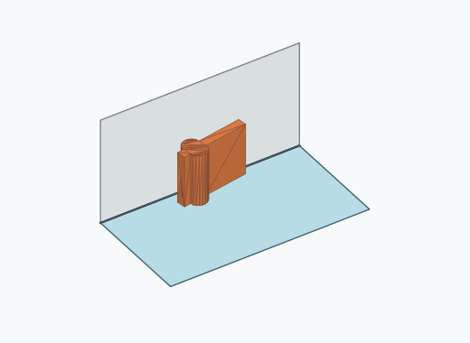 | 1843 | 18.43 % | 17.68–19.20 % | 18.49 % |
| Pose 1 | Group 1 | 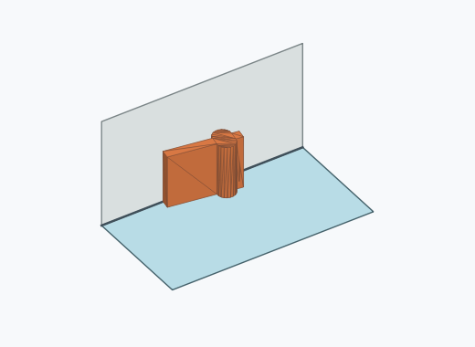 | 1569 | 15.69 % | 14.99–16.42 % | 15.75 % |
| Pose 2 | Group 2 | 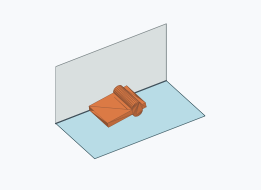 | 1519 | 15.19 % | 14.50–15.91 % | 15.24 % |
| Pose 3 | Group 4 | 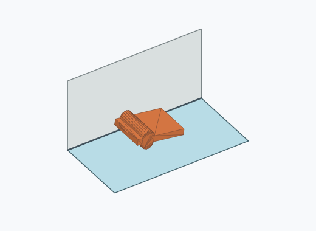 | 1372 | 13.72 % | 13.06–14.41 % | 13.77 % |
| Pose 4 | Group 3 | 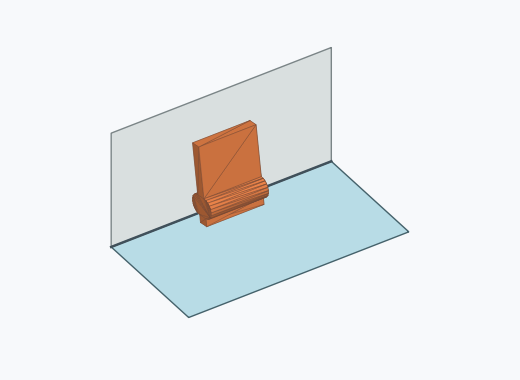 | 1363 | 13.63 % | 12.97–14.32 % | 13.68 % |
| Pose 5 | Group 5 | 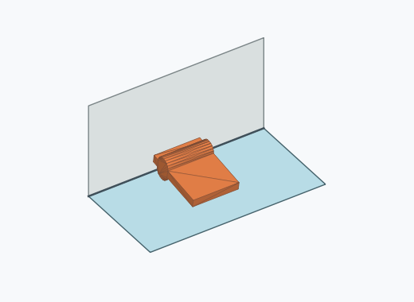 | 1191 | 11.91 % | 11.29–12.56 % | 11.95 % |
| Pose 6 | Group 6 | 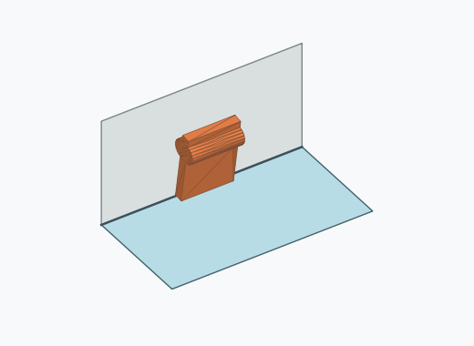 | 435 | 4.35 % | 3.97–4.77 % | 4.37 % |
| Pose 7 | Group 7 | 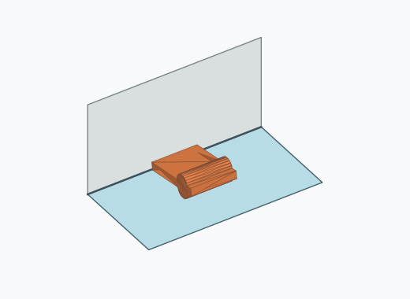 | 427 | 4.27 % | 3.89–4.68 % | 4.28 % |
| Pose 8 | Group 8 |  | 118 | 1.18 % | 0.99–1.41 % | 1.18 % |
| Pose 9 | Group 3 | 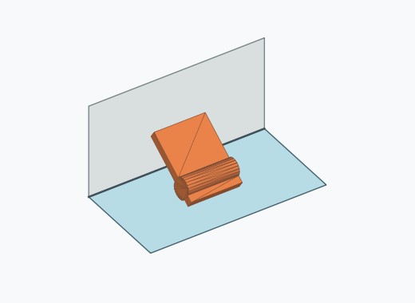 | 96 | 0.96 % | 0.79–1.17 % | 0.96 % |
| Pose 10 | Group 9 |  | 9 | 0.09 % | 0.05–0.17 % | 0.09 % |
| Pose 11 | Group 5 | 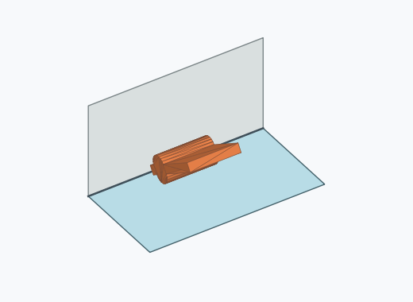 | 6 | 0.06 % | 0.03–0.13 % | 0.06 % |
| Pose 12 | Group 9 | 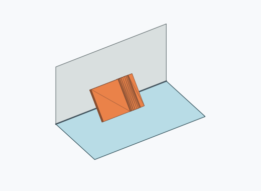 | 5 | 0.05 % | 0.02–0.12 % | 0.05 % |
| Pose 13 | Group 8 | 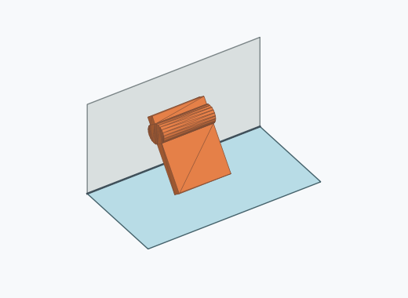 | 4 | 0.04 % | 0.02–0.10 % | 0.04 % |
| Pose 14 | Group 10 | 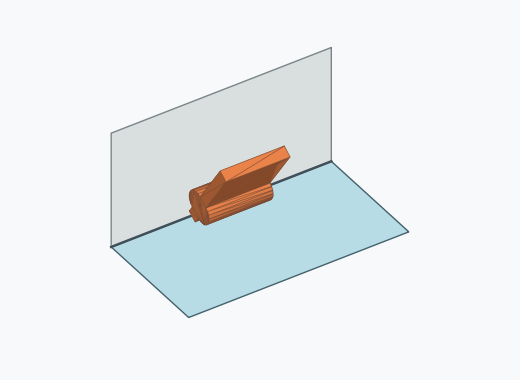 | 3 | 0.03 % | 0.01–0.09 % | 0.03 % |
| Pose 15 | Group 11 | 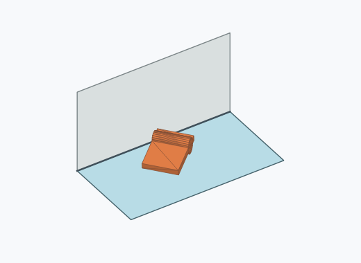 | 2 | 0.02 % | 0.01–0.07 % | 0.02 % |
| Pose 16 | Group 5 | 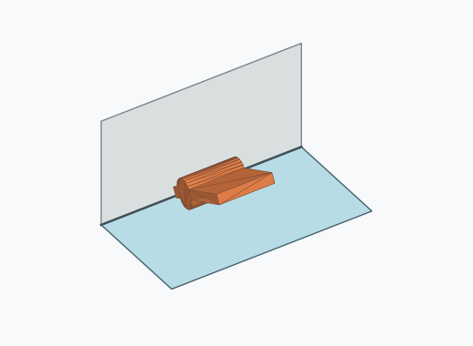 | 1 | 0.01 % | 0.00–0.06 % | 0.01 % |
| Pose 17 | Group 7 | 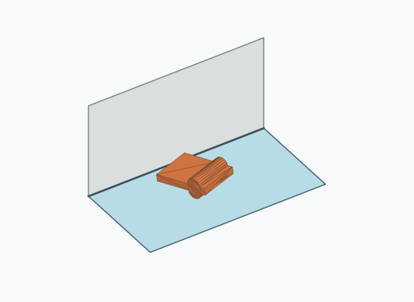 | 1 | 0.01 % | 0.00–0.06 % | 0.01 % |
| Pose 18 | Group 7 | 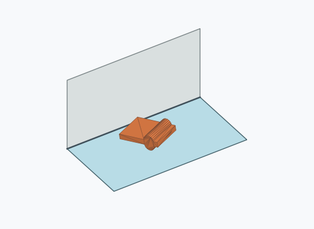 | 1 | 0.01 % | 0.00–0.06 % | 0.01 % |

[Pose catalogue JSON](poses.json) · [Pose catalogue YAML](poses.yaml) · [Frequencies](frequencies.csv) · [Trial records](trials.csv)

Pose orientations use `xyzw` quaternions from the workpiece frame to the chute frame. Recognition uses the recorded symmetry, a 5° tolerance, and a 1° ambiguity margin. The pose registry reserves previously observed IDs for later recognition.

### Historical run files

- [Configuration](config.json)
- [Manifest](manifest.json)
