# Rf4i

10000 Fallversuche auf 500 mm Strecke; 9885 eingependelte Endlagen. Prozentangaben beziehen sich auf alle Fallversuche.

Dies sind beobachtete Simulationslagen unter den dokumentierten Parametern; Reibung und Unebenheitsmodell sind noch nicht an realen Häufigkeiten kalibriert.

| Pose | Bild | Anzahl | Anteil | 95-%-Intervall | Anteil eingependelt |
| --- | --- | ---: | ---: | ---: | ---: |
| Rf4i_0008 | 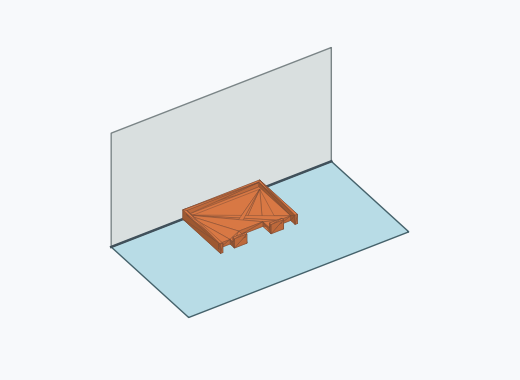 | 1061 | 10.61 % | 10.02–11.23 % | 10.73 % |
| Rf4i_0005 | 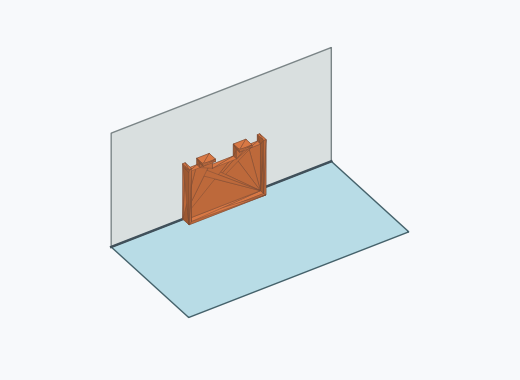 | 1052 | 10.52 % | 9.93–11.14 % | 10.64 % |
| Rf4i_0015 | 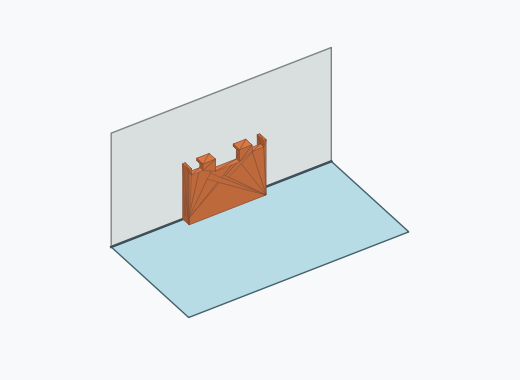 | 816 | 8.16 % | 7.64–8.71 % | 8.25 % |
| Rf4i_0003 | 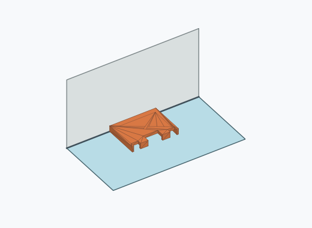 | 776 | 7.76 % | 7.25–8.30 % | 7.85 % |
| Rf4i_0006 | 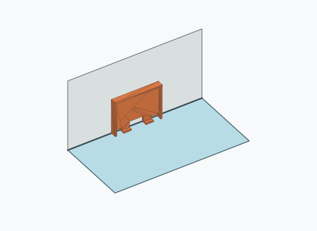 | 616 | 6.16 % | 5.71–6.65 % | 6.23 % |
| Rf4i_0010 | 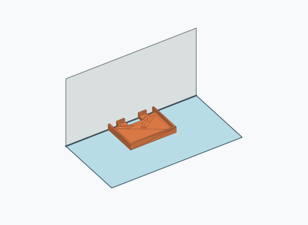 | 571 | 5.71 % | 5.27–6.18 % | 5.78 % |
| Rf4i_0016 | 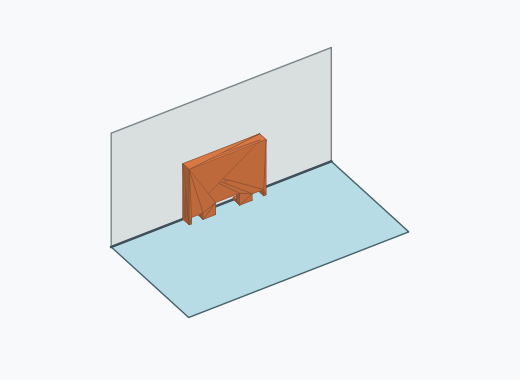 | 557 | 5.57 % | 5.14–6.04 % | 5.63 % |
| Rf4i_0011 | 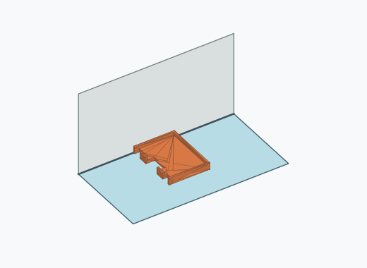 | 550 | 5.50 % | 5.07–5.96 % | 5.56 % |
| Rf4i_0002 |  | 544 | 5.44 % | 5.01–5.90 % | 5.50 % |
| Rf4i_0013 |  | 544 | 5.44 % | 5.01–5.90 % | 5.50 % |
| Rf4i_0009 | 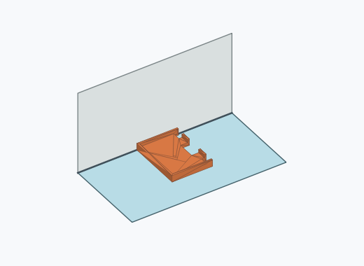 | 499 | 4.99 % | 4.58–5.43 % | 5.05 % |
| Rf4i_0004 | 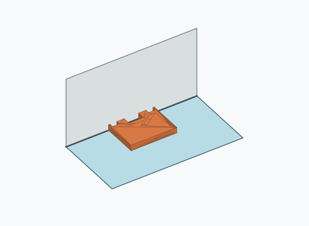 | 496 | 4.96 % | 4.55–5.40 % | 5.02 % |
| Rf4i_0020 | 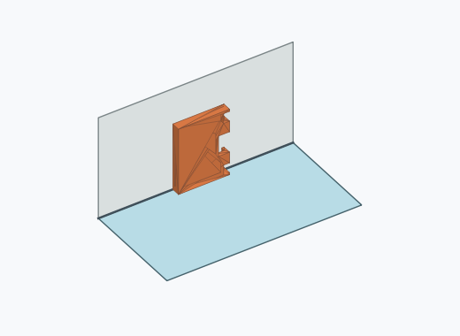 | 469 | 4.69 % | 4.29–5.12 % | 4.74 % |
| Rf4i_0012 |  | 466 | 4.66 % | 4.26–5.09 % | 4.71 % |
| Rf4i_0014 | 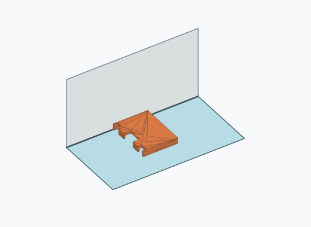 | 443 | 4.43 % | 4.04–4.85 % | 4.48 % |
| Rf4i_0001 | 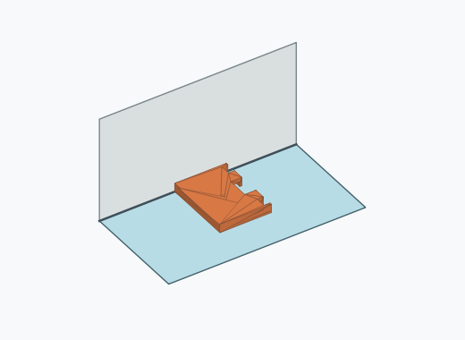 | 396 | 3.96 % | 3.60–4.36 % | 4.01 % |
| Rf4i_0017 |  | 5 | 0.05 % | 0.02–0.12 % | 0.05 % |
| Rf4i_0019 | 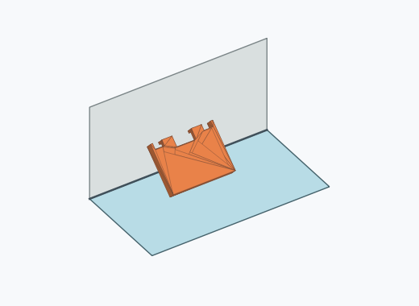 | 4 | 0.04 % | 0.02–0.10 % | 0.04 % |
| Rf4i_0022 |  | 4 | 0.04 % | 0.02–0.10 % | 0.04 % |
| Rf4i_0007 | 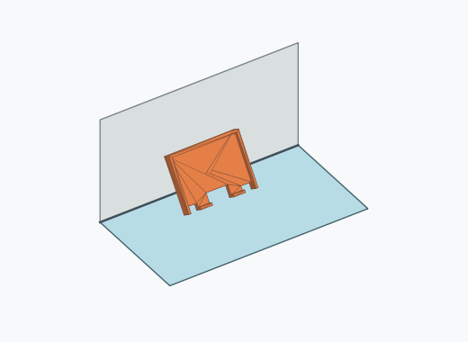 | 3 | 0.03 % | 0.01–0.09 % | 0.03 % |
| Rf4i_0023 | 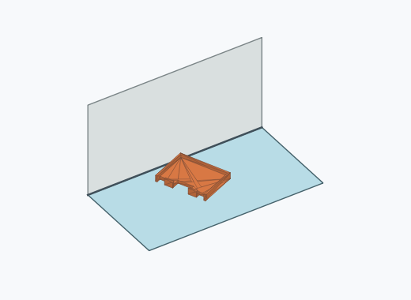 | 3 | 0.03 % | 0.01–0.09 % | 0.03 % |
| Rf4i_0026 |  | 3 | 0.03 % | 0.01–0.09 % | 0.03 % |
| Rf4i_0018 | 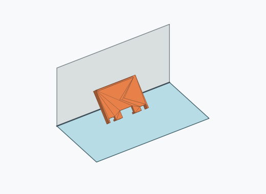 | 2 | 0.02 % | 0.01–0.07 % | 0.02 % |
| Rf4i_0025 |  | 2 | 0.02 % | 0.01–0.07 % | 0.02 % |
| Rf4i_0021 | 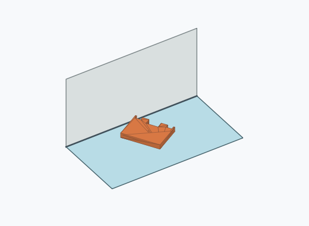 | 1 | 0.01 % | 0.00–0.06 % | 0.01 % |
| Rf4i_0024 | 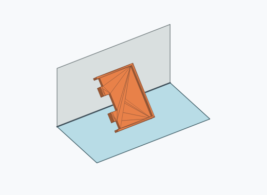 | 1 | 0.01 % | 0.00–0.06 % | 0.01 % |
| Rf4i_0027 | 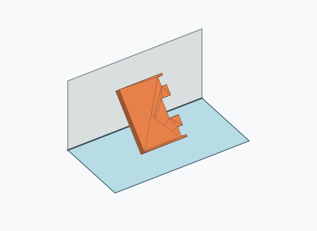 | 1 | 0.01 % | 0.00–0.06 % | 0.01 % |

Ergebnisstatus: settled: 9885, unsettled: 115

Details und Erkennung: [JSON](poses.json), [YAML](poses.yaml). Quaternionen: xyzw, Bauteil → Rutsche. Symmetrieoperationen werden rechts an die Bauteilrotation multipliziert. Die kontinuierliche Symmetrieachse wird gerichtet verglichen. Orientierungsabstand ≤5°; bei konkurrierenden Treffern innerhalb 1° bleibt die Zuordnung mehrdeutig.

Die Pose-IDs bleiben über Läufe erhalten. Der Registereintrag einer früher beobachteten, aktuell nicht aufgetretenen Pose bleibt zur Wiedererkennung reserviert.
