# Rk1a

1000 Fallversuche auf 500 mm Strecke; 999 eingependelte Endlagen. Prozentangaben beziehen sich auf alle Fallversuche.

Dies sind beobachtete Simulationslagen unter den dokumentierten Parametern; Reibung und Unebenheitsmodell sind noch nicht an realen Häufigkeiten kalibriert.

| Pose | Bild | Anzahl | Anteil | 95-%-Intervall | Anteil eingependelt |
| --- | --- | ---: | ---: | ---: | ---: |
| Rk1a_0010 |  | 72 | 7.20 % | 5.76–8.97 % | 7.21 % |
| Rk1a_0011 |  | 71 | 7.10 % | 5.67–8.86 % | 7.11 % |
| Rk1a_0008 | 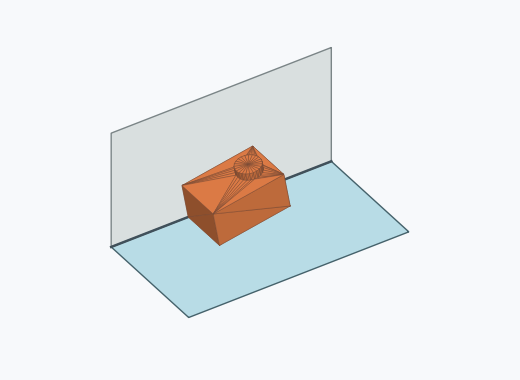 | 54 | 5.40 % | 4.16–6.98 % | 5.41 % |
| Rk1a_0026 |  | 54 | 5.40 % | 4.16–6.98 % | 5.41 % |
| Rk1a_0033 | 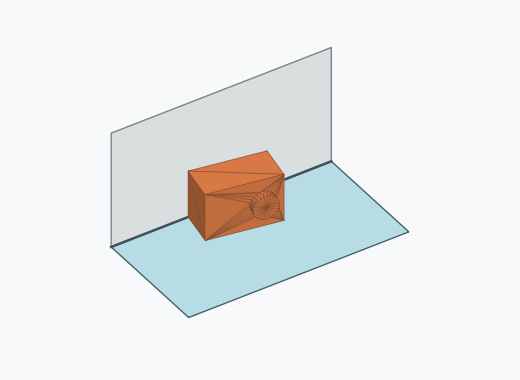 | 49 | 4.90 % | 3.73–6.42 % | 4.90 % |
| Rk1a_0034 | 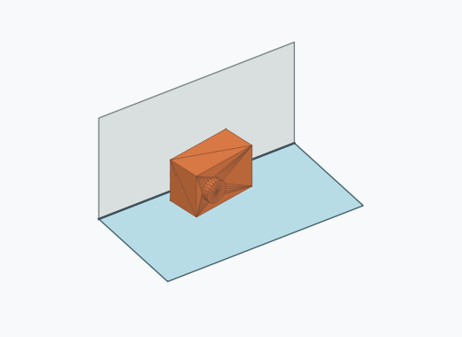 | 47 | 4.70 % | 3.55–6.19 % | 4.70 % |
| Rk1a_0007 |  | 45 | 4.50 % | 3.38–5.97 % | 4.50 % |
| Rk1a_0022 | 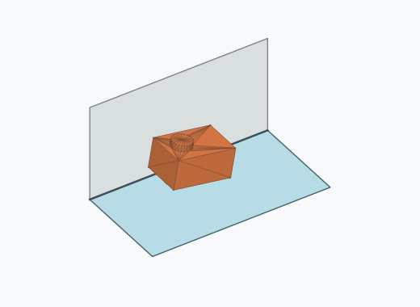 | 41 | 4.10 % | 3.04–5.51 % | 4.10 % |
| Rk1a_0035 | 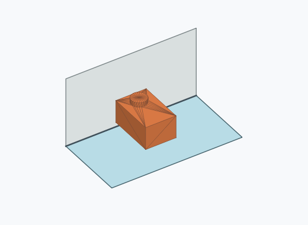 | 41 | 4.10 % | 3.04–5.51 % | 4.10 % |
| Rk1a_0003 |  | 35 | 3.50 % | 2.53–4.83 % | 3.50 % |
| Rk1a_0021 |  | 32 | 3.20 % | 2.28–4.48 % | 3.20 % |
| Rk1a_0024 |  | 31 | 3.10 % | 2.19–4.37 % | 3.10 % |
| Rk1a_0004 |  | 28 | 2.80 % | 1.94–4.02 % | 2.80 % |
| Rk1a_0005 |  | 28 | 2.80 % | 1.94–4.02 % | 2.80 % |
| Rk1a_0025 |  | 28 | 2.80 % | 1.94–4.02 % | 2.80 % |
| Rk1a_0030 | 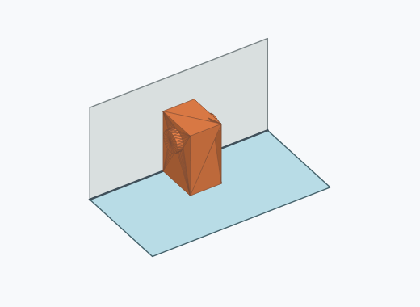 | 28 | 2.80 % | 1.94–4.02 % | 2.80 % |
| Rk1a_0001 |  | 27 | 2.70 % | 1.86–3.90 % | 2.70 % |
| Rk1a_0037 |  | 25 | 2.50 % | 1.70–3.66 % | 2.50 % |
| Rk1a_0006 |  | 23 | 2.30 % | 1.54–3.43 % | 2.30 % |
| Rk1a_0028 |  | 23 | 2.30 % | 1.54–3.43 % | 2.30 % |
| Rk1a_0013 |  | 22 | 2.20 % | 1.46–3.31 % | 2.20 % |
| Rk1a_0009 | 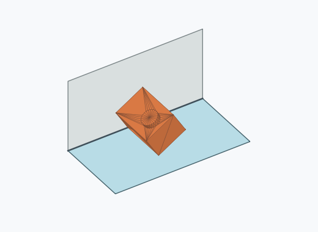 | 20 | 2.00 % | 1.30–3.07 % | 2.00 % |
| Rk1a_0019 | 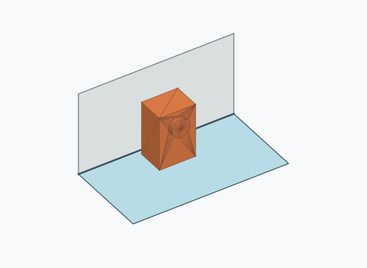 | 20 | 2.00 % | 1.30–3.07 % | 2.00 % |
| Rk1a_0031 | 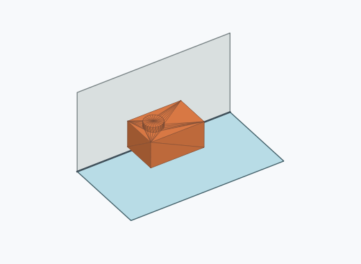 | 20 | 2.00 % | 1.30–3.07 % | 2.00 % |
| Rk1a_0012 |  | 19 | 1.90 % | 1.22–2.95 % | 1.90 % |
| Rk1a_0023 |  | 17 | 1.70 % | 1.06–2.71 % | 1.70 % |
| Rk1a_0042 | 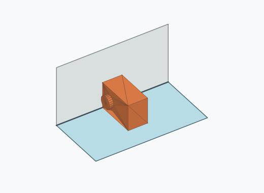 | 17 | 1.70 % | 1.06–2.71 % | 1.70 % |
| Rk1a_0017 |  | 15 | 1.50 % | 0.91–2.46 % | 1.50 % |
| Rk1a_0020 | 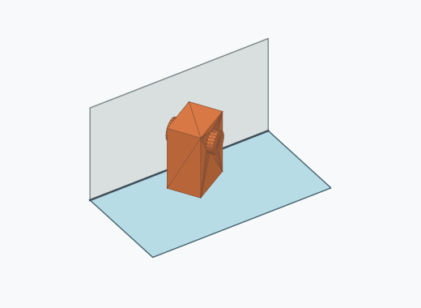 | 14 | 1.40 % | 0.84–2.34 % | 1.40 % |
| Rk1a_0027 |  | 9 | 0.90 % | 0.47–1.70 % | 0.90 % |
| Rk1a_0032 | 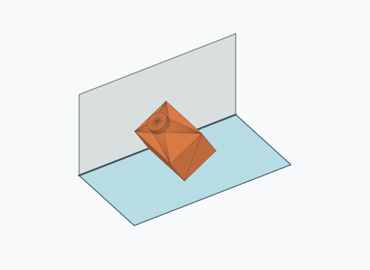 | 8 | 0.80 % | 0.41–1.57 % | 0.80 % |
| Rk1a_0029 |  | 7 | 0.70 % | 0.34–1.44 % | 0.70 % |
| Rk1a_0038 |  | 7 | 0.70 % | 0.34–1.44 % | 0.70 % |
| Rk1a_0036 | 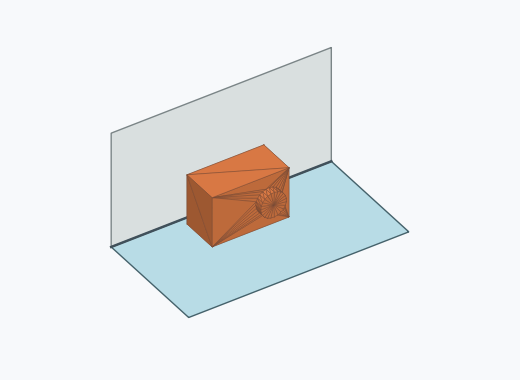 | 6 | 0.60 % | 0.28–1.30 % | 0.60 % |
| Rk1a_0016 | 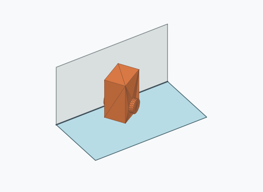 | 3 | 0.30 % | 0.10–0.88 % | 0.30 % |
| Rk1a_0039 | 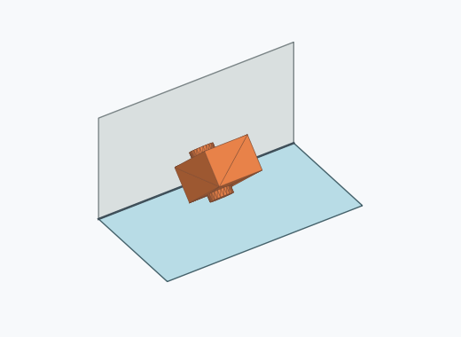 | 3 | 0.30 % | 0.10–0.88 % | 0.30 % |
| Rk1a_0002 |  | 2 | 0.20 % | 0.05–0.73 % | 0.20 % |
| Rk1a_0040 | 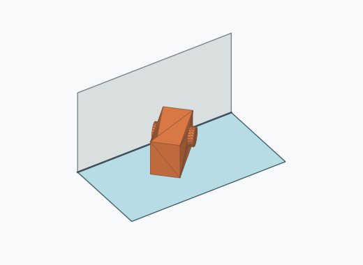 | 2 | 0.20 % | 0.05–0.73 % | 0.20 % |
| Rk1a_0043 | 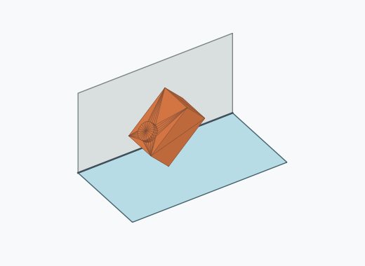 | 2 | 0.20 % | 0.05–0.73 % | 0.20 % |
| Rk1a_0014 | 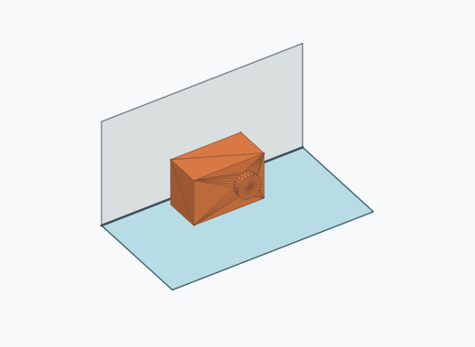 | 1 | 0.10 % | 0.02–0.56 % | 0.10 % |
| Rk1a_0015 |  | 1 | 0.10 % | 0.02–0.56 % | 0.10 % |
| Rk1a_0018 |  | 1 | 0.10 % | 0.02–0.56 % | 0.10 % |
| Rk1a_0041 |  | 1 | 0.10 % | 0.02–0.56 % | 0.10 % |

Ergebnisstatus: settled: 999, unsettled: 1

Details und Erkennung: [JSON](poses.json), [YAML](poses.yaml). Quaternionen: xyzw, Bauteil → Rutsche. Symmetrieoperationen werden rechts an die Bauteilrotation multipliziert. Die kontinuierliche Symmetrieachse wird gerichtet verglichen. Orientierungsabstand ≤5°; bei konkurrierenden Treffern innerhalb 1° bleibt die Zuordnung mehrdeutig.

Die Pose-IDs bleiben über Läufe erhalten. Der Registereintrag einer früher beobachteten, aktuell nicht aufgetretenen Pose bleibt zur Wiedererkennung reserviert.
