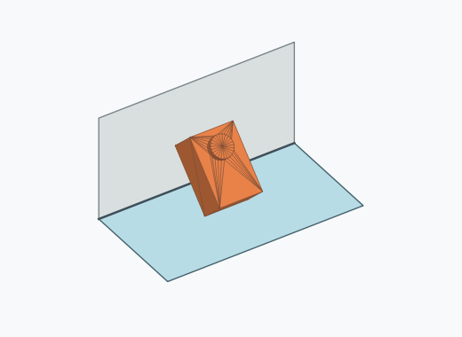

# Rk1a

10000 Fallversuche auf 500 mm Strecke; 9976 eingependelte Endlagen. Prozentangaben beziehen sich auf alle Fallversuche.

Dies sind beobachtete Simulationslagen unter den dokumentierten Parametern; Reibung und Unebenheitsmodell sind noch nicht an realen Häufigkeiten kalibriert.

| Pose | Bild | Anzahl | Anteil | 95-%-Intervall | Anteil eingependelt |
| --- | --- | ---: | ---: | ---: | ---: |
| Rk1a_0034 |  | 717 | 7.17 % | 6.68–7.69 % | 7.19 % |
| Rk1a_0026 |  | 656 | 6.56 % | 6.09–7.06 % | 6.58 % |
| Rk1a_0011 |  | 640 | 6.40 % | 5.94–6.90 % | 6.42 % |
| Rk1a_0008 |  | 623 | 6.23 % | 5.77–6.72 % | 6.24 % |
| Rk1a_0010 |  | 604 | 6.04 % | 5.59–6.52 % | 6.05 % |
| Rk1a_0033 |  | 576 | 5.76 % | 5.32–6.23 % | 5.77 % |
| Rk1a_0007 |  | 391 | 3.91 % | 3.55–4.31 % | 3.92 % |
| Rk1a_0022 |  | 385 | 3.85 % | 3.49–4.25 % | 3.86 % |
| Rk1a_0004 |  | 345 | 3.45 % | 3.11–3.83 % | 3.46 % |
| Rk1a_0003 |  | 321 | 3.21 % | 2.88–3.57 % | 3.22 % |
| Rk1a_0035 |  | 319 | 3.19 % | 2.86–3.55 % | 3.20 % |
| Rk1a_0037 |  | 316 | 3.16 % | 2.83–3.52 % | 3.17 % |
| Rk1a_0019 |  | 267 | 2.67 % | 2.37–3.00 % | 2.68 % |
| Rk1a_0006 |  | 257 | 2.57 % | 2.28–2.90 % | 2.58 % |
| Rk1a_0042 |  | 244 | 2.44 % | 2.16–2.76 % | 2.45 % |
| Rk1a_0024 |  | 243 | 2.43 % | 2.15–2.75 % | 2.44 % |
| Rk1a_0001 |  | 238 | 2.38 % | 2.10–2.70 % | 2.39 % |
| Rk1a_0021 |  | 236 | 2.36 % | 2.08–2.68 % | 2.37 % |
| Rk1a_0030 |  | 229 | 2.29 % | 2.01–2.60 % | 2.30 % |
| Rk1a_0025 |  | 223 | 2.23 % | 1.96–2.54 % | 2.24 % |
| Rk1a_0005 |  | 218 | 2.18 % | 1.91–2.49 % | 2.19 % |
| Rk1a_0023 |  | 218 | 2.18 % | 1.91–2.49 % | 2.19 % |
| Rk1a_0028 |  | 205 | 2.05 % | 1.79–2.35 % | 2.05 % |
| Rk1a_0031 |  | 205 | 2.05 % | 1.79–2.35 % | 2.05 % |
| Rk1a_0009 |  | 189 | 1.89 % | 1.64–2.18 % | 1.89 % |
| Rk1a_0017 |  | 181 | 1.81 % | 1.57–2.09 % | 1.81 % |
| Rk1a_0013 |  | 155 | 1.55 % | 1.33–1.81 % | 1.55 % |
| Rk1a_0012 |  | 152 | 1.52 % | 1.30–1.78 % | 1.52 % |
| Rk1a_0027 |  | 127 | 1.27 % | 1.07–1.51 % | 1.27 % |
| Rk1a_0020 |  | 126 | 1.26 % | 1.06–1.50 % | 1.26 % |
| Rk1a_0032 |  | 55 | 0.55 % | 0.42–0.72 % | 0.55 % |
| Rk1a_0038 |  | 51 | 0.51 % | 0.39–0.67 % | 0.51 % |
| Rk1a_0036 |  | 43 | 0.43 % | 0.32–0.58 % | 0.43 % |
| Rk1a_0002 |  | 41 | 0.41 % | 0.30–0.56 % | 0.41 % |
| Rk1a_0016 |  | 37 | 0.37 % | 0.27–0.51 % | 0.37 % |
| Rk1a_0014 |  | 34 | 0.34 % | 0.24–0.47 % | 0.34 % |
| Rk1a_0029 |  | 30 | 0.30 % | 0.21–0.43 % | 0.30 % |
| Rk1a_0043 |  | 25 | 0.25 % | 0.17–0.37 % | 0.25 % |
| Rk1a_0018 |  | 14 | 0.14 % | 0.08–0.23 % | 0.14 % |
| Rk1a_0039 |  | 13 | 0.13 % | 0.08–0.22 % | 0.13 % |
| Rk1a_0040 |  | 11 | 0.11 % | 0.06–0.20 % | 0.11 % |
| Rk1a_0041 |  | 7 | 0.07 % | 0.03–0.14 % | 0.07 % |
| Rk1a_0015 |  | 3 | 0.03 % | 0.01–0.09 % | 0.03 % |
| Rk1a_0044 |  | 3 | 0.03 % | 0.01–0.09 % | 0.03 % |
| Rk1a_0045 |  | 3 | 0.03 % | 0.01–0.09 % | 0.03 % |

Ergebnisstatus: settled: 9976, unsettled: 24

Details und Erkennung: [JSON](poses.json), [YAML](poses.yaml). Quaternionen: xyzw, Bauteil → Rutsche. Symmetrieoperationen werden rechts an die Bauteilrotation multipliziert. Die kontinuierliche Symmetrieachse wird gerichtet verglichen. Orientierungsabstand ≤5°; bei konkurrierenden Treffern innerhalb 1° bleibt die Zuordnung mehrdeutig.

Die Pose-IDs bleiben über Läufe erhalten. Der Registereintrag einer früher beobachteten, aktuell nicht aufgetretenen Pose bleibt zur Wiedererkennung reserviert.
