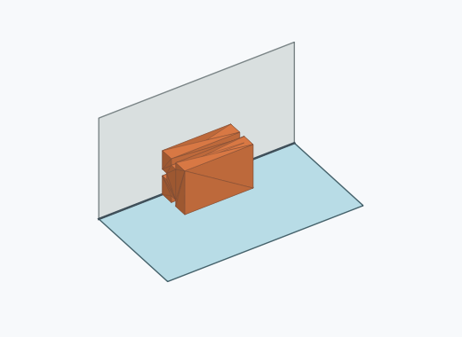
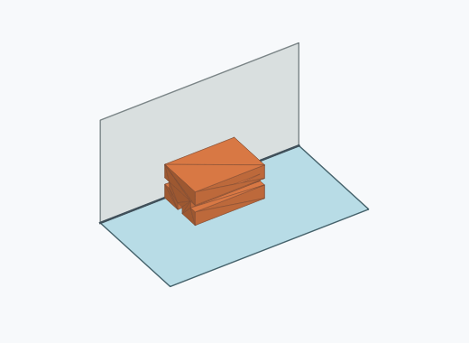
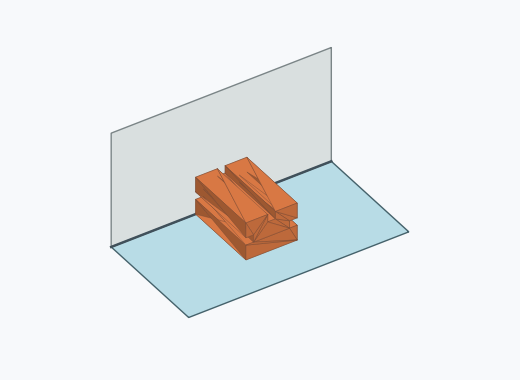
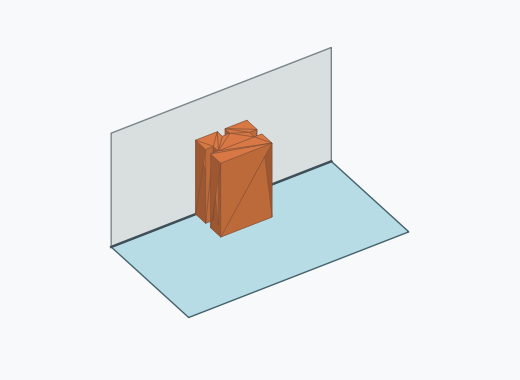
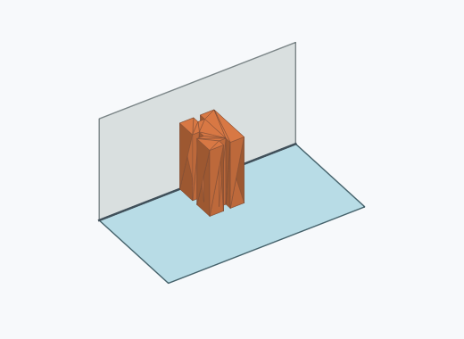
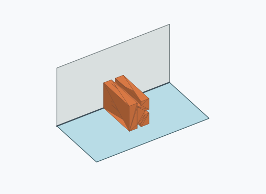

# Rk2i

1000 Fallversuche auf 500 mm Strecke; 1000 eingependelte Endlagen. Prozentangaben beziehen sich auf alle Fallversuche.

Dies sind beobachtete Simulationslagen unter den dokumentierten Parametern; Reibung und Unebenheitsmodell sind noch nicht an realen Häufigkeiten kalibriert.

| Pose | Bild | Anzahl | Anteil | 95-%-Intervall | Anteil eingependelt |
| --- | --- | ---: | ---: | ---: | ---: |
| Rk2i_0010 |  | 132 | 13.20 % | 11.24–15.44 % | 13.20 % |
| Rk2i_0006 |  | 124 | 12.40 % | 10.50–14.59 % | 12.40 % |
| Rk2i_0009 |  | 121 | 12.10 % | 10.22–14.27 % | 12.10 % |
| Rk2i_0003 |  | 118 | 11.80 % | 9.95–13.95 % | 11.80 % |
| Rk2i_0008 |  | 92 | 9.20 % | 7.56–11.15 % | 9.20 % |
| Rk2i_0002 |  | 75 | 7.50 % | 6.03–9.30 % | 7.50 % |
| Rk2i_0005 |  | 72 | 7.20 % | 5.76–8.97 % | 7.20 % |
| Rk2i_0007 |  | 68 | 6.80 % | 5.40–8.53 % | 6.80 % |
| Rk2i_0012 |  | 58 | 5.80 % | 4.51–7.42 % | 5.80 % |
| Rk2i_0001 |  | 51 | 5.10 % | 3.90–6.64 % | 5.10 % |
| Rk2i_0011 |  | 46 | 4.60 % | 3.47–6.08 % | 4.60 % |
| Rk2i_0004 |  | 43 | 4.30 % | 3.21–5.74 % | 4.30 % |

Ergebnisstatus: settled: 1000

Details und Erkennung: [JSON](poses.json), [YAML](poses.yaml). Quaternionen: xyzw, Bauteil → Rutsche. Symmetrieoperationen werden rechts an die Bauteilrotation multipliziert. Die kontinuierliche Symmetrieachse wird gerichtet verglichen. Orientierungsabstand ≤5°; bei konkurrierenden Treffern innerhalb 1° bleibt die Zuordnung mehrdeutig.

Die Pose-IDs bleiben über Läufe erhalten. Der Registereintrag einer früher beobachteten, aktuell nicht aufgetretenen Pose bleibt zur Wiedererkennung reserviert.
