# Rk3a

10000 Fallversuche auf 500 mm Strecke; 9995 eingependelte Endlagen. Prozentangaben beziehen sich auf alle Fallversuche.

Dies sind beobachtete Simulationslagen unter den dokumentierten Parametern; Reibung und Unebenheitsmodell sind noch nicht an realen Häufigkeiten kalibriert.

| Pose | Bild | Anzahl | Anteil | 95-%-Intervall | Anteil eingependelt |
| --- | --- | ---: | ---: | ---: | ---: |
| Rk3a_0014 | 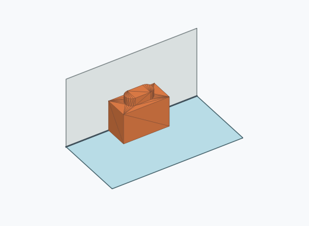 | 1349 | 13.49 % | 12.83–14.17 % | 13.50 % |
| Rk3a_0012 | 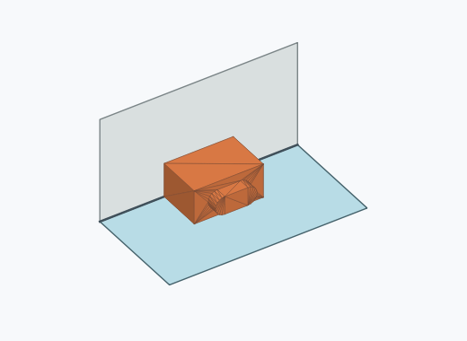 | 1267 | 12.67 % | 12.03–13.34 % | 12.68 % |
| Rk3a_0010 | 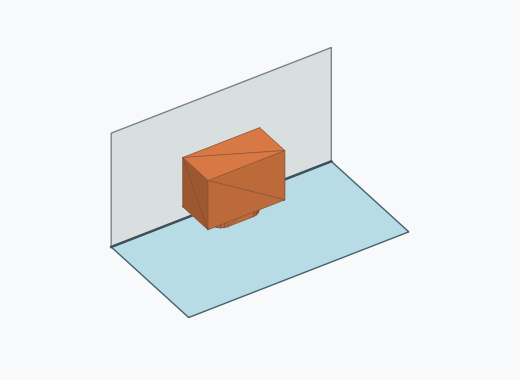 | 1109 | 11.09 % | 10.49–11.72 % | 11.10 % |
| Rk3a_0004 | 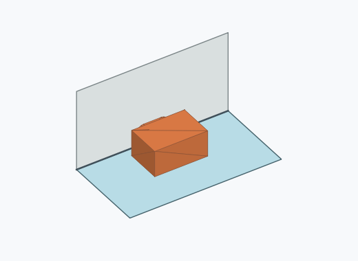 | 1053 | 10.53 % | 9.94–11.15 % | 10.54 % |
| Rk3a_0003 | 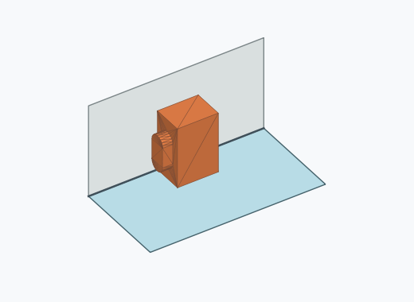 | 1035 | 10.35 % | 9.77–10.96 % | 10.36 % |
| Rk3a_0009 |  | 1027 | 10.27 % | 9.69–10.88 % | 10.28 % |
| Rk3a_0002 | 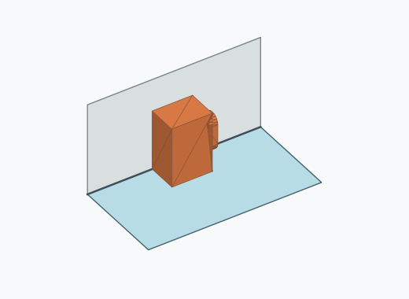 | 899 | 8.99 % | 8.45–9.57 % | 8.99 % |
| Rk3a_0008 | 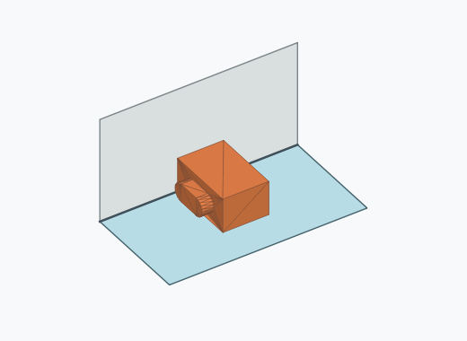 | 849 | 8.49 % | 7.96–9.05 % | 8.49 % |
| Rk3a_0011 | 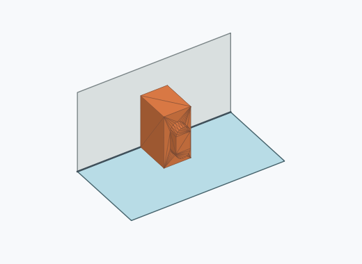 | 426 | 4.26 % | 3.88–4.67 % | 4.26 % |
| Rk3a_0013 | 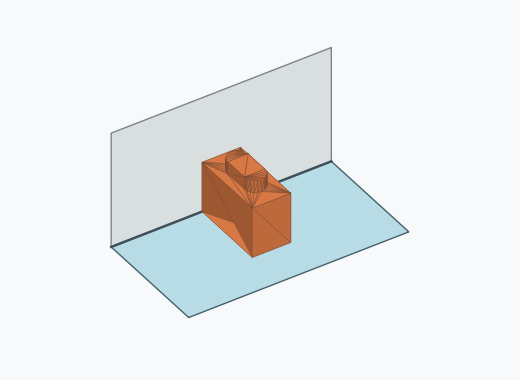 | 409 | 4.09 % | 3.72–4.50 % | 4.09 % |
| Rk3a_0007 | 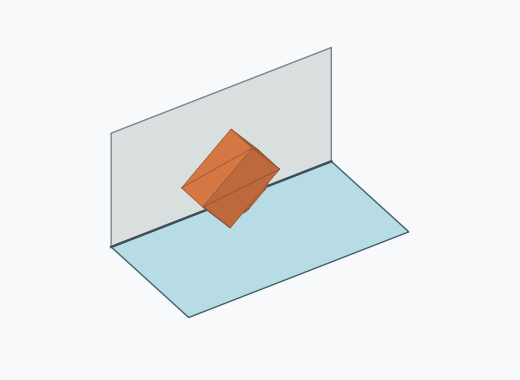 | 201 | 2.01 % | 1.75–2.30 % | 2.01 % |
| Rk3a_0006 | 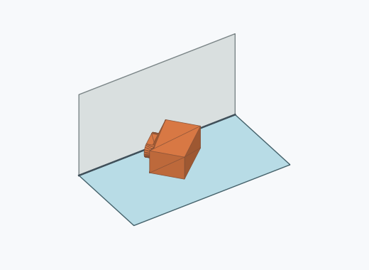 | 162 | 1.62 % | 1.39–1.89 % | 1.62 % |
| Rk3a_0001 | 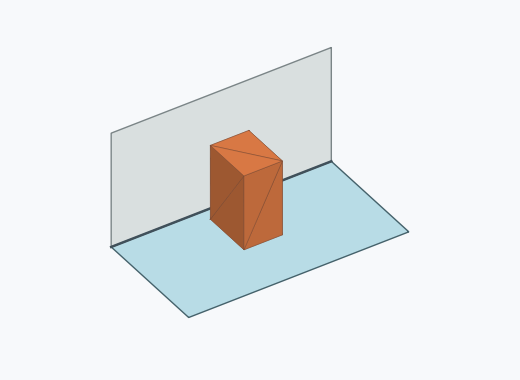 | 133 | 1.33 % | 1.12–1.57 % | 1.33 % |
| Rk3a_0005 | 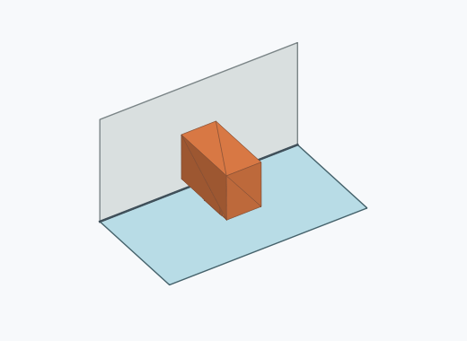 | 61 | 0.61 % | 0.48–0.78 % | 0.61 % |
| Rk3a_0016 | 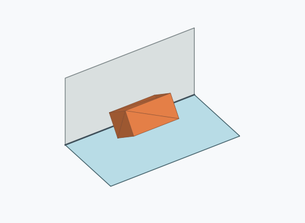 | 12 | 0.12 % | 0.07–0.21 % | 0.12 % |
| Rk3a_0017 | 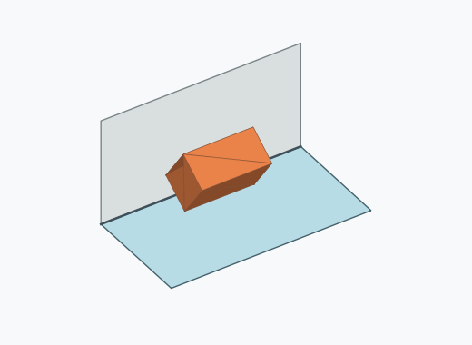 | 2 | 0.02 % | 0.01–0.07 % | 0.02 % |
| Rk3a_0015 | 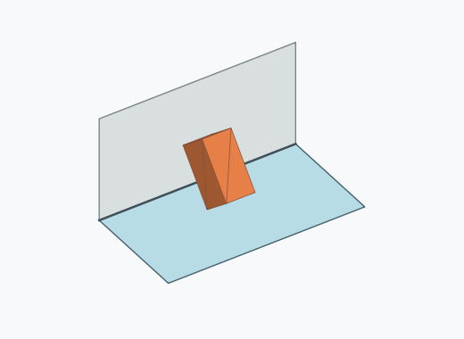 | 1 | 0.01 % | 0.00–0.06 % | 0.01 % |

Ergebnisstatus: settled: 9995, unsettled: 5

Details und Erkennung: [JSON](poses.json), [YAML](poses.yaml). Quaternionen: xyzw, Bauteil → Rutsche. Symmetrieoperationen werden rechts an die Bauteilrotation multipliziert. Die kontinuierliche Symmetrieachse wird gerichtet verglichen. Orientierungsabstand ≤5°; bei konkurrierenden Treffern innerhalb 1° bleibt die Zuordnung mehrdeutig.

Die Pose-IDs bleiben über Läufe erhalten. Der Registereintrag einer früher beobachteten, aktuell nicht aufgetretenen Pose bleibt zur Wiedererkennung reserviert.
