# Rk4i

10000 Fallversuche auf 500 mm Strecke; 9999 eingependelte Endlagen. Prozentangaben beziehen sich auf alle Fallversuche.

Dies sind beobachtete Simulationslagen unter den dokumentierten Parametern; Reibung und Unebenheitsmodell sind noch nicht an realen Häufigkeiten kalibriert.

| Pose | Bild | Anzahl | Anteil | 95-%-Intervall | Anteil eingependelt |
| --- | --- | ---: | ---: | ---: | ---: |
| Rk4i_0006 | 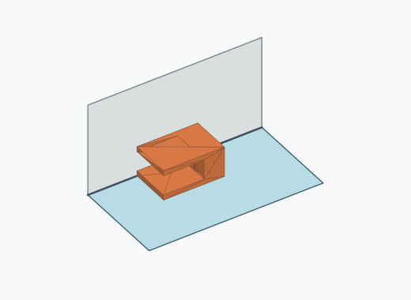 | 623 | 6.23 % | 5.77–6.72 % | 6.23 % |
| Rk4i_0020 | 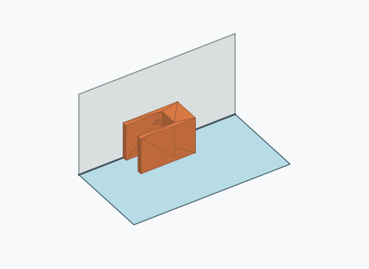 | 623 | 6.23 % | 5.77–6.72 % | 6.23 % |
| Rk4i_0011 |  | 621 | 6.21 % | 5.75–6.70 % | 6.21 % |
| Rk4i_0019 | 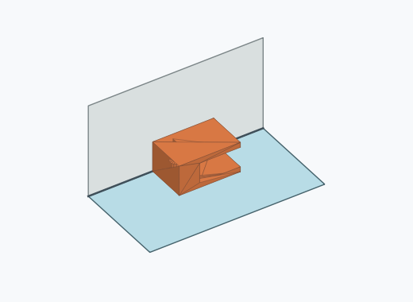 | 621 | 6.21 % | 5.75–6.70 % | 6.21 % |
| Rk4i_0012 | 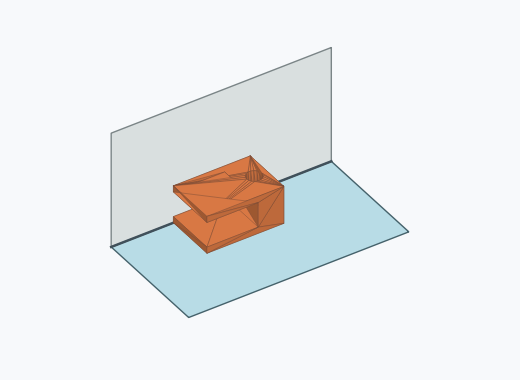 | 616 | 6.16 % | 5.71–6.65 % | 6.16 % |
| Rk4i_0008 | 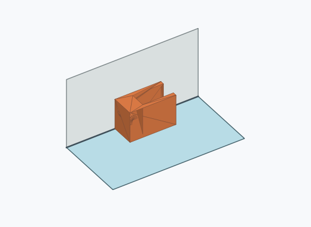 | 610 | 6.10 % | 5.65–6.59 % | 6.10 % |
| Rk4i_0005 |  | 602 | 6.02 % | 5.57–6.50 % | 6.02 % |
| Rk4i_0021 |  | 601 | 6.01 % | 5.56–6.49 % | 6.01 % |
| Rk4i_0010 |  | 590 | 5.90 % | 5.45–6.38 % | 5.90 % |
| Rk4i_0009 | 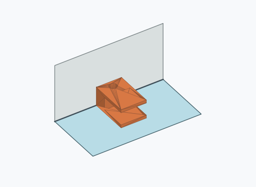 | 560 | 5.60 % | 5.17–6.07 % | 5.60 % |
| Rk4i_0007 | 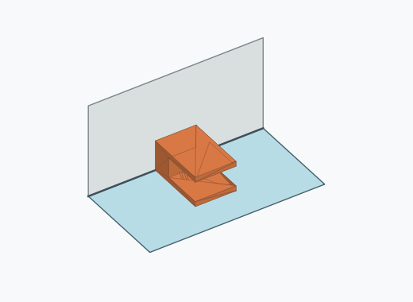 | 544 | 5.44 % | 5.01–5.90 % | 5.44 % |
| Rk4i_0013 | 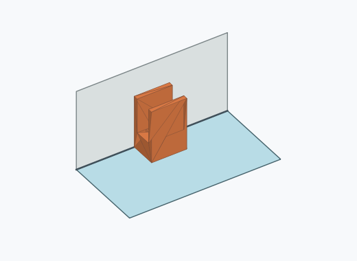 | 533 | 5.33 % | 4.91–5.79 % | 5.33 % |
| Rk4i_0016 |  | 379 | 3.79 % | 3.43–4.18 % | 3.79 % |
| Rk4i_0002 | 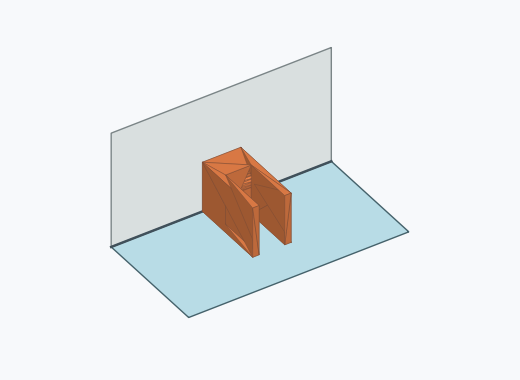 | 356 | 3.56 % | 3.21–3.94 % | 3.56 % |
| Rk4i_0017 | 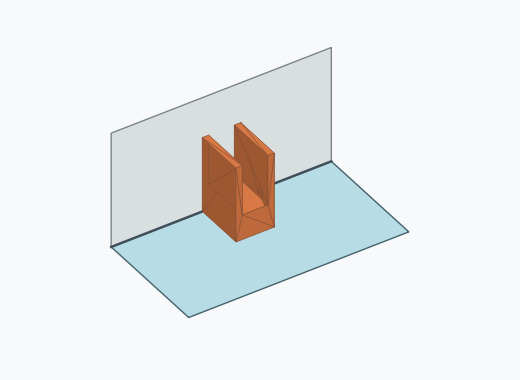 | 349 | 3.49 % | 3.15–3.87 % | 3.49 % |
| Rk4i_0014 |  | 347 | 3.47 % | 3.13–3.85 % | 3.47 % |
| Rk4i_0023 | 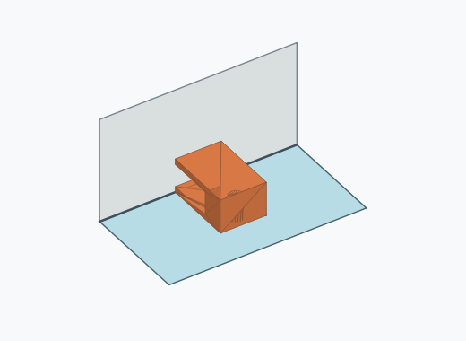 | 236 | 2.36 % | 2.08–2.68 % | 2.36 % |
| Rk4i_0022 | 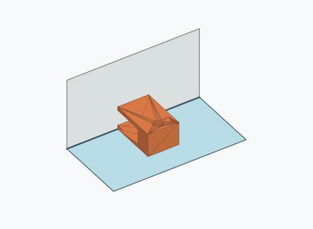 | 230 | 2.30 % | 2.02–2.61 % | 2.30 % |
| Rk4i_0004 |  | 228 | 2.28 % | 2.01–2.59 % | 2.28 % |
| Rk4i_0003 |  | 196 | 1.96 % | 1.71–2.25 % | 1.96 % |
| Rk4i_0024 |  | 143 | 1.43 % | 1.22–1.68 % | 1.43 % |
| Rk4i_0015 | 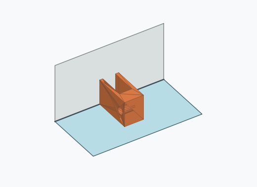 | 135 | 1.35 % | 1.14–1.60 % | 1.35 % |
| Rk4i_0018 | 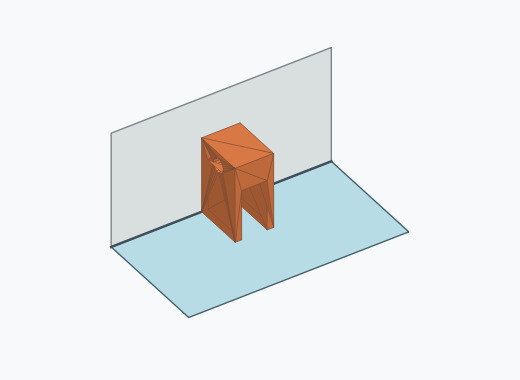 | 133 | 1.33 % | 1.12–1.57 % | 1.33 % |
| Rk4i_0001 |  | 123 | 1.23 % | 1.03–1.47 % | 1.23 % |

Ergebnisstatus: settled: 9999, unsettled: 1

Details und Erkennung: [JSON](poses.json), [YAML](poses.yaml). Quaternionen: xyzw, Bauteil → Rutsche. Symmetrieoperationen werden rechts an die Bauteilrotation multipliziert. Die kontinuierliche Symmetrieachse wird gerichtet verglichen. Orientierungsabstand ≤5°; bei konkurrierenden Treffern innerhalb 1° bleibt die Zuordnung mehrdeutig.

Die Pose-IDs bleiben über Läufe erhalten. Der Registereintrag einer früher beobachteten, aktuell nicht aufgetretenen Pose bleibt zur Wiedererkennung reserviert.
